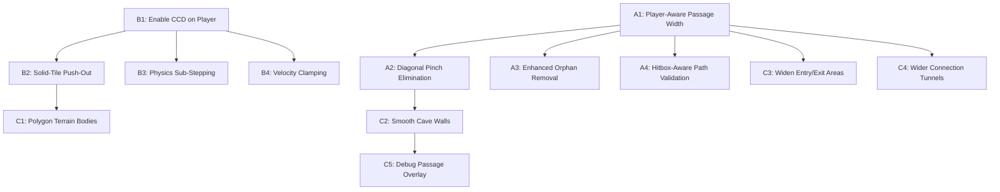

# Cave Generation & Physics Improvements Plan

## Problem Summary

Two critical bugs and several quality-of-life issues in the cave system:

1. **Player gets stuck between tiles** — Single-tile gaps and tight diagonal passages trap the player
2. **Player tunnels through solid tiles** — High-velocity movement causes the physics body to pass through terrain and remain inside solid geometry

---

## Root Cause Analysis

### Bug 1: Getting Stuck Between Tiles

**Files involved:**
- [`LevelGenerator.EnforceMinPassageWidth()`](Bloop/Generators/LevelGenerator.cs:885) — Only widens 1-tile horizontal and vertical gaps
- [`LevelGenerator.SmoothPass()`](Bloop/Generators/LevelGenerator.cs:849) — Cellular automata can create irregular edges after widening

**Root causes:**
- The player body is **24×40 pixels** — roughly **0.75×1.25 tiles** at 32px/tile. The current [`EnforceMinPassageWidth()`](Bloop/Generators/LevelGenerator.cs:885) only checks for single-tile-wide gaps in cardinal directions, but does NOT check:
  - **Diagonal pinch points** — Two solid tiles diagonally adjacent create a gap the player can enter but not exit
  - **L-shaped corners** — A 2-tile-wide passage that turns 90° can trap the 1.25-tile-tall player
  - **Player height vs passage height** — A horizontal passage 1 tile tall is passable by the BFS pathfinder but NOT by the 40px-tall player body
- The [`PathValidator.BFS()`](Bloop/Generators/PathValidator.cs:103) treats each tile as a single point, not accounting for the player's actual hitbox dimensions
- [`RemoveOrphanBlocks()`](Bloop/Generators/LevelGenerator.cs:1009) only removes 1×1 orphans surrounded on all 4 cardinal sides — 1×2 or 2×1 floating blocks that create pinch points are left in place

### Bug 2: Tunneling Through Tiles

**Files involved:**
- [`BodyFactory.CreatePlayerBody()`](Bloop/Physics/BodyFactory.cs:25) — Player body is NOT marked as `IsBullet`
- [`PhysicsManager.Step()`](Bloop/Physics/PhysicsManager.cs:49) — Single physics step per frame, no sub-stepping
- [`TileMap.GeneratePhysicsBodies()`](Bloop/World/TileMap.cs:109) — Terrain uses edge-chain bodies with no interior volume

**Root causes:**
- **No CCD on player body**: Only the [`grapple hook`](Bloop/Physics/BodyFactory.cs:171) has `IsBullet = true`. The player body uses standard discrete collision detection, which misses contacts when velocity exceeds ~1 tile per frame — easily reached during slingshot launches, grapple releases, and long falls
- **Edge chains have no volume**: The terrain is built from [`CreateChainShape`](Bloop/Physics/BodyFactory.cs:108) edge segments. If the player body crosses an edge in a single step, there is no solid polygon to push it back out — the player ends up inside the terrain with no collision response
- **No escape mechanism**: Once inside solid geometry, there is no code to detect the invalid state and teleport the player to safety
- **Single physics step**: [`PhysicsManager.Step()`](Bloop/Physics/PhysicsManager.cs:49) runs one step per frame. At 60 FPS with dt clamped to 1/30, fast-moving bodies can skip over thin geometry

---

## Improvement Plan

### Category A: Cave Generation Fixes — Prevent Stuck Spots

#### A1. Player-Aware Minimum Passage Width
**File:** [`LevelGenerator.cs`](Bloop/Generators/LevelGenerator.cs)

Replace the current [`EnforceMinPassageWidth()`](Bloop/Generators/LevelGenerator.cs:885) with a player-hitbox-aware version:
- The player is ~1.25 tiles tall and ~0.75 tiles wide
- **Minimum horizontal passage height: 2 tiles** — already enforced for vertical gaps, but not consistently for horizontal passages
- **Minimum vertical passage width: 2 tiles** — already partially enforced, but the current code only checks immediate neighbors
- Add a **second pass** that scans for any empty tile where the player body footprint — a 2-wide × 2-tall rectangle — cannot fit without overlapping solid tiles. If found, widen the passage by clearing the most constrained neighbor

#### A2. Diagonal Pinch Point Elimination
**File:** [`LevelGenerator.cs`](Bloop/Generators/LevelGenerator.cs)

Add a new post-processing step after `EnforceMinPassageWidth()`:
- Scan for diagonal pinch points: two solid tiles at positions `(x, y)` and `(x+1, y+1)` — or `(x+1, y)` and `(x, y+1)` — where both diagonal-adjacent tiles are empty
- These create a 1-pixel-wide diagonal gap that the player can slip into but not escape
- **Fix:** Clear one of the two solid tiles to open the passage to at least 2 tiles wide

#### A3. Enhanced Orphan Block Removal
**File:** [`LevelGenerator.cs`](Bloop/Generators/LevelGenerator.cs)

Extend [`RemoveOrphanBlocks()`](Bloop/Generators/LevelGenerator.cs:1009) to also remove:
- **1×2 and 2×1 floating blocks** — solid blocks where the entire group is surrounded by empty tiles on all exposed faces
- **Thin peninsulas** — solid tiles that protrude into open space with only 1 tile of connection to the main terrain mass, creating snag points

#### A4. Player-Hitbox-Aware Path Validation
**File:** [`PathValidator.cs`](Bloop/Generators/PathValidator.cs)

Update [`IsPassable()`](Bloop/Generators/PathValidator.cs:330) and [`GetNeighbors()`](Bloop/Generators/PathValidator.cs:291) to check a 2×2 tile footprint instead of a single tile:
- Currently, the BFS treats each tile as passable independently. A 1-tile-wide passage is marked passable even though the player physically cannot fit
- Change passability to require that the tile AND its right neighbor AND the tile below are all non-solid — this approximates the player's 0.75×1.25 tile footprint
- This ensures the path validator rejects levels where the only route passes through gaps too narrow for the player

### Category B: Physics Fixes — Prevent Tunneling

#### B1. Enable CCD on Player Body
**File:** [`BodyFactory.cs`](Bloop/Physics/BodyFactory.cs)

Add `body.IsBullet = true` in [`CreatePlayerBody()`](Bloop/Physics/BodyFactory.cs:25):
```
body.IsBullet = true;
```
This enables Continuous Collision Detection for the player, preventing the body from passing through thin geometry at high velocities. The performance cost is minimal for a single body.

#### B2. Solid-Tile Overlap Detection and Push-Out
**File:** New method in [`Player.cs`](Bloop/Gameplay/Player.cs) or [`PlayerController.cs`](Bloop/Gameplay/PlayerController.cs)

Add a per-frame safety check that detects when the player center is inside a solid tile:
- Each frame, after physics step, convert `Player.PixelPosition` to tile coordinates
- Check if the tile at the player center — and the tiles covering the player's bounding box — are solid
- If overlap detected, perform an emergency push-out:
  1. Search in expanding rings — up, down, left, right — for the nearest empty tile with a 2×2 clear area
  2. Teleport the player body to that position
  3. Zero the velocity to prevent re-entry
  4. Log a warning for debugging

#### B3. Physics Sub-Stepping
**File:** [`PhysicsManager.cs`](Bloop/Physics/PhysicsManager.cs)

Change [`Step()`](Bloop/Physics/PhysicsManager.cs:49) to use fixed sub-steps:
- Instead of one `World.Step(dt)` call, divide the frame delta into fixed sub-steps of 1/120s
- Cap at 4 sub-steps per frame to prevent spiral-of-death
- This halves the maximum distance a body can travel between collision checks

```
const float FixedStep = 1f / 120f;
const int MaxSubSteps = 4;

float remaining = Math.Min(deltaSeconds, 1f / 30f);
int steps = 0;
while (remaining > 0f && steps < MaxSubSteps)
{
    float sub = Math.Min(remaining, FixedStep);
    World.Step(TimeSpan.FromSeconds(sub));
    remaining -= sub;
    steps++;
}
```

#### B4. Velocity Clamping
**File:** [`Player.cs`](Bloop/Gameplay/Player.cs) or [`PlayerController.cs`](Bloop/Gameplay/PlayerController.cs)

Add a maximum velocity clamp applied each frame after forces are resolved:
- Maximum horizontal speed: already capped at 180 px/s for input, but slingshot/grapple can exceed this
- Add a hard cap of ~600 px/s — roughly 18 tiles/s at 32px/tile — which is fast enough for exciting gameplay but slow enough that CCD + sub-stepping can handle it
- Maximum vertical speed: cap at ~800 px/s to prevent terminal-velocity tunneling on long falls

### Category C: Additional Improvements

#### C1. Terrain Body Improvement — Use Polygon Bodies Instead of Edge Chains
**File:** [`TileMap.cs`](Bloop/World/TileMap.cs)

The current edge-chain approach creates hollow terrain — if a body crosses an edge, there is nothing to push it back. Consider replacing edge chains with **merged rectangle polygon bodies**:
- For each horizontal run of solid tiles, create a filled rectangle body instead of just the top/bottom edges
- This gives the terrain actual volume, so Aether's collision resolver can push overlapping bodies out
- Trade-off: more fixtures, but the merged-run approach keeps the count manageable

**Alternative — lighter approach:** Keep edge chains but add a **backup AABB overlap test** in the player update — see B2 above. This is simpler and avoids the fixture count increase.

#### C2. Smooth Cave Walls — Reduce Jagged Edges
**File:** [`LevelGenerator.cs`](Bloop/Generators/LevelGenerator.cs)

The current 3 passes of cellular automata smoothing can still leave jagged 1-tile protrusions that snag the player:
- Add a **post-smooth erosion pass** that removes solid tiles with only 1 solid cardinal neighbor — these are thin spikes that serve no structural purpose
- This creates smoother cave walls that feel more natural and reduce collision snags

#### C3. Widen Passages Near Entry and Exit Points
**File:** [`LevelGenerator.cs`](Bloop/Generators/LevelGenerator.cs)

Ensure a **3×3 clear area** around both the entry and exit points:
- Currently [`IsOpenArea()`](Bloop/Generators/LevelGenerator.cs:1235) only checks for a 2×2 area
- Widen to 3×3 to prevent the player from spawning in a tight spot or getting stuck at the exit portal

#### C4. Connection Tunnel Width Guarantee
**File:** [`LevelGenerator.cs`](Bloop/Generators/LevelGenerator.cs)

The [`ConnectToMainRegion()`](Bloop/Generators/LevelGenerator.cs:693) method carves L-shaped tunnels that are only 2 tiles wide. These can create tight corners:
- Widen connection tunnels to **3 tiles** in both the horizontal and vertical segments
- This ensures the player can navigate the connection without getting stuck at the L-bend

#### C5. Debug Visualization for Passage Width
**File:** [`PhysicsDebugDraw.cs`](Bloop/Physics/PhysicsDebugDraw.cs)

Add an optional debug overlay — toggled with a key — that highlights:
- Tiles where the player hitbox would overlap solid geometry — shown in red
- Passages narrower than 2 tiles — shown in yellow
- This helps identify problematic areas during testing

---

## Implementation Order

The fixes are ordered by impact and dependency:



**Phase 1 — Critical Fixes:**
1. B1: Enable CCD on player body — one-line fix, immediate tunneling reduction
2. B2: Solid-tile overlap push-out — safety net for any remaining tunneling
3. A1: Player-aware minimum passage width — prevents most stuck situations
4. A2: Diagonal pinch point elimination — prevents diagonal traps

**Phase 2 — Robustness:**
5. B3: Physics sub-stepping — further reduces tunneling probability
6. B4: Velocity clamping — hard safety cap
7. A3: Enhanced orphan block removal — cleaner cave geometry
8. A4: Hitbox-aware path validation — rejects unplayable levels at generation time

**Phase 3 — Polish:**
9. C2: Smooth cave walls — erosion pass for cleaner geometry
10. C3: Widen entry/exit areas — better spawn/exit experience
11. C4: Wider connection tunnels — smoother navigation at junctions
12. C1: Polygon terrain bodies — optional, only if push-out alone is insufficient
13. C5: Debug passage overlay — development aid

---

## Files Modified

| File | Changes |
|------|---------|
| [`BodyFactory.cs`](Bloop/Physics/BodyFactory.cs) | Add `IsBullet = true` to player body |
| [`PhysicsManager.cs`](Bloop/Physics/PhysicsManager.cs) | Sub-stepping in `Step()` |
| [`Player.cs`](Bloop/Gameplay/Player.cs) | Velocity clamping, solid-tile push-out check |
| [`PlayerController.cs`](Bloop/Gameplay/PlayerController.cs) | Call push-out check each frame |
| [`LevelGenerator.cs`](Bloop/Generators/LevelGenerator.cs) | Rewrite `EnforceMinPassageWidth()`, add diagonal pinch elimination, enhanced orphan removal, erosion pass, wider entry/exit/connection areas |
| [`PathValidator.cs`](Bloop/Generators/PathValidator.cs) | Update `IsPassable()` to check 2×2 footprint |
| [`TileMap.cs`](Bloop/World/TileMap.cs) | Optional: polygon terrain bodies |
| [`PhysicsDebugDraw.cs`](Bloop/Physics/PhysicsDebugDraw.cs) | Optional: passage width debug overlay |
