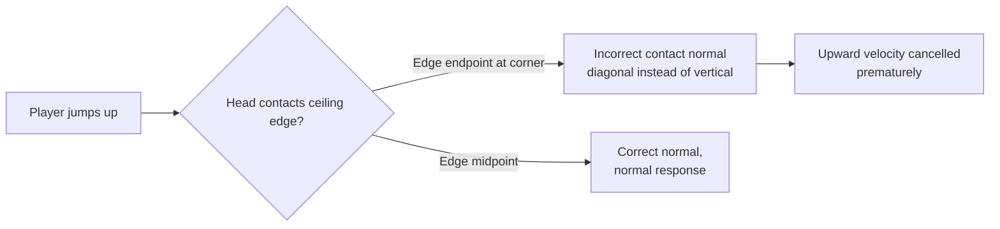

# Collision Detection & Physics Improvement Plan

## Overview

This plan addresses two categories of issues found in the Bloop codebase:
1. **Tile‑player collision** — specifically the "jump stops too soon when brushing a tile" problem
2. **Grappling hook & player physics** — responsiveness, stability, and correctness improvements

---

## A. Player↔Tile Collision Improvements

### A1. Root Cause: Edge‑Chain Endpoint Contact Normals

**Problem:** Terrain is built from individual 2‑vertex edge‑chain bodies ([`TileMap.cs:181-288`](../Bloop/World/TileMap.cs:181)). Each exposed tile boundary is a separate edge chain with **no ghost vertices** at endpoints. Aether.Physics2D at chain endpoints without ghost vertices produces **incorrect contact normals** — especially at tile corners (T‑junctions) where horizontal ceiling edges meet vertical wall edges. This causes the player's upward jump velocity to be cancelled prematurely by a diagonal or otherwise incorrect collision normal.



**Fix:** Merge adjacent exposed tile edges into **longer continuous chains** so that interior vertices have ghost vertices and produce correct normals. This is already partially done (runs of same‑edge tiles are merged) but the individual 2‑vertex edge chains at run boundaries still lack ghost vertices. The fix is to use Aether's `ChainShape` with proper ghost vertices via adjacent edge vertices.

**Implementation steps:**

1. In [`TileMap.GenerateHorizontalEdges()`](../Bloop/World/TileMap.cs:181) and [`GenerateVerticalEdges()`](../Bloop/World/TileMap.cs:237), extend runs to include neighboring edge vertices as ghost vertices.
2. Add 2px of **pre‑emptive ghost vertex padding** (the vertex just outside the run) so Aether's collision normal smoothing works correctly at run endpoints.
3. For isolated single‑tile edges, consider using a **small static rectangle** (half‑tile sized) instead of an edge chain so the player always contacts a solid area rather than a naked line.

---

### A2. Head‑Bump Smoothing (Player‑Side Safety Net)

**Problem:** Even with perfect edge chains, Aether's instantaneous velocity cancellation on ceiling contact can feel abrupt. The player's upward velocity goes from full to zero in one physics sub‑step, which can feel like "jump stopped too soon" when the contact is glancing (brushing a ceiling corner while jumping past it).

**Fix:** Add a **ceiling‑bump detection** and smoothing layer in [`PlayerController.Update()`](../Bloop/Gameplay/PlayerController.cs:153) that detects when the player's upward velocity is cancelled by a ceiling contact and smoothly transitions from `Jumping` to `Falling` instead of applying an aggressive downward impulse.

**Implementation:**

```csharp
// In Player.cs, track ceiling contact:
private int _ceilingContactCount = 0;

// In OnCollision: if contact normal points downward (player head hitting ceiling)
// and sender is the main body fixture (not foot sensor), increment ceiling count.

// In PlayerController.Update(): after physics step, if _ceilingContactCount > 0
// and player was jumping, snap upward velocity to zero but don't apply downward
// impulse — let gravity do the work naturally.
```

**Key detail:** Aether's [`Contact`](https://www.nkast.net/docs/aether-physics2d/api/nkast.Aether.Physics2D.Dynamics.Contacts.Contact) provides `Contact.Manifold` which contains the contact normal. When the normal's Y component is negative (pointing downward in screen space), the player's head is hitting a ceiling. Check this in the collision callback rather than relying on velocity changes.

---

### A3. Foot Sensor Width Reduction

**Problem:** The foot sensor is **1.6× wider** than the player body ([`BodyFactory.cs:61`](../Bloop/Physics/BodyFactory.cs:61)):
```csharp
var footFixture = body.CreateRectangle(halfW * 1.6f, ...);
```
This extra width can cause the foot sensor to detect ground contact through **1‑tile‑thin gaps** beside walls or at ledge edges, keeping `IsGrounded = true` when the player has visually left the platform. Combined with coyote time (0.12s), this can make a jump feel delayed or cancelled.

**Fix:** Reduce foot sensor width from `1.6×` to `1.2×` body width. This still provides tolerance for pixel‑perfect ledge detection but reduces false positives.

---

### A4. Frame‑Rate Independent Ground Friction

**Problem:** In [`PlayerController.cs:461`](../Bloop/Gameplay/PlayerController.cs:461):
```csharp
_player.Body.LinearVelocity = new Vector2(vel.X * 0.75f, vel.Y);
```
This 0.75× multiplier is applied once per frame regardless of delta time. At 60 FPS this gives one feel; at 120 FPS or 30 FPS the friction changes dramatically.

**Fix:** Use frame‑rate independent damping:
```csharp
float frictionFactor = MathF.Pow(0.75f, dt * 60f);
_player.Body.LinearVelocity = new Vector2(vel.X * frictionFactor, vel.Y);
```

---

## B. Grappling Hook Physics Improvements

### B1. Grapple Anchor Yank Impulse

**Problem:** When the grapple hook catches, **no yank impulse** is applied ([`GrapplingHook.cs:236`](../Bloop/Gameplay/GrapplingHook.cs:236)):
```csharp
// NOTE: No yank impulse applied here.
// The player stays where they are when the hook anchors.
```
This makes the grapple feel unresponsive — the player just keeps falling until the rope goes taut naturally. In most grapple‑based games, a small initial pull‑toward‑anchor makes the mechanic feel snappy.

**Fix:** Apply a configurable yank impulse toward the anchor point at the moment of anchoring:

```csharp
// In GrapplingHook.Update() where _pendingAnchor is finalized:
Vector2 dirToAnchor = _pendingAnchorPos - _ownerPlayer.Body.Position;
float distToAnchor = dirToAnchor.Length();
if (distToAnchor > 0.01f)
{
    dirToAnchor /= distToAnchor;
    float yankStrength = MathHelper.Clamp(distToAnchor * 2f, 5f, 20f); // tunable
    _ownerPlayer.Body.ApplyLinearImpulse(dirToAnchor * yankStrength);
}
```

The yank strength should be proportional to distance (closer anchors = weaker yank) so short‑range grapples don't over‑correct.

---

### B2. Swing Damping Tuning

**Problem:** Swing state uses `LinearDamping = 0.3f` ([`Player.cs:310`](../Bloop/Gameplay/Player.cs:310)), described as "increased from 0.1f to reduce oscillation." At 0.3, the player loses swing energy very quickly — swings decay in 2–3 arcs instead of 5–6, making traversal feel heavy.

**Fix:** Reduce swing damping to `0.15f` and add **velocity‑proportional additional damping** that only kicks in at high swing speeds:
```csharp
// In PlayerController, during Swinging state:
float swingSpeed = Math.Abs(player.PixelVelocity.Length());
if (swingSpeed > 200f)
{
    // Add extra damping only at high speed to prevent runaway oscillation
    float extraDamping = (swingSpeed - 200f) * 0.0002f;
    player.Body.LinearDamping = 0.15f + extraDamping;
}
else
{
    player.Body.LinearDamping = 0.15f; // base low damping
}
```

---

### B3. OnHookCollision Bitmask Comparison (Bug)

**Problem:** [`GrapplingHook.cs:395-397`](../Bloop/Gameplay/GrapplingHook.cs:395):
```csharp
if (other.CollisionCategories != CollisionCategories.Terrain &&
    other.CollisionCategories != CollisionCategories.Climbable &&
    other.CollisionCategories != CollisionCategories.CrystalBridge)
    return true;
```
`Category` is a [`Flags`] enum. Using `!=` for bitmask comparison is fragile. While current fixtures use single categories, future changes (e.g., adding a fixture with multiple categories) would break this check silently.

**Fix:** Use `HasFlag` or bitwise AND:
```csharp
const Category grappleTargets = CollisionCategories.Terrain 
                              | CollisionCategories.Climbable 
                              | CollisionCategories.CrystalBridge;
if ((other.CollisionCategories & grappleTargets) == 0)
    return true; // continue flying through non-target
```

---

### B4. Rope Wrap DDA Step Size

**Problem:** [`RopeWrapSystem.cs:284`](../Bloop/Gameplay/RopeWrapSystem.cs:284):
```csharp
float stepSize = TileSize * 0.5f; // half-tile steps for accuracy
int   steps    = (int)(length / stepSize) + 1;
```
Half‑tile (16px) steps can miss terrain features that are 1 tile wide when the rope is moving at high angular velocity between frames.

**Fix:** Reduce to quarter‑tile steps (8px) and use a proper **Bresenham‑style line‑tile traversal** instead of uniform sampling:

```csharp
// Replace DDA with tile-aligned ray march
float t = 0f;
float tMaxX = float.MaxValue, tMaxY = float.MaxValue;
// ... standard grid traversal algorithm ...
while (t < 1f)
{
    // Check current tile
    if (TileProperties.IsSolid(_tileMap.GetTile(tx, ty)))
        return new Vector2(fromPixels.X + dir.X * t * length,
                           fromPixels.Y + dir.Y * t * length);
    // Step to next tile boundary
    if (tMaxX < tMaxY) { t = tMaxX; tMaxX += stepX; tx += stepSignX; }
    else               { t = tMaxY; tMaxY += stepY; ty += stepSignY; }
}
```

---

### B5. Wrap Point Oscillation Prevention

**Problem:** [`RopeWrapSystem.FindNearestCorner()`](../Bloop/Gameplay/RopeWrapSystem.cs:313) offsets the wrap point by 2px toward the player to avoid re‑intersection. When the player swings back and forth around a corner, this offset can cause the wrap point to flip between two adjacent corners each frame, producing visible oscillation.

**Fix:** Add a **hysteresis** mechanism: only add a new wrap point if it's at a different corner than the current last wrap point, AND the angle change exceeds `MinWrapAngle * 1.5f` when the wrap point is being re‑evaluated (vs `MinWrapAngle` when first created).

Additionally, in the [`Update()`](../Bloop/Gameplay/RopeWrapSystem.cs:109) method, the unwrap check should verify that the line has been **clear for at least 3 consecutive frames** before actually removing the wrap point (debounce).

---

## C. Player Physics Improvements

### C1. Jump Height Evaluation

**Current values:**
- Gravity: 20 m/s²
- Jump impulse: 240 px/s → 3.75 m/s (after `ToMeters`)
- Time to apex: 3.75 / 20 = 0.1875s
- Max jump height: v²/(2g) = 14.06 / 40 = **0.35m ≈ 22.5px ≈ 0.7 tiles**

A jump of ~0.7 tiles is very low for a platformer where tile gaps are typically 2–4 tiles wide. This is intentional (precision platforming), but the low height magnifies the ceiling‑brush issue — even a tiny upward velocity cancellation near a ceiling at 0.7‑tile height makes the jump feel impossibly short.

**Recommendation:** Keep the current values but verify that level generation never creates ceiling gaps shorter than 1.5 tiles of clearance for standard movement paths. If the user wants a more generous jump, increase `JumpImpulse` from 240 to **300** (~28px height) or reduce gravity from 20 to **18**.

---

### C2. Inventory Weight → Actual Mass

**Problem:** [`Player.cs:578-583`](../Bloop/Gameplay/Player.cs:578):
```csharp
// Aether mass is set per-fixture via density; we adjust linear damping
// as a proxy for weight effects on movement feel
float dampingScale = MathHelper.Clamp(weightKg / 30f, 0f, 1f);
Body.LinearDamping = dampingScale * 2f;
```

Damping affects all velocity equally (horizontal, vertical, falling), which is not physically accurate. Heavy inventory should affect **acceleration** (how quickly you reach max speed) and **jump height**, not just ground friction.

**Fix:** Change the player fixture's **density** based on inventory weight:

```csharp
// In SetInventoryWeight:
float totalMass = BaseBodyMass + weightKg;
foreach (var fixture in Body.FixtureList)
{
    if (fixture.Tag is string tag && tag == "foot") continue;
    fixture.Density = totalMass / fixture.Shape.MassData.Area; // approximate
}
Body.ResetMassData();
```

This naturally affects jump height (heavier = lower jump with same impulse) and acceleration (heavier = slower to reach max speed), without needing ad‑hoc damping multipliers.

---

### C3. Hard Velocity Cap Softening

**Problem:** [`PlayerController.ClampVelocity()`](../Bloop/Gameplay/PlayerController.cs:575) applies an absolute hard cap (600 px/s horizontal, 800 px/s downward) every frame. When the player hits this cap, they feel an invisible wall — velocity is abruptly clamped.

**Fix:** Replace the hard clamp with a **soft drag** that increases asymptotically as velocity approaches the cap:

```csharp
private void ApplyVelocityDrag()
{
    var vel = PhysicsManager.ToPixels(_player.Body.LinearVelocity);
    float absVx = Math.Abs(vel.X);
    float absVy = Math.Abs(vel.Y);
    
    const float softCapH = 550f; // drag starts here
    const float hardCapH = 600f;
    const float softCapV = 750f;
    const float hardCapV = 800f;
    
    float dragX = 0f, dragY = 0f;
    if (absVx > softCapH)
        dragX = (absVx - softCapH) / (hardCapH - softCapH) * 0.95f; // 0–95% drag
    if (absVy > softCapV)
        dragY = (absVy - softCapV) / (hardCapV - softCapV) * 0.95f;
    
    _player.Body.LinearVelocity *= new Vector2(1f - dragX, 1f - dragY);
}
```

---

## D. Level Generation Impact (Collision)

### D1. Slope Collision Response

**Problem:** Slope tiles use diagonal 2‑vertex edge chains ([`TileMap.cs:290-328`](../Bloop/World/TileMap.cs:290)). These have the same ghost‑vertex issue as horizontal/vertical edges. Additionally, slopes lack friction data — the chain shape has `Friction = 0.3f` (from `CreateTerrainChain`) but slopes should have distinct friction for slide‑feel.

**Fix:** Merge adjacent same‑direction slope edges into longer chains, and add slope‑specific friction via a fixture override after creation.

---

## E. Implementation Order

| Priority | Item | Area | Effort |
|----------|------|------|--------|
| P0 | A1: Edge‑chain ghost vertices (ceilings/walls) | `TileMap.cs` | Medium |
| P0 | B3: Bitmask comparison bug fix | `GrapplingHook.cs` | Trivial |
| P1 | A2: Head‑bump smoothing | `Player.cs` + `PlayerController.cs` | Medium |
| P1 | B1: Yank impulse on grapple anchor | `GrapplingHook.cs` | Small |
| P1 | B2: Swing damping tuning | `Player.cs` + `PlayerController.cs` | Small |
| P2 | A3: Foot sensor width reduction | `BodyFactory.cs` | Trivial |
| P2 | A4: Frame‑rate independent friction | `PlayerController.cs` | Trivial |
| P2 | B4: Rope wrap DDA improvement | `RopeWrapSystem.cs` | Medium |
| P2 | B5: Wrap point hysteresis | `RopeWrapSystem.cs` | Small |
| P2 | C2: Inventory weight → actual mass | `Player.cs` | Small |
| P3 | C1: Jump height evaluation | `PlayerController.cs` | Trivial |
| P3 | C3: Soft velocity cap | `PlayerController.cs` | Small |
| P3 | D1: Slope chain merging | `TileMap.cs` | Small |

---

## F. Verification & Testing

After implementing each item, verify:

1. **A1/A2**: Jump into a 1‑tile‑high alcove exit. The jump should stop naturally (head bump) but not slam the player back down. The transition from Jumping → Falling should feel smooth.
2. **B1**: Fire grapple at a distant ceiling tile. The player should feel a gentle pull toward the anchor point, not just stop in place.
3. **B2**: Swing from a grapple anchor. The swing should decay naturally over 4–6 full arcs, not stop in 2.
4. **A3**: Walk off a 1‑tile ledge. The foot sensor should not detect ground through the wall beside the ledge.
5. **C2**: Pick up heavy items. The player's acceleration and jump height should reduce proportionally.
