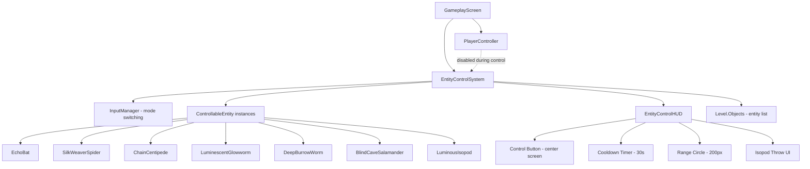
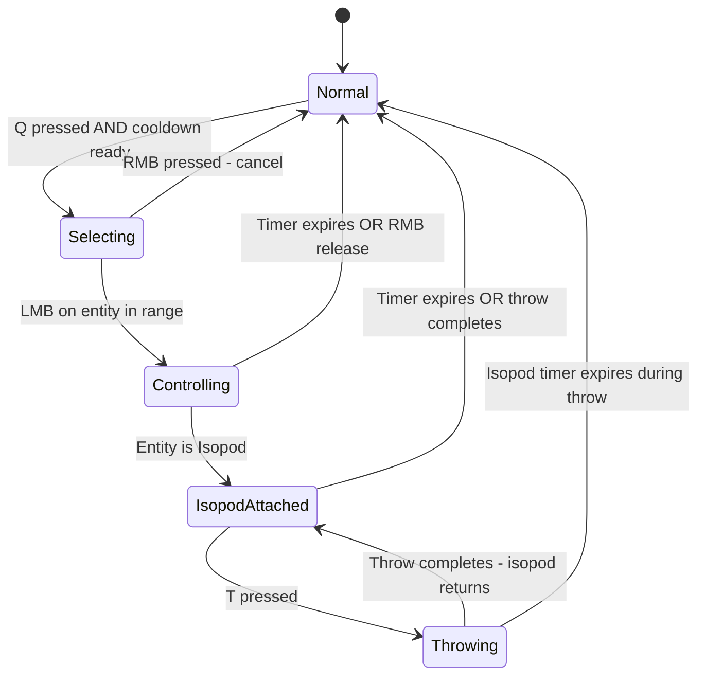

# Controllable Cave Entities — Architecture Plan

## Overview

Add 7 controllable cave entities to the game. The player activates a "Control Entity" button (center screen), selects a target within 200px range, and takes control of it for a duration. During control, the player character is immobilized (except for the Luminous Isopod, which attaches to the player). Left/right mouse clicks are temporarily re-routed from grappling hook to entity selection/cancellation.

---

## System Architecture



---

## File Structure

### New Files

| File | Purpose |
|------|---------|
| [`Bloop/Entities/ControllableEntity.cs`](Bloop/Entities/ControllableEntity.cs) | Abstract base class extending WorldObject with control mechanics |
| [`Bloop/Entities/EntityControlSystem.cs`](Bloop/Entities/EntityControlSystem.cs) | Central manager: cooldown, selection, input mode, active control state |
| [`Bloop/Entities/EchoBat.cs`](Bloop/Entities/EchoBat.cs) | Echo Bat entity |
| [`Bloop/Entities/SilkWeaverSpider.cs`](Bloop/Entities/SilkWeaverSpider.cs) | Silk Weaver Spider entity |
| [`Bloop/Entities/ChainCentipede.cs`](Bloop/Entities/ChainCentipede.cs) | Chain Centipede entity |
| [`Bloop/Entities/LuminescentGlowworm.cs`](Bloop/Entities/LuminescentGlowworm.cs) | Luminescent Glowworm entity |
| [`Bloop/Entities/DeepBurrowWorm.cs`](Bloop/Entities/DeepBurrowWorm.cs) | Deep Burrow Worm entity |
| [`Bloop/Entities/BlindCaveSalamander.cs`](Bloop/Entities/BlindCaveSalamander.cs) | Blind Cave Salamander entity |
| [`Bloop/Entities/LuminousIsopod.cs`](Bloop/Entities/LuminousIsopod.cs) | Luminous Isopod entity (special: attaches to player) |
| [`Bloop/Entities/EntitySkill.cs`](Bloop/Entities/EntitySkill.cs) | Skill base class with cooldown, activation, and effect logic |
| [`Bloop/UI/EntityControlHUD.cs`](Bloop/UI/EntityControlHUD.cs) | HUD: control button, cooldown ring, range circle, isopod throw icon |
| [`Bloop/Rendering/EntityRenderer.cs`](Bloop/Rendering/EntityRenderer.cs) | Static renderer for all 7 entity types using GeometryBatch primitives |

### Modified Files

| File | Changes |
|------|---------|
| [`Bloop/Core/InputManager.cs`](Bloop/Core/InputManager.cs) | Add `InputMode` enum, `IsControlEntityPressed()`, `IsThrowPressed()` (T key) |
| [`Bloop/Gameplay/PlayerController.cs`](Bloop/Gameplay/PlayerController.cs) | Skip grapple/movement when `EntityControlSystem.IsControlActive` or `IsSelecting` |
| [`Bloop/Gameplay/Player.cs`](Bloop/Gameplay/Player.cs) | Add `PlayerState.Controlling` state that freezes the player |
| [`Bloop/Screens/GameplayScreen.cs`](Bloop/Screens/GameplayScreen.cs) | Instantiate EntityControlSystem, wire into update/draw, pass to HUD |
| [`Bloop/World/Level.cs`](Bloop/World/Level.cs) | Add entity creation in `CreateObject()`, entity types in factory switch |
| [`Bloop/Generators/ObjectPlacer.cs`](Bloop/Generators/ObjectPlacer.cs) | Add placement logic for 7 entity types with biome-appropriate distribution |
| [`Bloop/Physics/CollisionCategories.cs`](Bloop/Physics/CollisionCategories.cs) | Add `Entity = Category.Cat11` for controllable entity bodies |
| [`Bloop/Physics/BodyFactory.cs`](Bloop/Physics/BodyFactory.cs) | Add `CreateEntityBody()` for dynamic entity physics bodies |

---

## Phase 1: Core Entity Control System Infrastructure

### 1.1 InputManager Changes

Add to [`InputManager.cs`](Bloop/Core/InputManager.cs):

```csharp
public enum InputMode
{
    Normal,          // LMB = grapple fire, RMB = grapple release
    EntitySelecting, // LMB = select entity, RMB = cancel selection
    EntityControlling // LMB/RMB = entity-specific, normal hook disabled
}

public InputMode CurrentMode { get; set; } = InputMode.Normal;

// Q key activates entity control mode
public bool IsControlEntityPressed() => IsKeyPressed(Keys.Q);

// T key throws attached isopod
public bool IsThrowPressed() => IsKeyPressed(Keys.T);
```

### 1.2 EntityControlSystem

Central orchestrator in [`Bloop/Entities/EntityControlSystem.cs`](Bloop/Entities/EntityControlSystem.cs):

```
Fields:
- _cooldownTimer: float (30s between uses)
- _controlTimer: float (remaining control duration)
- _selectedEntity: ControllableEntity?
- _isSelecting: bool (range circle visible, awaiting LMB click)
- _isControlling: bool (actively possessing an entity)
- _player: Player reference
- _camera: Camera reference
- _input: InputManager reference
- ControlRange: 200f pixels

Key Methods:
- Update(GameTime, Level, Player): tick cooldowns, handle selection, update controlled entity
- TryActivate(): start selection mode if cooldown ready
- SelectEntity(Vector2 mouseWorldPos, Level): find nearest entity in range
- BeginControl(ControllableEntity): lock player, start control timer
- EndControl(): release entity, unlock player, start cooldown
- CancelSelection(): exit selection mode, restore normal input
```

### 1.3 Player State Addition

Add `Controlling` to [`PlayerState`](Bloop/Gameplay/Player.cs:15) enum. When entering this state:
- `Body.IgnoreGravity = true` (if hanging from hook, keep hook active)
- `Body.LinearDamping = 99f`
- `Body.LinearVelocity = Vector2.Zero`
- Player must be grounded OR hanging from grapple hook (swinging state)

For the Isopod exception: player does NOT enter Controlling state; the isopod attaches to the player body and the player moves normally.

### 1.4 PlayerController Changes

In [`PlayerController.Update()`](Bloop/Gameplay/PlayerController.cs:117):
- Early return if `_player.State == PlayerState.Controlling`
- When `EntityControlSystem.IsSelecting`: redirect LMB/RMB to entity selection instead of grapple
- When `EntityControlSystem.IsControlling` and entity is NOT isopod: skip all input processing

### 1.5 Collision Category

Add to [`CollisionCategories.cs`](Bloop/Physics/CollisionCategories.cs):
```csharp
public const Category Entity = Category.Cat11;
```

Update `PlayerCollidesWith` to NOT include Entity (entities are sensor-only for selection, not physical blockers for the player).

---

## Phase 2: ControllableEntity Base Class

### 2.1 Abstract Base

[`Bloop/Entities/ControllableEntity.cs`](Bloop/Entities/ControllableEntity.cs) extends [`WorldObject`](Bloop/World/WorldObject.cs):

```
Properties:
- EntityType: enum (EchoBat, SilkWeaverSpider, etc.)
- ControlDuration: float (seconds)
- IsControlled: bool
- ControlTimer: float (remaining time)
- Skill: EntitySkill (the specific skill for this entity type)
- MovementSpeed: float (pixels/second)
- CanWallClimb: bool
- CanCeilingClimb: bool
- CanFly: bool
- CanBurrow: bool
- CanSwim: bool
- DisplayName: string

Abstract Methods:
- UpdateControlled(GameTime, InputManager, Camera, TileMap): movement + skill while possessed
- UpdateIdle(GameTime): AI behavior when not controlled
- OnControlStart(): called when possession begins
- OnControlEnd(): called when possession ends
- UseSkill(GameTime, InputManager, Camera, Level): activate the entity-specific skill
- GetEffectRadius(): float — range for same/different type effects

Virtual Methods:
- DrawControlled(SpriteBatch, AssetManager): draw with control highlight
- GetNearbyEntities(Level, float radius): find entities in range for effects
- ApplySameTypeEffect(List of ControllableEntity): effect on same-type entities
- ApplyDifferentTypeEffect(List of ControllableEntity): effect on different-type entities
```

### 2.2 EntitySkill

[`Bloop/Entities/EntitySkill.cs`](Bloop/Entities/EntitySkill.cs):

```
Properties:
- Name: string
- Cooldown: float
- CooldownTimer: float
- IsReady: bool
- IsActive: bool (for hold-type skills like Pheromone Web Trail)
- Duration: float (for timed effects)
- DurationTimer: float

Methods:
- Update(float dt): tick cooldown/duration timers
- TryActivate(): returns bool, starts cooldown
- Deactivate(): for hold-type skills
```

---

## Phase 3: Seven Entity Implementations

### Entity Summary Table

| Entity | Duration | Speed | Movement | Skill | Skill CD | Size (px) |
|--------|----------|-------|----------|-------|----------|-----------|
| Echo Bat | 9s | 200 | Free fly | Sonic Pulse | 3s | 16×10 |
| Silk Weaver Spider | 16s | 120 | Wall climb + swing | Pheromone Web Trail | hold | 20×14 |
| Chain Centipede | 11s | 180 | Wall + ceiling | Aggression Pheromone | instant | 30×8 |
| Luminescent Glowworm | 14s | 60 | Crawl + squeeze | Bioluminescence Flash | 5s charge | 12×8 |
| Deep Burrow Worm | 20s | 50 surface, 100 burrow | Surface + underground | Seismic Burrow | 6s | 10×24 |
| Blind Cave Salamander | 13s | 90 | Walk + swim + wet walls | Slime Trail Spit | 4s | 22×10 |
| Luminous Isopod | 30s | attaches to player | Player movement | Glow Surge | 6s | 14×8 |

### 3.1 Echo Bat

- **Movement**: WASD controls free flight in any direction; no gravity while controlled
- **Skill (Sonic Pulse)**: Instant radial pulse, 3s cooldown
  - Same type: nearby bats flock and mirror flight path for 6s
  - Different type: ground enemies reverse/jump randomly for 4s
  - Extra: shatters fragile stalactites (check FallingStalactite objects in range)
- **Visual**: Small dark body with angular wing shapes that flap; pulse shown as expanding ring

### 3.2 Silk Weaver Spider

- **Movement**: WASD on surfaces; can wall-climb; hold Space to swing on silk thread
- **Skill (Pheromone Web Trail)**: Hold LMB to spray glowing trail; limited silk meter (refills while possessed)
  - Same type: other spiders follow the trail, cluster at end
  - Different type: enemies touching trail stuck for 8s
  - Extra: creates web platforms mid-air (temporary solid surfaces)
- **Visual**: Round body with 8 angular legs; trail is glowing dotted line

### 3.3 Chain Centipede

- **Movement**: WASD on surfaces; climbs walls and ceilings at high speed
- **Skill (Aggression Pheromone Burst)**: Instant aura pulse
  - Same type: up to 4 centipedes lock into train formation, follow path
  - Different type: triggers infighting for 7s
  - Extra: can push heavy objects when in train formation
- **Visual**: Segmented body (6-8 segments), many tiny legs; pulse shown as orange ring

### 3.4 Luminescent Glowworm

- **Movement**: Slow crawl on surfaces; can squeeze through 1-tile gaps
- **Skill (Bioluminescence Flash)**: Short charge-up then bright pulse
  - Same type: all glowworms sync glow and follow in single-file line
  - Different type: light-averse creatures flee for 6s
  - Extra: flash reveals entire screen (hidden ledges, glyphs)
- **Visual**: Soft glowing body with segments; flash is bright expanding circle
- **Light source**: Emits constant ambient light (register with LightingSystem)

### 3.5 Deep Burrow Worm

- **Movement**: Slow surface crawl; Skill dives underground for fast travel
- **Skill (Seismic Burrow)**: Dive underground, move short distance, erupt
  - Same type: 2-3 worms erupt at random nearby spots (worm elevators)
  - Different type: surface enemies above burrow path stunned 5s
  - Extra: can travel under gaps/pits while burrowed
- **Visual**: Thick segmented body; burrowing shown as dirt particles; eruption as debris spray
- **State machine**: Surface → Burrowing → Underground → Erupting → Surface

### 3.6 Blind Cave Salamander (Olm)

- **Movement**: Walk on surfaces; swim in water pools; stick to wet walls
- **Skill (Slime Trail Spit)**: Shoots sticky trail or blob in aimed direction
  - Same type: other salamanders follow slime trail at 2× speed
  - Different type: enemies on slime glued 9s or slide on slopes
  - Extra: can swim in underground pools (WaterPool integration)
- **Visual**: Elongated pale body with tiny legs; slime trail is translucent green line

### 3.7 Luminous Isopod (Special)

- **Movement**: Attaches to player body; player moves normally
- **Passive**: Constant blue-green glow (medium radius light source)
- **Skill (Glow Surge)**: Instant bright pulse, 6s cooldown
  - Same type: nearby isopods drawn to glow, form convoy following player path
  - Different type: enemies flee for 8s; passive glow mildly repels
  - Extra: can crawl on any surface; squeeze through tiny cracks
- **Throw mechanic**: Press T to throw in mouse direction; show trajectory arc
- **Visual**: Oval segmented body with many tiny legs; constant blue-green glow
- **HUD**: Central icon when isopod is attached; T key prompt; trajectory preview on T hold

---

## Phase 4: Entity Rendering

All rendering in [`Bloop/Rendering/EntityRenderer.cs`](Bloop/Rendering/EntityRenderer.cs) using [`GeometryBatch`](Bloop/Rendering/GeometryBatch.cs) primitives (lines, circles, diamonds, rectangles).

Each entity gets a `DrawXxx()` static method following the pattern in [`WorldObjectRenderer`](Bloop/Rendering/WorldObjectRenderer.cs):
- Use [`AnimationClock`](Bloop/Rendering/AnimationClock.cs) for all animation timing
- Idle animation (breathing, bobbing, wing flapping)
- Controlled highlight (pulsing outline or glow)
- Skill effect visuals (expanding rings, trails, particles)
- Same-type follower indicators (connection lines, formation markers)

### Control Highlight

When an entity is controlled, draw:
1. Pulsing colored outline around the entity
2. Small timer bar above the entity showing remaining control time
3. Skill cooldown indicator near the entity

### Selection Mode Visuals

When in selection mode:
1. 200px radius circle around player (dashed, semi-transparent)
2. Entities in range get a highlight outline
3. Nearest entity to mouse cursor gets a brighter highlight
4. Entity name tooltip near highlighted entity

---

## Phase 5: Entity Placement

### ObjectPlacer Integration

Add to [`ObjectType`](Bloop/Generators/ObjectPlacer.cs:13) enum:
```csharp
EchoBat,
SilkWeaverSpider,
ChainCentipede,
LuminescentGlowworm,
DeepBurrowWorm,
BlindCaveSalamander,
LuminousIsopod,
```

### Biome Distribution

| Entity | ShallowCaves | FungalGrottos | CrystalDepths | TheAbyss |
|--------|-------------|---------------|---------------|----------|
| Echo Bat | Common | Common | Rare | None |
| Silk Weaver Spider | Common | Common | Common | Rare |
| Chain Centipede | Rare | Common | Common | Common |
| Luminescent Glowworm | Common | Common | Rare | None |
| Deep Burrow Worm | None | Rare | Common | Common |
| Blind Cave Salamander | Common | Common | Common | Rare |
| Luminous Isopod | Rare | Rare | Common | Common |

### Placement Rules

- Bats: ceiling tiles in large cavities (hanging upside down)
- Spiders: wall tiles near corners and overhangs
- Centipedes: wall and ceiling tiles in corridors
- Glowworms: ceiling tiles in dark areas (away from other light sources)
- Burrow Worms: floor tiles in wide areas with soil
- Salamanders: floor tiles near water pools or wet areas
- Isopods: floor/wall tiles in deep dark areas

Minimum spacing: 6 tiles between same-type entities, 3 tiles between any entities.

---

## Phase 6: HUD Integration

### EntityControlHUD

[`Bloop/UI/EntityControlHUD.cs`](Bloop/UI/EntityControlHUD.cs):

**Control Button (center bottom of screen)**:
- Circular button with "Q" label
- Shows cooldown ring (30s timer as circular progress)
- Glows when ready; dims when on cooldown
- Pulsing animation when ready to use
- Click or press Q to activate

**During Selection Mode**:
- Range circle (200px) drawn in world space around player
- Entity highlights within range
- "LMB: Select | RMB: Cancel" prompt text

**During Control**:
- Control duration bar at top center
- Entity name and skill name display
- Skill cooldown indicator
- "RMB: Release" prompt (or auto-release on timer)

**Isopod Attached**:
- Central icon showing isopod silhouette (blue-green)
- "T: Throw" prompt
- When T is held: trajectory arc preview (parabolic dotted line toward mouse)
- Glow Surge cooldown indicator

---

## Phase 7: Input Mode Switching

### Flow Diagram



### Input Routing Table

| Input | Normal Mode | Selecting Mode | Controlling Mode | Isopod Attached |
|-------|------------|----------------|-----------------|-----------------|
| LMB | Fire grapple | Select entity | Entity skill (if applicable) | Fire grapple (normal) |
| RMB | Release grapple | Cancel selection | End control early | Release grapple (normal) |
| WASD | Move player | Move player (disabled if not grounded) | Move entity | Move player (normal) |
| Space | Jump | Jump | Entity-specific | Jump (normal) |
| Q | Activate control | Cancel selection | — | — |
| T | — | — | — | Throw isopod |
| E | Interact | — | Use entity skill | Use Glow Surge |

---

## Phase 8: Inter-Entity Effects System

### Effect Application Flow

When a controlled entity uses its skill:
1. `EntityControlSystem` calls `entity.UseSkill()`
2. Skill queries `Level.Objects` for nearby `ControllableEntity` instances
3. Separates into same-type and different-type lists
4. Calls `ApplySameTypeEffect()` and `ApplyDifferentTypeEffect()`
5. Effects are applied as timed states on target entities

### Effect States on Non-Controlled Entities

Each `ControllableEntity` tracks:
- `IsFollowing`: bool — following a controlled entity of same type
- `FollowTarget`: ControllableEntity? — who to follow
- `FollowPath`: Queue of Vector2 — recorded path points to replay
- `IsDisoriented`: bool — affected by different-type effect
- `DisorientTimer`: float — remaining disorientation time
- `IsStuck`: bool — immobilized by web/slime
- `StuckTimer`: float
- `IsFleeing`: bool — running from light
- `FleeDirection`: Vector2
- `FleeTimer`: float
- `IsInfighting`: bool — attacking nearest non-same-type entity
- `InfightTimer`: float

---

## Phase 9: Isopod Special Behavior

### Attach Mechanic

When the Isopod is selected for control:
1. Isopod entity moves from its world position to the player body
2. Isopod "attaches" — its position tracks `Player.PixelPosition + offset`
3. Player does NOT enter Controlling state — normal movement continues
4. Isopod emits passive light (LightSource attached to player position)
5. Glow Surge skill available via E key

### Throw Mechanic

When T is pressed:
1. Show trajectory arc (parabolic curve from player toward mouse)
2. On T release: isopod launches as a projectile along the arc
3. Isopod lands and becomes a temporary world light source at landing position
4. After landing, isopod crawls back toward player (or stays if timer expires)
5. If timer expires during flight/crawl-back, isopod stops and becomes idle again

### Trajectory Preview

- Dotted parabolic arc from player center to estimated landing point
- Arc accounts for gravity (same physics as a thrown object)
- Color: blue-green matching isopod glow
- Updates in real-time as mouse moves
- Max throw distance: 300px

---

## Implementation Order

The phases should be implemented in this order to build incrementally:

1. **Phase 1**: Infrastructure (InputManager, CollisionCategories, BodyFactory, PlayerState)
2. **Phase 2**: ControllableEntity base + EntitySkill + EntityControlSystem
3. **Phase 3**: First entity implementation (Echo Bat — simplest, free flight)
4. **Phase 4**: EntityRenderer for Echo Bat + control highlight
5. **Phase 5**: EntityControlHUD (button, cooldown, range circle)
6. **Phase 6**: PlayerController input mode switching
7. **Phase 7**: GameplayScreen integration (wire everything together)
8. **Phase 8**: Test Echo Bat end-to-end, then implement remaining 6 entities
9. **Phase 9**: Entity placement in ObjectPlacer
10. **Phase 10**: Inter-entity effects (same-type/different-type)
11. **Phase 11**: Isopod special behavior (attach, throw, trajectory)
12. **Phase 12**: All entity renderers (primitives for each type)
