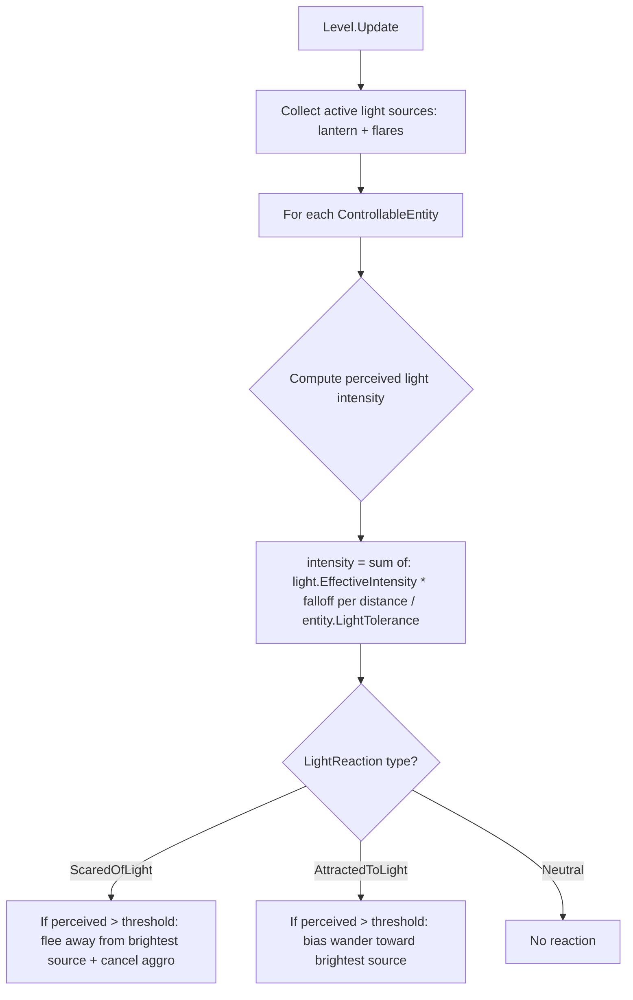

# Entity Light Reaction System — Implementation Plan

## Summary

Two features:
1. **Player remains static when controlling an animal** — Already implemented via `PlayerState.Controlling`. The Luminous Isopod special case (player moves normally) is preserved. No changes needed; verify no regressions.
2. **Entities react to light** — Fast entities flee from light (lantern + flares); slow entities are attracted to light. Reaction strength is a gradient based on light intensity, range, and per-entity tolerance.

---

## Feature 1: Player Static During Control (Verification Only)

The current implementation in `EntityControlSystem.BeginControl()` already calls `_player.SetState(PlayerState.Controlling)`, which freezes the player body (gravity off, damping 99, velocity zeroed). The Luminous Isopod bypasses this via `IsIsopodAttached` — player moves normally while the isopod rides along.

**Action:** No code changes. Verify during testing that the player body is frozen for all 6 non-Isopod entity types.

---

## Feature 2: Light Reaction System

### Architecture



### Step-by-step Changes

---

### Step 1: Add `LightReactionType` enum and base-class properties to `ControllableEntity`

**File:** `Bloop/Entities/ControllableEntity.cs`

Add a new enum at the top of the namespace:

```csharp
public enum LightReactionType
{
    Neutral,         // No reaction to light
    ScaredOfLight,   // Flees from light sources (fast entities)
    AttractedToLight // Wanders toward light sources (slow entities)
}
```

Add new virtual properties and state fields to `ControllableEntity`:

```csharp
// ── Light reaction ──────────────────────────────────────────────────
/// <summary>How this entity reacts to light (lantern + flares).</summary>
public virtual LightReactionType LightReaction => LightReactionType.Neutral;

/// <summary>
/// Light tolerance threshold (0–1). Higher = more tolerant (needs brighter/closer light to react).
/// At 0.0, the entity reacts to any light. At 1.0, only direct lantern contact triggers a reaction.
/// </summary>
public virtual float LightTolerance => 0.5f;

/// <summary>
/// Perceived light intensity this frame (0–1). Computed by Level.Update() from
/// nearby lantern/flare sources. 0 = total darkness, 1 = maximum illumination.
/// </summary>
public float PerceivedLightIntensity { get; private set; }

/// <summary>
/// Direction toward the brightest light source affecting this entity.
/// Normalized vector, or Vector2.Zero if no light is perceived.
/// </summary>
public Vector2 BrightestLightDirection { get; private set; }

/// <summary>
/// Called by Level.Update() each frame to provide light perception data.
/// </summary>
public void SetLightPerception(float intensity, Vector2 brightestDirection)
{
    PerceivedLightIntensity = intensity;
    BrightestLightDirection = brightestDirection;
}

/// <summary>
/// Returns the effective reaction strength (0–1) after applying tolerance.
/// 0 = no reaction, 1 = maximum reaction. Used by subclass idle AI.
/// </summary>
protected float GetLightReactionStrength()
{
    if (LightReaction == LightReactionType.Neutral) return 0f;
    // Reaction = perceived intensity minus tolerance, clamped to 0–1
    return MathHelper.Clamp(PerceivedLightIntensity - LightTolerance, 0f, 1f)
         / MathHelper.Max(1f - LightTolerance, 0.01f); // normalize to 0–1 range
}
```

---

### Step 2: Configure per-entity light reaction properties

Each entity subclass overrides `LightReaction` and `LightTolerance`:

| Entity | LightReaction | LightTolerance | Rationale |
|--------|--------------|----------------|-----------|
| **EchoBat** | `ScaredOfLight` | `0.15` | Very sensitive — nocturnal predator |
| **ChainCentipede** | `ScaredOfLight` | `0.30` | Moderately sensitive — armored but prefers dark |
| **SilkWeaverSpider** | `ScaredOfLight` | `0.25` | Sensitive — ambush predator, avoids exposure |
| **BlindCaveSalamander** | `AttractedToLight` | `0.40` | Moderate tolerance — blind, drawn to warmth |
| **LuminescentGlowworm** | `AttractedToLight` | `0.50` | High tolerance — already emits light |
| **DeepBurrowWorm** | `AttractedToLight` | `0.35` | Moderate — subterranean, curious about light |
| **LuminousIsopod** | `AttractedToLight` | `0.55` | Highest tolerance — emits its own light |

**Files to modify:** Each entity `.cs` file — add two property overrides.

---

### Step 3: Compute light perception in `Level.Update()`

**File:** `Bloop/World/Level.cs`

The `Level.Update()` method already iterates over all entities to set player position. We extend this loop to also compute light perception from the player's lantern and any active flare objects.

The computation for each entity:
1. Collect light sources: player lantern position + radius, and all `FlareObject` instances in `_objects`.
2. For each entity, compute perceived intensity as the **maximum** contribution from any single source (not summed — avoids double-counting overlapping lights):
   ```
   contribution = source.EffectiveIntensity * max(0, 1 - distance / source.EffectiveRadius)
   ```
3. Track the direction toward the source with the highest contribution.
4. Call `entity.SetLightPerception(maxIntensity, directionToBrightest)`.

**New method signature:**
```csharp
public void Update(GameTime gameTime, Gameplay.Player? player = null,
    LightSource? playerLantern = null)
```

The `playerLantern` parameter is passed from `GameplayScreen` (which already owns the lantern `LightSource`). Flare lights are discovered by iterating `_objects` for `FlareObject` instances that have an associated `LightSource`.

**Alternative:** Instead of passing the lantern, we can pass a `List<LightSource>` of "reaction-triggering" lights. This is cleaner and more extensible.

```csharp
public void Update(GameTime gameTime, Gameplay.Player? player = null,
    IReadOnlyList<LightSource>? reactionLights = null)
```

`GameplayScreen` builds this list each frame: `[playerLantern, ...activeFlareLights]`.

---

### Step 4: Implement flee-from-light in fast entities

**Files:** `EchoBat.cs`, `ChainCentipede.cs`, `SilkWeaverSpider.cs`

In each entity's `UpdateIdle()`, add a light reaction check **early** (before aggro checks):

```csharp
// ── Light reaction: flee from light ────────────────────────────────
float lightStrength = GetLightReactionStrength();
if (lightStrength > 0f && BrightestLightDirection != Vector2.Zero)
{
    // Flee away from the brightest light source
    Vector2 fleeDir = -BrightestLightDirection;
    if (fleeDir.LengthSquared() > 0.01f)
        fleeDir = Vector2.Normalize(fleeDir);
    
    // Speed scales with reaction strength (stronger light = faster flee)
    float fleeSpeed = IdleWanderSpeed * (1f + lightStrength * 2f);
    SetVelocity(fleeDir * fleeSpeed);  // or appropriate per-entity velocity
    
    // Cancel any active aggro state
    _isAggro = false;         // EchoBat
    _isDropping = false;      // ChainCentipede  
    _isLunging = false;       // SilkWeaverSpider
    
    return; // skip normal idle AI this frame
}
```

**Key behavior details:**
- Light reaction takes **priority over aggro** — if the entity is in light, it won't attack.
- Flee speed scales with `lightStrength` — brighter light = faster retreat.
- Once the entity leaves the light radius, `PerceivedLightIntensity` drops to 0 and normal AI resumes.

---

### Step 5: Implement attract-to-light in slow entities

**Files:** `BlindCaveSalamander.cs`, `LuminescentGlowworm.cs`, `DeepBurrowWorm.cs`, `LuminousIsopod.cs`

In each entity's `UpdateIdle()`, add a light attraction bias **after** effect checks but **before** normal wander:

```csharp
// ── Light reaction: attracted to light ─────────────────────────────
float lightStrength = GetLightReactionStrength();
if (lightStrength > 0f && BrightestLightDirection != Vector2.Zero)
{
    // Bias movement toward the brightest light source
    // Blend between normal wander direction and light direction
    Vector2 lightDir = BrightestLightDirection;
    if (lightDir.LengthSquared() > 0.01f)
        lightDir = Vector2.Normalize(lightDir);
    
    float attractSpeed = MovementSpeed * 0.3f * lightStrength;
    SetVelocity(lightDir * attractSpeed);
    // Don't return — allow normal wander to blend on subsequent frames
    // when light is weak. For strong light, this velocity dominates.
    return; // skip normal wander when actively attracted
}
```

**Key behavior details:**
- Attraction is a **bias**, not an override — at low `lightStrength`, the entity drifts slowly toward light.
- At high `lightStrength`, the entity moves more purposefully toward the source.
- The `BlindCaveSalamander` already flees from the player — light attraction should be checked **after** the player-flee check, so the salamander still flees if the player is too close, but wanders toward distant light otherwise.
- For `LuminousIsopod` idle state: attraction only applies when not scattered/regrouping.

---

### Step 6: Update `GameplayScreen` to pass reaction lights

**File:** `Bloop/Screens/GameplayScreen.cs`

In the `Update()` method, build the reaction lights list and pass it to `Level.Update()`:

```csharp
// Build list of light sources that trigger entity reactions
var reactionLights = new List<LightSource>();
if (_playerLantern != null && _player.Stats.LanternFuel > 0f)
    reactionLights.Add(_playerLantern);
// Add active flare lights
foreach (var obj in _level.Objects)
{
    if (obj is FlareObject flare && !flare.IsDestroyed && flare.Light != null)
        reactionLights.Add(flare.Light);
}

_level.Update(gameTime, _player, reactionLights);
```

This requires checking how `FlareObject` exposes its `LightSource`. If it doesn't currently expose it, add a public property.

---

### Step 7: Verify FlareObject exposes its LightSource

**File:** `Bloop/Objects/FlareObject.cs`

Ensure `FlareObject` has a public `LightSource? Light` property so `GameplayScreen` can collect flare lights for the reaction system.

---

## File Change Summary

| File | Change Type | Description |
|------|-------------|-------------|
| `Bloop/Entities/ControllableEntity.cs` | **Modify** | Add `LightReactionType` enum, light reaction properties, perception state, helper method |
| `Bloop/Entities/EchoBat.cs` | **Modify** | Override `LightReaction`/`LightTolerance`, add flee-from-light in `UpdateIdle` |
| `Bloop/Entities/ChainCentipede.cs` | **Modify** | Override `LightReaction`/`LightTolerance`, add flee-from-light in `UpdateIdle` |
| `Bloop/Entities/SilkWeaverSpider.cs` | **Modify** | Override `LightReaction`/`LightTolerance`, add flee-from-light in `UpdateIdle` |
| `Bloop/Entities/BlindCaveSalamander.cs` | **Modify** | Override `LightReaction`/`LightTolerance`, add attract-to-light in `UpdateIdle` |
| `Bloop/Entities/LuminescentGlowworm.cs` | **Modify** | Override `LightReaction`/`LightTolerance`, add attract-to-light in `UpdateIdle` |
| `Bloop/Entities/DeepBurrowWorm.cs` | **Modify** | Override `LightReaction`/`LightTolerance`, add attract-to-light in `UpdateIdle` |
| `Bloop/Entities/LuminousIsopod.cs` | **Modify** | Override `LightReaction`/`LightTolerance`, add attract-to-light in `UpdateIdle` |
| `Bloop/World/Level.cs` | **Modify** | Add light perception computation in `Update()`, accept reaction lights parameter |
| `Bloop/Screens/GameplayScreen.cs` | **Modify** | Build reaction lights list, pass to `Level.Update()` |
| `Bloop/Objects/FlareObject.cs` | **Modify** | Expose `LightSource?` property (if not already public) |

---

## Tolerance & Intensity Design

The gradient system works as follows:

```
perceived_intensity = max over all reaction lights of:
    light.EffectiveIntensity * max(0, 1 - distance / light.EffectiveRadius)

reaction_strength = clamp((perceived_intensity - tolerance) / (1 - tolerance), 0, 1)
```

**Example scenarios:**
- EchoBat (tolerance 0.15) at 50% of lantern radius: perceived ≈ 0.5, reaction = (0.5-0.15)/(1-0.15) ≈ 0.41 → moderate flee
- EchoBat at edge of lantern radius: perceived ≈ 0.0, reaction = 0 → no reaction
- ChainCentipede (tolerance 0.30) at 30% of lantern radius: perceived ≈ 0.7, reaction = (0.7-0.3)/(1-0.3) ≈ 0.57 → strong flee
- LuminescentGlowworm (tolerance 0.50) at 80% of lantern radius: perceived ≈ 0.2, reaction = 0 → no reaction (too tolerant)
- LuminescentGlowworm at 20% of lantern radius: perceived ≈ 0.8, reaction = (0.8-0.5)/(1-0.5) = 0.6 → moderate attraction

This creates natural gameplay where:
- Sensitive entities (bats) scatter when the player enters a room with their lantern
- Tolerant entities (glowworms, isopods) only react when the player is quite close
- Flares can be used strategically to scare predators or lure slow creatures
