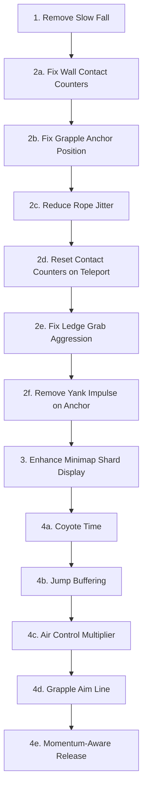

# Gameplay Fixes & Improvements Plan

## 1. Remove Slow Fall Mechanic

### Analysis
The "slow fall" / wall-slide mechanic is in [`PlayerController.Update()`](Bloop/Gameplay/PlayerController.cs:289-315). When the player is:
- Not grounded
- Touching a wall
- **Pressing horizontal input toward the wall**
- In `Falling` state
- Wall jump cooldown is expired

...the downward velocity is clamped to `WallSlideMaxFallSpeed` (60 px/s).

### Changes Required

**File: [`PlayerController.cs`](Bloop/Gameplay/PlayerController.cs)**
- **Delete** the wall-slide friction block (lines 289–315) — the entire section from `// ── Wall-slide friction` through the closing brace of the `if` block.
- **Delete** the constant [`WallSlideMaxFallSpeed`](Bloop/Gameplay/PlayerController.cs:33) (line 33).
- The wall-slide comment block at lines 27–34 can be removed entirely.

No other files reference `WallSlideMaxFallSpeed`, so this is a clean removal.

---

## 2. Fix Hook, Movement & Collision Glitches

### Root Cause Analysis

After reviewing the physics and collision code, several issues contribute to glitchy behavior:

#### 2a. Wall contact counter drift
**File: [`Player.cs`](Bloop/Gameplay/Player.cs:444-494)**

The wall contact detection uses `OnCollision`/`OnSeparation` callbacks with contact normal analysis. The problem is that contact normals can change between collision and separation events, causing the counters (`_leftWallContactCount`, `_rightWallContactCount`) to drift — a collision increments the left counter but the separation decrements the right counter because the normal shifted.

**Fix:** Track wall contacts by fixture pair rather than relying on normal direction matching between collision and separation. Alternatively, add a **per-frame reset** of wall contact state using a raycast or overlap test instead of relying on callback counters.

**Recommended approach — raycast-based wall detection:**
- Each frame, cast two short horizontal rays (left and right) from the player center.
- Set `IsTouchingWallLeft`/`IsTouchingWallRight` based on ray hits.
- Remove the callback-based wall counter logic entirely.
- This eliminates counter drift and gives frame-accurate wall state.

#### 2b. Grapple hook anchor creation during physics step
**File: [`GrapplingHook.cs`](Bloop/Gameplay/GrapplingHook.cs:308-327)**

The `OnHookCollision` callback sets `_pendingAnchor = true` and stores the position. The anchor is finalized in `Update()`. However, between the collision callback and `Update()`, the hook body's position may have been modified by the physics solver, causing the anchor to be placed at a slightly wrong position.

**Fix:** Store the **contact point** from the `Contact` object rather than the hook body position:
- In `OnHookCollision`, extract the contact point via `contact.GetWorldManifold(out _, out var points)` and use `points[0]` as the anchor position.
- This gives the exact terrain surface point rather than the hook body center.

#### 2c. Rope joint oscillation / jitter when rope is taut
**File: [`GrapplingHook.cs`](Bloop/Gameplay/GrapplingHook.cs:177-184)**

The `RopeJoint` allows slack but when taut, the constraint solver can cause oscillation, especially when the player is near the anchor. The initial yank impulse (line 194-199) also fights the joint constraint.

**Fix:**
- Add a small `LinearDamping` (0.3–0.5) to the player body while in `Swinging` state to reduce oscillation.
- In [`Player.ApplyStateBodyConfig()`](Bloop/Gameplay/Player.cs:236-239), set `LinearDamping = 0.3f` for the `Swinging` state instead of 0.1f.

#### 2f. Remove yank impulse on grapple anchor — player should not be pulled
**File: [`GrapplingHook.cs`](Bloop/Gameplay/GrapplingHook.cs:194-199)**

When the hook anchors to a surface, a `2.5f` impulse is applied toward the anchor point, yanking the player. This feels wrong — the player should remain stationary when the rope attaches and only move when they provide input or gravity acts on them.

**Fix:**
- **Delete** the entire yank impulse block in `GrapplingHook.Update()` (lines 194-199):
  ```csharp
  // DELETE THIS BLOCK:
  Vector2 toAnchor = _pendingAnchorPos - _ownerPlayer.Body.Position;
  if (toAnchor.LengthSquared() > 0.0001f)
  {
      toAnchor.Normalize();
      _ownerPlayer.Body.ApplyLinearImpulse(toAnchor * 2.5f);
  }
  ```
- The `RopeJoint` constraint is sufficient — it prevents the player from moving beyond the rope length. Gravity and player input handle all movement naturally.
- If the player is grounded when the hook anchors, they stay grounded. If airborne, they begin a natural pendulum swing from gravity alone.

#### 2d. Ground contact counter can go negative or stale
**File: [`Player.cs`](Bloop/Gameplay/Player.cs:447-451)**

The foot sensor collision uses `_groundContactCount++` on collision and `Math.Max(0, _groundContactCount - 1)` on separation. If the player body is teleported (e.g., during mantle), contacts may not fire separation events, leaving the counter elevated.

**Fix:** Reset `_groundContactCount` to 0 when entering `Mantling` state and when teleporting the player body position (in `ReloadLevel`). Add a reset method:
```csharp
public void ResetContactCounters()
{
    _groundContactCount = 0;
    _leftWallContactCount = 0;
    _rightWallContactCount = 0;
}
```
Call it from `StartMantle()` and from `GameplayScreen.ReloadLevel()`.

#### 2e. Ledge grab triggers too aggressively
**File: [`PlayerController.CheckLedgeGrab()`](Bloop/Gameplay/PlayerController.cs:346-405)**

The ledge grab can trigger when the player is moving upward past a ledge during a wall jump, causing unexpected mantling mid-jump.

**Fix:** Add a velocity check — only allow ledge grab when the player is falling (vertical velocity > 0):
```csharp
// Only grab ledges when falling, not when jumping upward
if (_player.Body.LinearVelocity.Y < 0f) return;
```

---

## 3. Show Shard Positions on Minimap

### Analysis
**File: [`Minimap.cs`](Bloop/UI/Minimap.cs:96-111)**

The minimap already draws shards! Looking at lines 96-111, it iterates `level.Objects`, finds `ResonanceShard` instances, and draws them. However, the current implementation only draws shards that are **not destroyed** — it does NOT filter by discovery state, so shards should already be visible.

The issue is likely that the shard dots are too small (same size as tiles) and blend into the undiscovered black area. The shards are drawn as `scale + 2` pixel rectangles in `ShardColor` (purple), but on undiscovered tiles they sit on a transparent/black background and are hard to spot.

### Changes Required

**File: [`Minimap.cs`](Bloop/UI/Minimap.cs)**

Make shard indicators more prominent and always visible:

1. **Add a pulsing animation** to shard dots so they stand out:
   - Use `AnimationClock.Pulse()` to modulate the shard dot size and alpha.
   - Draw a small pulsing glow ring around each shard position.

2. **Draw shards AFTER the player dot** or with a distinct larger size:
   - Increase shard dot size to `scale + 4` pixels.
   - Add a secondary outer glow rectangle at `scale + 6` with lower alpha.

3. **Add a directional indicator** — draw a small arrow or line from the player dot toward the nearest uncollected shard when shards are off-screen from the minimap viewport. Since the minimap shows the full level, this is less critical, but the pulsing will help.

4. **Differentiate collected vs uncollected** — collected shards could show as a dim dot, uncollected as bright pulsing.

---

## 4. Suggested Game Mechanic Improvements

Based on the full codebase analysis, here are improvements that would enhance gameplay feel:

### 4a. Coyote Time for Jumping
**File: [`PlayerController.cs`](Bloop/Gameplay/PlayerController.cs:240-257)**

Currently, the player can only jump when `IsGrounded` is true. Add a small grace period after leaving a platform where jumping is still allowed.

**Implementation:**
- Add a `_coyoteTimer` field (0.12s window).
- When `IsGrounded` transitions from true to false, start the timer.
- Allow jumping if `_coyoteTimer > 0` even when not grounded.

### 4b. Jump Buffering
**File: [`PlayerController.cs`](Bloop/Gameplay/PlayerController.cs:240-257)**

If the player presses jump slightly before landing, the jump should still trigger on landing.

**Implementation:**
- Add a `_jumpBufferTimer` field (0.1s window).
- When jump is pressed while airborne, start the buffer timer.
- On landing, if `_jumpBufferTimer > 0`, auto-trigger the jump.

### 4c. Better Air Control
**File: [`PlayerController.cs`](Bloop/Gameplay/PlayerController.cs:194-233)**

Currently air control uses the same `MoveForce` as ground movement. Air control should be slightly reduced but still responsive.

**Implementation:**
- Add an `AirControlMultiplier` constant (0.7f).
- When not grounded, multiply the applied horizontal force by this factor.
- This gives the player less air authority while still feeling responsive.

### 4d. Grapple Hook Visual Feedback — Aim Line
**File: [`GrapplingHook.cs`](Bloop/Gameplay/GrapplingHook.cs)**

Add a faint aim line from the player toward the mouse cursor when the grapple is ready to fire. This helps the player aim in dark environments.

**Implementation:**
- In `GrapplingHook.Draw()`, when not flying and not anchored, draw a faint dotted line from player to mouse cursor direction, capped at `MaxRange`.
- Use a dim color with low alpha so it does not clutter the screen.

### 4e. Momentum Preservation on Rope Release
**File: [`GrapplingHook.Release()`](Bloop/Gameplay/GrapplingHook.cs:111-141)**

The current 1.2x velocity boost on release is good, but the direction should be biased toward the player's swing direction rather than a flat multiplier on both axes. Currently, if the player releases at the bottom of a swing, the upward component gets boosted too, which can feel unnatural.

**Implementation:**
- On release, only boost the component of velocity that is tangential to the rope direction.
- Keep the radial component unchanged.

---

## Implementation Order



## Files Modified

| File | Changes |
|------|---------|
| [`PlayerController.cs`](Bloop/Gameplay/PlayerController.cs) | Remove wall-slide, add coyote time, jump buffer, air control multiplier, fix ledge grab |
| [`Player.cs`](Bloop/Gameplay/Player.cs) | Fix wall contact detection, add contact counter reset, adjust swinging damping |
| [`GrapplingHook.cs`](Bloop/Gameplay/GrapplingHook.cs) | Fix anchor position, reduce yank impulse, add aim line, improve release momentum |
| [`Minimap.cs`](Bloop/UI/Minimap.cs) | Pulsing shard indicators, larger dots, glow effect |
| [`GameplayScreen.cs`](Bloop/Screens/GameplayScreen.cs) | Call ResetContactCounters on level reload |
