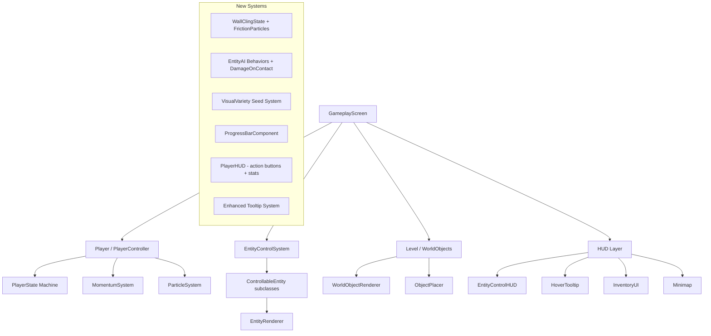

# Gameplay, Visual & HUD Improvements Plan

## Overview

This plan covers requested features and suggested improvements for the Bloop 2D platformer, organized into 5 major areas: **Wall Cling Mechanic**, **Entity Behaviors & Damage**, **Visual Variety**, **Recharging Object Progress Bars**, **HUD & Tooltip System**, plus **Suggested Improvements**.

---

## Architecture Context



---

## 1. Wall Cling Mechanic (Gameplay)

### Current State
- [`Player.cs`](Bloop/Gameplay/Player.cs) has `PlayerState.Falling` and wall detection via `IsTouchingWallLeft` / `IsTouchingWallRight`
- [`PlayerController.cs`](Bloop/Gameplay/PlayerController.cs) performs wall raycasts each frame in `UpdateWallDetection()` and supports wall jumps
- No wall-slide deceleration or wall-cling exists — the player falls at full speed along walls

### Implementation

**1.1 New PlayerState: `WallClinging`**
- Add `WallClinging` to [`PlayerState`](Bloop/Gameplay/Player.cs:17) enum
- In [`ApplyStateBodyConfig()`](Bloop/Gameplay/Player.cs:236): set `IgnoreGravity = true`, `LinearDamping = 99f`, `LinearVelocity = Zero` — player sticks to the wall
- Reset `_peakFallVelMs` when entering WallClinging (absorbs fall impact)

**1.2 Wall Slide → Cling Transition in PlayerController**
- When `Falling` + `IsTouchingWall` + pressing toward wall:
  - Gradually increase `LinearDamping` from 0 → 20 over ~0.5s (deceleration phase)
  - Track a `_wallSlideTimer` that counts up while conditions hold
  - When vertical velocity drops below a threshold (~10 px/s) OR timer exceeds 0.6s → transition to `WallClinging`
- While `WallClinging`:
  - Jump input → wall jump (existing logic)
  - Release directional input toward wall → detach, enter `Falling`
  - Down input → release cling, resume falling
  - Up input → slow climb upward if wall continues above

**1.3 Friction/Smoke Particle Effect**
- In [`ParticleSystem`](Bloop/Effects/ParticleSystem.cs) or a new dedicated emitter on the player:
  - Emit small grey-white smoke puffs at the contact point between player and wall
  - Contact point = player edge on the wall side, at vertical center
  - Emission rate scales with fall speed: faster fall = more particles
  - Particles drift slightly away from wall + upward, fade over 0.3–0.5s
  - Color: warm grey `Color(180, 170, 160)` → transparent
- In [`PlayerRenderer`](Bloop/Rendering/PlayerRenderer.cs): draw friction streaks on the player body during wall slide phase

### Files Modified
- [`Player.cs`](Bloop/Gameplay/Player.cs) — new state + body config
- [`PlayerController.cs`](Bloop/Gameplay/PlayerController.cs) — wall slide/cling logic
- [`PlayerRenderer.cs`](Bloop/Rendering/PlayerRenderer.cs) — friction visual on player body
- [`ParticleSystem.cs`](Bloop/Effects/ParticleSystem.cs) or new `WallFrictionEmitter` — smoke particles
- [`GameplayScreen.cs`](Bloop/Screens/GameplayScreen.cs) — wire up emitter

---

## 2. Entity Behaviors & Contact Damage (Gameplay)

### Current State
- 7 entity types exist in [`Entities/`](Bloop/Entities/) — all extend [`ControllableEntity`](Bloop/Entities/ControllableEntity.cs)
- Each has `UpdateIdle()` with basic wander AI
- [`ObjectPlacer.cs`](Bloop/Generators/ObjectPlacer.cs:1221) places entities with fixed counts per biome
- No contact damage system exists — entities are passive when not controlled

### 2.1 Entity Contact Damage System

**On ControllableEntity base class:**
- Add `virtual bool DamagesPlayerOnContact => false` property
- Add `virtual float ContactDamage => 0f` and `virtual float ContactStunDuration => 0f`
- In [`Level.cs`](Bloop/World/Level.cs) update loop: for each non-controlled entity where `DamagesPlayerOnContact == true`, perform AABB overlap with player → call `player.Stats.TakeDamage()` + `player.Stun()` with a 1s invulnerability cooldown

**Per-entity damage configuration:**

| Entity | Damages Player? | Damage | Stun | Rationale |
|--------|----------------|--------|------|-----------|
| EchoBat | Yes | 5 | 0.3s | Swoops and scratches |
| SilkWeaverSpider | Yes | 8 | 0.5s | Venomous bite |
| ChainCentipede | Yes | 12 | 0.8s | Aggressive, armored |
| LuminescentGlowworm | No | — | — | Docile, light-producing |
| DeepBurrowWorm | Yes | 10 | 0.5s | Ambush predator |
| BlindCaveSalamander | No | — | — | Timid, avoids player |
| LuminousIsopod | No | — | — | Friendly, attaches to player |

### 2.2 Differentiated Idle Behaviors

Each entity should have distinct AI personality:

**EchoBat** — Gregarious (groups of 3–5)
- Current: solo wander near roost ✓
- Add: when multiple bats are nearby, they form loose flocks — pick wander targets near each other
- Aggro behavior: when player approaches within 80px, swoop toward player briefly then retreat

**SilkWeaverSpider** — Solitary (1–2 per area)
- Current: basic wander ✓  
- Add: patrol along wall surfaces, occasionally stop and "web" (visual only)
- Aggro: lunges toward player when within 60px, then retreats to wall

**ChainCentipede** — Gregarious (groups of 2–4)
- Current: basic wander ✓
- Add: patrol ceiling in chains (follow-the-leader), speed up when player is below
- Aggro: drops from ceiling toward player, then scurries back up

**LuminescentGlowworm** — Gregarious (groups of 4–6)
- Current: basic wander ✓
- Add: cluster together, synchronized pulsing glow, drift slowly as a group
- No aggro — peaceful ambient creatures

**DeepBurrowWorm** — Solitary (1 per area)
- Current: basic wander ✓
- Add: burrows underground periodically, emerges near player if they walk over its area
- Aggro: ambush from below when player is directly above

**BlindCaveSalamander** — Semi-gregarious (pairs)
- Current: basic wander ✓
- Add: follows water edges, flees from player when approached within 100px
- No aggro — timid creature

**LuminousIsopod** — Gregarious (groups of 3–5)
- Current: basic wander ✓
- Add: cluster near light sources, scatter when startled, regroup after 5s
- No aggro — friendly

### 2.3 Entity Spawn Counts in ObjectPlacer

Modify [`ObjectPlacer.cs`](Bloop/Generators/ObjectPlacer.cs) entity placement to spawn groups:
- Gregarious entities: place 2–5 within a 3-tile radius of the anchor point
- Solitary entities: enforce minimum 8-tile spacing between same-type
- Scale counts with depth: deeper levels have more aggressive entities

### Files Modified
- [`ControllableEntity.cs`](Bloop/Entities/ControllableEntity.cs) — damage properties
- All 7 entity subclasses — override damage flags + enhanced `UpdateIdle()`
- [`Level.cs`](Bloop/World/Level.cs) — contact damage check in update loop
- [`ObjectPlacer.cs`](Bloop/Generators/ObjectPlacer.cs) — group spawning logic
- [`Player.cs`](Bloop/Gameplay/Player.cs) — invulnerability timer for contact damage

---

## 3. Visual Variety (Rendering)

### Current State
- World objects use deterministic seeds based on position: `int seed = (int)(pixelPos.X * N + pixelPos.Y * M)`
- Colors are static constants in renderers
- No per-instance variation in hue, size, or shape

### 3.1 Visual Variety Seed System

**Approach:** Each world object and entity gets a `VisualSeed` (already partially exists as `tileHash` / position-based seeds). Extend this to drive:

1. **Color Hue Shift** — ±10–20° hue rotation per instance
2. **Size Scale** — ±10–15% scale variation
3. **Shape Variation** — different lobe counts, facet counts, tendril counts
4. **Animation Phase Offset** — already partially done, extend to all objects

**Implementation in WorldObjectRenderer:**
- Add a `VisualVariant` struct: `{ float HueShift, float Scale, int ShapeVariant, float PhaseOffset }`
- Derive from seed: `HueShift = HashSigned(seed) * 15f` degrees, `Scale = 0.9f + Hash01(seed+1) * 0.2f`, etc.
- Apply in each `DrawXxx()` method by modulating base colors and dimensions

**Per-object variety examples:**
- **GlowVine**: stem color shifts green↔teal, leaf count varies 3–6, node brightness varies
- **CaveLichen**: rosette color shifts yellow-green↔lime, lobe count 4–6
- **BlindFish**: body tint shifts blue↔silver, tail length varies
- **StunDamageObject**: iris color shifts red↔magenta, vein density varies
- **VentFlower**: petal count 5–7, stem curvature varies, color shifts cyan↔emerald
- **RootClump**: tendril count 3–6, bark color shifts brown↔grey
- **PhosphorMoss**: frond count already varies (12–15), add tip color shift green↔yellow
- **IonStone**: facet count 5–8, arc color shifts violet↔blue
- **CrystalCluster**: already has 3 variants ✓, add per-shard size variation

### 3.2 Visually Indicate Damaging Entities

Entities that damage the player on contact need clear visual tells:

- **Red/orange pulsing aura** around damaging entities (not controlled)
- **Aggressive eye glow** — red eyes pulse faster when player is nearby
- **Warning particles** — small red sparks orbit the entity
- **Posture change** — damaging entities adopt aggressive stance when player approaches

In [`EntityRenderer.cs`](Bloop/Rendering/EntityRenderer.cs):
- Add `DrawDangerIndicator()` helper called for entities where `DamagesPlayerOnContact == true && !IsControlled`
- Draws: pulsing red outline, orbiting warning sparks, proximity-reactive intensity

### Files Modified
- [`WorldObjectRenderer.cs`](Bloop/Rendering/WorldObjectRenderer.cs) — color/shape modulation per object
- [`EntityRenderer.cs`](Bloop/Rendering/EntityRenderer.cs) — danger indicators + variety
- Individual object classes — pass variety seed to renderer

---

## 4. Recharging Object Progress Bars (Visual/UI)

### Current State
- [`VentFlower`](Bloop/Objects/VentFlower.cs) already has a progress ring in its renderer (segmented arc around center)
- But it is drawn as part of the world object, not as a clear HUD-style progress bar
- Other recharging objects (CrystalCluster cooldown, etc.) have no progress indication

### 4.1 World-Space Progress Bar Component

Create a reusable `WorldProgressBar` utility:

```
WorldProgressBar.Draw(sb, assets, position, progress01, width, height, fgColor, bgColor, label?)
```

- Drawn in world space above the object
- Thin bar (3–4px tall, 30–40px wide) with background + fill + optional label
- Only visible when pre-activation conditions are met (player in zone, etc.)
- Smooth fill animation (lerp toward target)
- Pulse effect when complete

**Objects that need progress bars:**
- **VentFlower** — 5s standing timer (replace current segmented ring with clearer bar)
- **GlowVine** — illumination progress when player is nearby with lantern
- **Any future recharging objects**

### 4.2 Cooldown Overlay for Spent Objects

When a recharging object is on cooldown after activation:
- Show a dimmed circular cooldown sweep (like the entity control button)
- Grey-out the object visually
- Show remaining cooldown time as small text

### Files Modified
- New file: `Bloop/Rendering/WorldProgressBar.cs`
- [`VentFlower.cs`](Bloop/Objects/VentFlower.cs) — use new progress bar
- [`WorldObjectRenderer.cs`](Bloop/Rendering/WorldObjectRenderer.cs) — integrate progress bar calls
- [`GlowVine.cs`](Bloop/Objects/GlowVine.cs) — add progress bar for illumination

---

## 5. HUD System & Action Buttons (UI)

### Current State
- [`GameplayScreen.DrawHUD()`](Bloop/Screens/GameplayScreen.cs:646) draws stat bars (lantern, breath, health, kinetic), flare count, weight, debuffs, shard counter, depth/seed, state indicator, and a controls strip
- [`EntityControlHUD`](Bloop/UI/EntityControlHUD.cs) draws the Q button + entity control overlay
- No proper action button bar exists — controls are shown as a text strip at the top
- No visual button indicators for key actions

### 5.1 Action Button Bar (Bottom-Center)

Replace the text controls strip with a visual action button bar:

```
┌─────────────────────────────────────────────────────┐
│  [Space]  [S+Space]  [C]    [F]    [Q]    [Tab]    │
│   Jump    Rappel    Climb  Flare  Entity  Inventory │
└─────────────────────────────────────────────────────┘
```

Each button:
- Circular or rounded-rect icon with key label
- Dim when unavailable (e.g., Flare dim when count = 0, Entity dim when on cooldown)
- Bright/pulsing when ready and relevant
- Cooldown sweep overlay when applicable (Q button already has this)
- Contextual: only show relevant buttons for current state

**Buttons needed (discovered from InputManager + PlayerController):**

| Key | Action | Show When | Dim When |
|-----|--------|-----------|----------|
| Space | Jump | Always | Airborne + no wall |
| S+Space | Rappel | Airborne | On ground |
| C | Climb | Near climbable | Not near climbable |
| F | Throw Flare | Has flares | FlareCount = 0 |
| Q | Entity Control | Always | On cooldown |
| Tab | Inventory | Always | Never |
| E | Interact/Skill | Controlling entity | Skill on cooldown |
| LMB | Grapple/Select | Always | Context-dependent |
| RMB | Release/Cancel | Grapple active or selecting | Nothing active |

### 5.2 Stat Bars Redesign

Current bars are functional but plain. Improve:
- Add icons/symbols before each bar (flame for lantern, lungs for breath, heart for health, lightning for kinetic)
- Add numeric value display (e.g., "67/100")
- Low-value warning animations (bar flashes, icon pulses)
- Smooth bar transitions (lerp fill width)

### 5.3 Shard Counter Enhancement

- Move to a more prominent position (top-center is good)
- Add shard icon (diamond shape, already used for flares)
- Pulse animation when a shard is collected
- "EXIT OPEN" text gets a glowing border effect

### 5.4 Contextual Prompts

Show contextual prompts near the player in world space:
- "Press C to climb" when near a climbable surface
- "Press E to interact" when near an interactable object
- "Press Q to control" when near an entity (and ability is ready)
- These replace/supplement the tooltip system for actionable items

### Files Modified
- New file: `Bloop/UI/ActionButtonBar.cs` — the button bar component
- [`GameplayScreen.cs`](Bloop/Screens/GameplayScreen.cs) — integrate new HUD components
- [`EntityControlHUD.cs`](Bloop/UI/EntityControlHUD.cs) — merge Q button into action bar

---

## 6. Tooltip System Enhancement (UI)

### Current State
- [`HoverTooltip.cs`](Bloop/UI/HoverTooltip.cs) shows name + effect for objects under the mouse cursor
- Static dictionary of `Type → (name, effect)` — only 7 object types registered
- No entity tooltips, no tile-specific detail, no contextual actions

### 6.1 Expand Tooltip Coverage

Add entries for all object types:
- All controllable entities (show name, behavior, damage warning)
- IonStone, PhosphorMoss, CrystalCluster, FallingStalactite, FallingRubble
- ResonanceShard, FlareObject, ClimbableSurface, DominoPlatformChain

### 6.2 Rich Tooltip Format

Enhance the tooltip panel:
```
┌──────────────────────────┐
│ ⚠ Echo Bat               │  ← Name (with danger icon if damaging)
│ Swooping cave predator   │  ← Description
│ Damage: 5  Stun: 0.3s   │  ← Stats (if damaging)
│ [Q] Control (9s flight)  │  ← Action hint (if controllable + ready)
└──────────────────────────┘
```

- **Danger icon** (⚠ or red dot) for damaging entities
- **Action hint line** showing what the player can do
- **Stats line** for entities with damage
- **Color coding**: red for hazards, green for beneficial, cyan for controllable, white for neutral

### 6.3 Entity-Specific Tooltip Data

Add a `GetTooltipInfo()` virtual method to [`ControllableEntity`](Bloop/Entities/ControllableEntity.cs):
```csharp
public virtual (string description, string? actionHint) GetTooltipInfo()
```

Each entity overrides with its specific description and available action.

### Files Modified
- [`HoverTooltip.cs`](Bloop/UI/HoverTooltip.cs) — expanded dictionary, rich format, entity support
- [`ControllableEntity.cs`](Bloop/Entities/ControllableEntity.cs) — tooltip data method
- All entity subclasses — override tooltip info

---

## 7. Suggested Additional Improvements

### 7.1 Wall Slide Dust Trail (pairs with Wall Cling)
- When wall sliding, leave faint scratch marks on the wall tiles behind the player
- Marks fade over 3–5 seconds
- Adds environmental storytelling

### 7.2 Entity Awareness Indicators
- Small directional arrows at screen edges pointing toward nearby entities when in selection mode
- Helps player find controllable entities in the dark

### 7.3 Damage Flash Effect
- When player takes contact damage from an entity, flash the screen border red briefly (0.15s)
- Already have screen shake on stun — add the red vignette on top

### 7.4 Entity Taming Visual
- When controlling an entity, nearby same-type entities that are following show a small heart/link icon
- Reinforces the "pack leader" fantasy

### 7.5 Ambient Entity Sounds (Visual Substitute)
- Since there is no audio system, add visual "sound wave" indicators:
  - Bats: small concentric arcs when echolocating (idle)
  - Centipedes: tiny vibration lines when moving
  - Glowworms: gentle pulse rings synchronized across the group

### 7.6 Death Recap Tooltip
- On the GameOver screen, show what killed the player (fall damage, suffocation, entity contact, hazard)
- Track last damage source in PlayerStats

### 7.7 Minimap Entity Dots
- Show entity positions on the existing [`Minimap`](Bloop/UI/Minimap.cs) as colored dots
- Red for damaging, green for friendly, yellow for controllable
- Only show entities within lantern radius (discovered entities)

---

## Implementation Order

The features are ordered by dependency and impact:

1. **Entity contact damage system** (2.1) — foundation for danger indicators
2. **Entity idle behaviors + spawn groups** (2.2, 2.3) — makes entities feel alive
3. **Danger visual indicators** (3.2) — player needs to see which entities hurt
4. **Wall cling mechanic + particles** (1.1–1.3) — new core movement ability
5. **Visual variety system** (3.1) — enriches the world
6. **Progress bar component** (4.1–4.2) — reusable UI element
7. **HUD action button bar** (5.1) — player orientation
8. **Stat bars redesign** (5.2–5.3) — polish
9. **Tooltip expansion** (6.1–6.3) — information layer
10. **Contextual prompts** (5.4) — discoverability
11. **Suggested improvements** (7.x) — polish and feel
