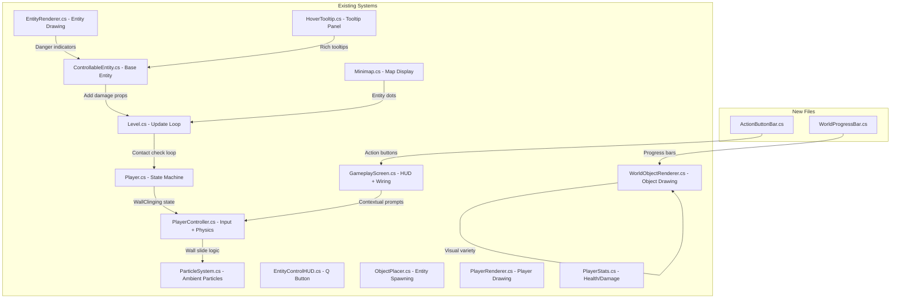

# Implementation Plan: Gameplay, Visual & HUD Improvements

## Overview

This document provides step-by-step implementation instructions for each feature in [`gameplay-visual-hud-improvements.md`](gameplay-visual-hud-improvements.md). Each task lists the exact files to modify, the changes to make, and integration points with existing systems.

The implementation order follows dependency chains — foundational systems first, then features that build on them.

---

## Architecture: Integration Points



---

## Task 1: Entity Contact Damage System

**Goal:** Entities that are hostile deal damage to the player on contact when not controlled.

### Files Modified

#### [`ControllableEntity.cs`](../Bloop/Entities/ControllableEntity.cs)
- Add three virtual properties after line 72:
  ```csharp
  /// <summary>Whether this entity damages the player on contact when idle.</summary>
  public virtual bool DamagesPlayerOnContact => false;
  /// <summary>Damage dealt on contact.</summary>
  public virtual float ContactDamage => 0f;
  /// <summary>Stun duration applied on contact.</summary>
  public virtual float ContactStunDuration => 0f;
  ```

#### [`EchoBat.cs`](../Bloop/Entities/EchoBat.cs)
- Override the three properties:
  ```csharp
  public override bool DamagesPlayerOnContact => true;
  public override float ContactDamage => 5f;
  public override float ContactStunDuration => 0.3f;
  ```

#### [`SilkWeaverSpider.cs`](../Bloop/Entities/SilkWeaverSpider.cs)
- `DamagesPlayerOnContact => true`, `ContactDamage => 8f`, `ContactStunDuration => 0.5f`

#### [`ChainCentipede.cs`](../Bloop/Entities/ChainCentipede.cs)
- `DamagesPlayerOnContact => true`, `ContactDamage => 12f`, `ContactStunDuration => 0.8f`

#### [`DeepBurrowWorm.cs`](../Bloop/Entities/DeepBurrowWorm.cs)
- `DamagesPlayerOnContact => true`, `ContactDamage => 10f`, `ContactStunDuration => 0.5f`

#### [`LuminescentGlowworm.cs`](../Bloop/Entities/LuminescentGlowworm.cs), [`BlindCaveSalamander.cs`](../Bloop/Entities/BlindCaveSalamander.cs), [`LuminousIsopod.cs`](../Bloop/Entities/LuminousIsopod.cs)
- No override needed — base returns `false` / `0f`

#### [`Player.cs`](../Bloop/Gameplay/Player.cs)
- Add invulnerability timer fields after `_stunTimer` (line 116):
  ```csharp
  private float _contactInvulnTimer = 0f;
  private const float ContactInvulnDuration = 1.0f;
  public bool IsContactInvulnerable => _contactInvulnTimer > 0f;
  ```
- In `Update()` method, tick the timer:
  ```csharp
  if (_contactInvulnTimer > 0f) _contactInvulnTimer -= dt;
  ```
- Add a public method:
  ```csharp
  public void ApplyContactDamage(float damage, float stunDuration)
  {
      if (IsContactInvulnerable || State == PlayerState.Dead) return;
      Stats.TakeDamage(damage);
      if (stunDuration > 0f) Stun(stunDuration);
      _contactInvulnTimer = ContactInvulnDuration;
  }
  ```

#### [`PlayerStats.cs`](../Bloop/Gameplay/PlayerStats.cs)
- Add a `LastDamageSource` string property for death recap:
  ```csharp
  public string? LastDamageSource { get; private set; }
  ```
- Modify `TakeDamage` to accept an optional source:
  ```csharp
  public void TakeDamage(float amount, string? source = null)
  {
      Health = MathHelper.Clamp(Health - amount, 0f, MaxHealth);
      if (source != null) LastDamageSource = source;
  }
  ```

#### [`Level.cs`](../Bloop/World/Level.cs)
- In `Update()`, after the existing AABB player contact dispatch block (around line 405), add entity contact damage check:
  ```csharp
  // Entity contact damage check
  if (player != null && !player.IsContactInvulnerable)
  {
      foreach (var obj in _objects)
      {
          if (obj is ControllableEntity entity
              && !entity.IsControlled
              && !entity.IsDestroyed
              && entity.DamagesPlayerOnContact)
          {
              var entityBounds = entity.GetBounds();
              if (!entityBounds.IsEmpty && entityBounds.Intersects(player.PixelBounds))
              {
                  player.ApplyContactDamage(entity.ContactDamage, entity.ContactStunDuration);
                  break; // only one hit per frame
              }
          }
      }
  }
  ```

### Integration Notes
- The existing `Player.Stun()` already triggers screen shake via `OnShakeRequested`
- The existing `PlayerStats.TakeDamage()` is already called from fall damage — adding the source parameter is backward-compatible with a default `null`
- `IsContactInvulnerable` prevents rapid multi-hits from the same entity

---

## Task 2: Entity Idle Behaviors

**Goal:** Each entity type has a distinct AI personality when not controlled.

### Files Modified — All 7 Entity Subclasses

Each entity's `UpdateIdle(GameTime)` method needs enhancement. The existing basic wander logic stays as a fallback; new behaviors layer on top.

#### [`EchoBat.cs`](../Bloop/Entities/EchoBat.cs) — Gregarious + Aggro Swoop
- Add fields: `_aggroTimer`, `_aggroTarget`, `_isAggro`
- In `UpdateIdle`: if player is within 80px and not controlled, set `_isAggro = true`, swoop toward player for 0.5s, then retreat to roost
- Flock behavior: if other EchoBats are within 120px, bias wander target toward their centroid

#### [`SilkWeaverSpider.cs`](../Bloop/Entities/SilkWeaverSpider.cs) — Solitary + Wall Patrol + Lunge
- Add fields: `_patrolDirection`, `_lungeTimer`, `_isLunging`
- In `UpdateIdle`: patrol along wall surfaces by checking adjacent solid tiles; occasionally stop for 1-2s
- Aggro: when player within 60px, lunge toward player for 0.3s, then retreat to wall

#### [`ChainCentipede.cs`](../Bloop/Entities/ChainCentipede.cs) — Gregarious + Ceiling Patrol + Drop
- Add fields: `_ceilingPatrolDir`, `_dropTimer`, `_isDropping`
- In `UpdateIdle`: patrol ceiling by moving horizontally while checking ceiling tiles above
- Aggro: when player is directly below within 100px, drop down briefly, then scurry back up

#### [`LuminescentGlowworm.cs`](../Bloop/Entities/LuminescentGlowworm.cs) — Gregarious + Cluster + Sync Glow
- Add fields: `_clusterCenter`, `_syncPhase`
- In `UpdateIdle`: drift slowly toward cluster center of nearby glowworms; synchronized pulsing glow
- No aggro — peaceful ambient creature

#### [`DeepBurrowWorm.cs`](../Bloop/Entities/DeepBurrowWorm.cs) — Solitary + Burrow + Ambush
- Add fields: `_burrowTimer`, `_isBurrowed`, `_ambushCooldown`
- In `UpdateIdle`: periodically burrow underground (set `IsBurrowing = true`, become invisible); when player walks within 40px above, emerge upward as ambush
- Already has `IsBurrowing` property used by renderer

#### [`BlindCaveSalamander.cs`](../Bloop/Entities/BlindCaveSalamander.cs) — Semi-gregarious + Water Edge + Flee
- Add fields: `_fleeFromPlayer`, `_fleeTimer`
- In `UpdateIdle`: bias wander toward water pool edges (check for WaterPool tiles nearby); when player approaches within 100px, flee in opposite direction for 2s

#### [`LuminousIsopod.cs`](../Bloop/Entities/LuminousIsopod.cs) — Gregarious + Light Cluster + Scatter
- Add fields: `_scatterTimer`, `_isScattered`, `_regroupTimer`
- In `UpdateIdle`: cluster near light sources (check for nearby LightSource positions); when player approaches within 60px, scatter randomly for 2s, then regroup over 5s

### Integration Notes
- All entities already have access to `PixelPosition` and `Body` for movement
- Player position can be obtained by scanning `Level.Objects` for the player or by adding a `PlayerPosition` property to a shared context — but since entities don't have a direct player reference, the aggro behaviors should use a proximity check against all bodies tagged as player
- **Alternative approach**: Add a `SetPlayerReference(Player)` method to `ControllableEntity` called from `Level.Update()`, storing a weak reference for proximity checks. This is cleaner than scanning objects.

---

## Task 3: Entity Spawn Groups

**Goal:** Gregarious entities spawn in clusters; solitary entities have enforced spacing.

### Files Modified

#### [`ObjectPlacer.cs`](../Bloop/Generators/ObjectPlacer.cs)
- Modify `PlaceControllableEntities()` (line 1232):
  - **EchoBat**: Change `maxCount` to `3 + depth` (capped at 5). When placing, spawn 2-4 additional bats within a 3-tile radius of the anchor point.
  - **ChainCentipede**: Change `maxCount` to `2 + (depth >= 4 ? 2 : 0)`. Spawn 1-3 additional within 3-tile radius.
  - **LuminescentGlowworm**: Change `maxCount` to `4 + depth` (capped at 6). Spawn cluster of 3-5 within 2-tile radius.
  - **LuminousIsopod**: Change `maxCount` to `3 + (depth >= 2 ? 2 : 0)`. Spawn 2-4 within 3-tile radius.
  - **BlindCaveSalamander**: Spawn in pairs — when one is placed, place a second within 4-tile radius.
  - **SilkWeaverSpider**: Keep 1-2 per area. Enforce minimum 8-tile spacing between same-type.
  - **DeepBurrowWorm**: Keep 1 per area. Enforce minimum 8-tile spacing.

- Add a helper method `PlaceCluster()`:
  ```csharp
  private static void PlaceCluster(TileMap map, Random rng, List<ObjectPlacement> placements,
      ObjectType type, Vector2 anchor, int count, int radiusTiles)
  ```
  This finds valid empty tiles within `radiusTiles` of the anchor and places up to `count` entities.

---

## Task 4: Danger Visual Indicators

**Goal:** Hostile entities have clear visual tells when not controlled.

### Files Modified

#### [`EntityRenderer.cs`](../Bloop/Rendering/EntityRenderer.cs)
- Add new static method `DrawDangerIndicator()`:
  ```csharp
  public static void DrawDangerIndicator(SpriteBatch sb, AssetManager assets,
      ControllableEntity entity, float widthPx, float heightPx)
  ```
  - **Red/orange pulsing aura**: `GeometryBatch.DrawCircleApprox` with pulsing alpha around the entity
  - **Warning sparks**: 3-4 small red dots orbiting the entity at `AnimationClock.Time * 2f`
  - **Proximity-reactive intensity**: Scale aura alpha and spark count based on distance to player (requires player position — pass as parameter or use a static field set each frame)

- Call `DrawDangerIndicator()` from each entity's draw method (e.g., `DrawEchoBat`, `DrawChainCentipede`, etc.) when `entity.DamagesPlayerOnContact && !entity.IsControlled`

- Add colors:
  ```csharp
  private static readonly Color DangerAuraColor = new Color(255, 80, 40, 60);
  private static readonly Color DangerSparkColor = new Color(255, 120, 60);
  ```

#### [`GameplayScreen.cs`](../Bloop/Screens/GameplayScreen.cs)
- Set a static player position reference each frame so `EntityRenderer` can compute proximity:
  ```csharp
  EntityRenderer.PlayerPositionForDanger = _player.PixelPosition;
  ```

---

## Task 5: Wall Cling Mechanic

**Goal:** Player can slide down walls with deceleration and cling to them.

### Files Modified

#### [`Player.cs`](../Bloop/Gameplay/Player.cs)
- Add `WallClinging` to `PlayerState` enum (after `WallJumping`, line 27):
  ```csharp
  WallClinging,
  ```
- In `ApplyStateBodyConfig()` (line 236), add case:
  ```csharp
  case PlayerState.WallClinging:
      Body.IgnoreGravity = true;
      Body.LinearDamping = 99f;
      Body.LinearVelocity = Vector2.Zero;
      break;
  ```
- In `SetState()`, when entering `WallClinging`, reset `_peakFallVelMs = 0f` (absorbs fall impact)
- In `Update()`, add `WallClinging` to the states that break impact tracking (line 224)
- In `Update()`, add auto-transition: if `WallClinging` and `!IsTouchingWall`, transition to `Falling`

#### [`PlayerController.cs`](../Bloop/Gameplay/PlayerController.cs)
- Add wall slide/cling fields:
  ```csharp
  private float _wallSlideTimer = 0f;
  private float _wallSlideDamping = 0f;
  private const float WallSlideMaxDamping = 20f;
  private const float WallSlideRampTime = 0.5f;
  private const float WallClingVelocityThreshold = 10f; // px/s
  private const float WallClingTimerThreshold = 0.6f;
  private const float WallClimbSpeed = 40f;
  ```
- In `Update()`, after wall detection and before jump logic, add wall slide/cling block:
  ```csharp
  // Wall slide → cling transition
  if (_player.State == PlayerState.Falling && _player.IsTouchingWall)
  {
      float horiz = _input.GetHorizontalAxis();
      bool pressingTowardWall = (_player.IsTouchingWallLeft && horiz < 0)
                             || (_player.IsTouchingWallRight && horiz > 0);
      if (pressingTowardWall)
      {
          _wallSlideTimer += dt;
          _wallSlideDamping = MathHelper.Lerp(0f, WallSlideMaxDamping,
              MathHelper.Clamp(_wallSlideTimer / WallSlideRampTime, 0f, 1f));
          _player.Body.LinearDamping = _wallSlideDamping;

          float fallSpeed = Math.Abs(PhysicsManager.ToPixels(_player.Body.LinearVelocity.Y));
          if (fallSpeed < WallClingVelocityThreshold || _wallSlideTimer > WallClingTimerThreshold)
          {
              _player.SetState(PlayerState.WallClinging);
              _wallSlideTimer = 0f;
          }
      }
      else
      {
          _wallSlideTimer = 0f;
      }
  }
  else if (_player.State != PlayerState.WallClinging)
  {
      _wallSlideTimer = 0f;
  }

  // Wall cling controls
  if (_player.State == PlayerState.WallClinging)
  {
      float horiz = _input.GetHorizontalAxis();
      bool pressingTowardWall = (_player.IsTouchingWallLeft && horiz < 0)
                             || (_player.IsTouchingWallRight && horiz > 0);

      if (_input.IsJumpPressed())
      {
          // Wall jump (reuse existing wall jump logic)
          // ... trigger wall jump
      }
      else if (!pressingTowardWall && horiz != 0f)
      {
          // Release: detach from wall
          _player.SetState(PlayerState.Falling);
      }
      else if (_input.IsCrouchHeld())
      {
          // Down: release cling, resume falling
          _player.SetState(PlayerState.Falling);
      }
      else if (_input.IsKeyHeld(Keys.W) || _input.IsKeyHeld(Keys.Up))
      {
          // Slow climb upward
          _player.Body.LinearVelocity = PhysicsManager.ToMeters(new Vector2(0f, -WallClimbSpeed));
      }
      return; // skip normal movement while clinging
  }
  ```
- Add `WallClinging` to the dead/stunned/mantling early-return check at line 145

#### [`PlayerRenderer.cs`](../Bloop/Rendering/PlayerRenderer.cs)
- Add a `DrawWallClinging` posture method:
  - Body pressed against wall, arms gripping, legs braced
  - Friction streaks: short horizontal lines on the body during wall slide phase
- Add `WallClinging` case to the main `Draw()` switch

#### [`ParticleSystem.cs`](../Bloop/Effects/ParticleSystem.cs) or new emitter
- Add a `WallFriction` particle kind to `ParticleKind` enum
- Add a public method `EmitWallFriction(Vector2 contactPoint, float fallSpeed)`:
  - Emit 1-3 grey-white smoke puffs at the contact point
  - Color: `new Color(180, 170, 160)` → transparent
  - Drift slightly away from wall + upward, fade over 0.3-0.5s
  - Emission rate scales with fall speed

#### [`GameplayScreen.cs`](../Bloop/Screens/GameplayScreen.cs)
- In `Update()`, after controller update, check if player is wall sliding and emit friction particles:
  ```csharp
  if (_player.State == PlayerState.Falling && _player.IsTouchingWall)
  {
      float fallSpeed = Math.Abs(_player.PixelVelocity.Y);
      if (fallSpeed > 20f)
      {
          float contactX = _player.IsTouchingWallLeft
              ? _player.PixelPosition.X - Player.WidthPx / 2f
              : _player.PixelPosition.X + Player.WidthPx / 2f;
          _particles?.EmitWallFriction(
              new Vector2(contactX, _player.PixelPosition.Y), fallSpeed);
      }
  }
  ```

---

## Task 6: Visual Variety System

**Goal:** Per-instance color/shape variation for world objects.

### Files Modified

#### [`WorldObjectRenderer.cs`](../Bloop/Rendering/WorldObjectRenderer.cs)
- Add a `VisualVariant` struct at the top of the class:
  ```csharp
  public struct VisualVariant
  {
      public float HueShift;    // degrees, ±15
      public float Scale;       // 0.9 - 1.1
      public int ShapeVariant;  // e.g., lobe count offset
      public float PhaseOffset; // animation phase offset
      
      public static VisualVariant FromSeed(int seed)
      {
          return new VisualVariant
          {
              HueShift = NoiseHelpers.HashSigned(seed) * 15f,
              Scale = 0.9f + NoiseHelpers.Hash01(seed + 1) * 0.2f,
              ShapeVariant = Math.Abs(seed) % 3,
              PhaseOffset = NoiseHelpers.Hash01(seed + 2) * MathHelper.TwoPi,
          };
      }
  }
  ```

- Add a color hue-shift helper:
  ```csharp
  private static Color ShiftHue(Color baseColor, float degrees)
  ```
  This converts RGB → HSL, shifts H, converts back. Keep it simple — approximate with lerp between warm/cool variants.

- Modify each `DrawXxx()` method to compute a `VisualVariant` from the existing seed and apply:
  - **GlowVine**: stem color shifts green↔teal via `ShiftHue`, leaf count = `4 + variant.ShapeVariant`
  - **CaveLichen**: rosette lobe count = `4 + variant.ShapeVariant`, color shift yellow-green↔lime
  - **BlindFish**: body tint shifts blue↔silver, tail length varies by `variant.Scale`
  - **StunDamageObject**: iris color shifts red↔magenta, vein count = `4 + variant.ShapeVariant`
  - **VentFlower**: petal count = `5 + variant.ShapeVariant`, stem curvature varies
  - **RootClump**: tendril count = `3 + variant.ShapeVariant * 2`, bark color shifts brown↔grey
  - **PhosphorMoss**: tip color shift green↔yellow (add to existing renderer in object class)
  - **IonStone**: facet count = `5 + variant.ShapeVariant`, arc color shifts violet↔blue
  - **CrystalCluster**: per-shard size variation via `variant.Scale`

---

## Task 7: World Progress Bar Component

**Goal:** Reusable world-space progress bar for recharging objects.

### New File: [`Bloop/Rendering/WorldProgressBar.cs`](../Bloop/Rendering/WorldProgressBar.cs)
```csharp
public static class WorldProgressBar
{
    public static void Draw(SpriteBatch sb, AssetManager assets,
        Vector2 worldPos, float progress01, float width, float height,
        Color fgColor, Color bgColor, string? label = null)
    {
        // Background bar
        // Foreground fill (lerped for smooth animation)
        // Optional label text above
        // Pulse effect when progress reaches 1.0
    }
    
    public static void DrawCooldownOverlay(SpriteBatch sb, AssetManager assets,
        Vector2 worldPos, float cooldownProgress01, float radius,
        Color overlayColor, float remainingTime)
    {
        // Circular cooldown sweep (like entity control button)
        // Grey-out overlay
        // Remaining time text
    }
}
```

### Files Modified

#### [`VentFlower.cs`](../Bloop/Objects/VentFlower.cs)
- Replace the segmented ring in `WorldObjectRenderer.DrawVentFlower` with `WorldProgressBar.Draw()` call
- Pass `standingProgress` as the progress value

#### [`GlowVine.cs`](../Bloop/Objects/GlowVine.cs)
- Add progress bar showing illumination progress when player is nearby with lantern

#### [`WorldObjectRenderer.cs`](../Bloop/Rendering/WorldObjectRenderer.cs)
- In `DrawVentFlower`: replace section 7 (progress ring, lines 594-610) with `WorldProgressBar.Draw()` call
- Add cooldown overlay call when `onCooldown` is true

---

## Task 8: HUD Action Button Bar

**Goal:** Visual action button bar replacing the text controls strip.

### New File: [`Bloop/UI/ActionButtonBar.cs`](../Bloop/UI/ActionButtonBar.cs)
- Static class with `Draw(SpriteBatch, AssetManager, PlayerState, PlayerStats, EntityControlSystem, int vw, int vh)` method
- Each button is a rounded rectangle with:
  - Key label text centered
  - Action name below
  - Dim color when unavailable
  - Bright/pulsing when ready
  - Cooldown sweep overlay when applicable
- Buttons: Space/Jump, S+Space/Rappel, C/Climb, F/Flare, Q/Entity, Tab/Inventory, E/Skill, LMB/Grapple, RMB/Cancel
- Contextual visibility: only show relevant buttons for current state
- Layout: centered at bottom of screen, horizontal row

### Files Modified

#### [`GameplayScreen.cs`](../Bloop/Screens/GameplayScreen.cs)
- In `DrawHUD()`: replace the controls strip text (line 764) with `ActionButtonBar.Draw()` call
- Pass current player state, stats, entity control system for button state determination

#### [`EntityControlHUD.cs`](../Bloop/UI/EntityControlHUD.cs)
- The Q button can be merged into the action bar, or kept as a separate overlay that the action bar defers to
- Recommended: keep `EntityControlHUD` for the detailed control overlay (duration bar, skill info) but remove the standalone Q button since it moves to the action bar

---

## Task 9: Stat Bars Redesign

**Goal:** Enhanced stat bars with icons, numeric values, and animations.

### Files Modified

#### [`GameplayScreen.cs`](../Bloop/Screens/GameplayScreen.cs)
- Modify `DrawBar()` method (line 769) to accept additional parameters:
  ```csharp
  private void DrawBar(SpriteBatch sb, AssetManager assets,
      int x, int y, int w, int h,
      float fraction, float displayFraction, // displayFraction lerps toward fraction
      Color fillColor, Color bgColor, string label,
      string? icon = null, string? valueText = null, bool lowWarning = false)
  ```
- Add smooth bar transition: track `_displayFractions` dictionary, lerp each frame
- Add icon drawing before each bar (flame symbol for lantern, lungs for breath, heart for health, lightning for kinetic)
- Add numeric value display: `"67/100"` after the label
- Add low-value warning: when fraction < 0.2, flash the bar and pulse the icon
- Add fields for display fractions:
  ```csharp
  private float _displayLantern = 1f;
  private float _displayBreath = 1f;
  private float _displayHealth = 1f;
  private float _displayKinetic = 0f;
  ```
- In `Update()`, lerp display values toward actual values:
  ```csharp
  _displayLantern = MathHelper.Lerp(_displayLantern, actualLantern, dt * 8f);
  ```

---

## Task 10: Shard Counter Enhancement

**Goal:** More prominent shard counter with animations.

### Files Modified

#### [`GameplayScreen.cs`](../Bloop/Screens/GameplayScreen.cs)
- In `DrawHUD()`, enhance the shard counter section (line 724):
  - Add diamond icon before text using `GeometryBatch.DrawDiamond`
  - Add pulse animation when shard count changes (track `_lastShardCount`, trigger pulse timer)
  - Add glowing border effect around "EXIT OPEN" text using pulsing rect outline
  - Move to top-center position (already there)
- Add fields:
  ```csharp
  private int _lastShardCount = 0;
  private float _shardPulseTimer = 0f;
  ```

---

## Task 11: Tooltip System Expansion

**Goal:** Rich tooltips for all objects and entities.

### Files Modified

#### [`ControllableEntity.cs`](../Bloop/Entities/ControllableEntity.cs)
- Add virtual method:
  ```csharp
  public virtual (string description, string? actionHint) GetTooltipInfo()
      => ("A cave creature.", null);
  ```

#### All 7 entity subclasses
- Override `GetTooltipInfo()` with specific descriptions:
  - EchoBat: `("Swooping cave predator. Echolocates in darkness.", "[Q] Control - 9s flight")`
  - SilkWeaverSpider: `("Venomous wall-crawler. Spins sticky webs.", "[Q] Control - 8s wall climb")`
  - etc.

#### [`HoverTooltip.cs`](../Bloop/UI/HoverTooltip.cs)
- Expand `ObjectInfo` dictionary to include all missing types:
  ```csharp
  [typeof(IonStone)]           = ("Ion Stone", "Emits electric arcs. Provides ambient light."),
  [typeof(PhosphorMoss)]       = ("Phosphor Moss", "Bioluminescent moss. Provides soft green light."),
  [typeof(CrystalCluster)]     = ("Crystal Cluster", "Resonating crystals. Provides colored light."),
  [typeof(FallingStalactite)]  = ("Stalactite", "Fragile! Falls when disturbed."),
  [typeof(FallingRubble)]      = ("Falling Rubble", "Debris from earthquake activity."),
  [typeof(ResonanceShard)]     = ("Resonance Shard", "Collect all shards to open the exit."),
  [typeof(FlareObject)]        = ("Flare", "Temporary light source."),
  [typeof(ClimbableSurface)]   = ("Climbable Surface", "Hold C to climb."),
  [typeof(DominoPlatformChain)]= ("Chain Platform", "Triggers adjacent platforms when stepped on."),
  ```

- Add entity tooltip support in `Update()`, before the existing world object loop:
  ```csharp
  // Priority 0.5: controllable entities
  foreach (var obj in level.Objects)
  {
      if (obj is ControllableEntity entity && !entity.IsDestroyed)
      {
          var b = entity.GetBounds();
          if (!b.IsEmpty && b.Contains((int)worldMouse.X, (int)worldMouse.Y))
          {
              var (desc, hint) = entity.GetTooltipInfo();
              _name = (entity.DamagesPlayerOnContact ? "! " : "") + entity.DisplayName;
              _effect = desc;
              _statsLine = entity.DamagesPlayerOnContact
                  ? $"Damage: {entity.ContactDamage}  Stun: {entity.ContactStunDuration}s"
                  : null;
              _actionHint = hint;
              return;
          }
      }
  }
  ```

- Add new fields for rich tooltip:
  ```csharp
  private string? _statsLine;
  private string? _actionHint;
  ```

- Enhance `Draw()` to render multi-line tooltip:
  - Line 1: Name with red tint for damaging entities
  - Line 2: Description
  - Line 3: Stats line if damaging, in red
  - Line 4: Action hint if available, in cyan
  - Color coding: red panel border for hazards, green for beneficial, cyan for controllable

---

## Task 12: Contextual Prompts

**Goal:** World-space action prompts near the player for nearby interactables.

### Files Modified

#### [`GameplayScreen.cs`](../Bloop/Screens/GameplayScreen.cs)
- Add a new method `DrawContextualPrompts()` called from `DrawWorld()`:
  ```csharp
  private void DrawContextualPrompts(SpriteBatch sb, AssetManager assets)
  ```
- Check proximity to interactable objects and draw prompts in world space above the player:
  - Near ClimbableSurface within 40px: `"[C] Climb"`
  - Near VentFlower within zone: `"Stand to recharge"`
  - Near ControllableEntity within 200px and Q ready: `"[Q] Control"`
  - Near collectible: `"Walk over to collect"`
- Prompt rendering: small text with semi-transparent background, positioned above the player head
- Only show the highest-priority prompt to avoid clutter
- Fade in/out with a 0.3s transition

#### [`PlayerController.cs`](../Bloop/Gameplay/PlayerController.cs)
- Add public properties exposing proximity state for prompt system:
  ```csharp
  public bool IsNearClimbable { get; private set; }
  public bool IsNearInteractable { get; private set; }
  ```

---

## Task 13: Suggested Improvements

**Goal:** Polish features that enhance game feel.

### 13.1 Damage Flash Effect

#### [`GameplayScreen.cs`](../Bloop/Screens/GameplayScreen.cs)
- Add a red vignette overlay when player takes contact damage:
  ```csharp
  private float _damageFlashTimer = 0f;
  private const float DamageFlashDuration = 0.15f;
  ```
- In `DrawHUD()`, if `_damageFlashTimer > 0`, draw red-tinted border rectangles forming a vignette
- Wire up: `Player.OnDamageReceived` callback sets `_damageFlashTimer = DamageFlashDuration`

### 13.2 Minimap Entity Dots

#### [`Minimap.cs`](../Bloop/UI/Minimap.cs)
- Iterate entities in `level.Objects`, draw colored dots for discovered entities:
  - Red for hostile (`DamagesPlayerOnContact`)
  - Green for friendly
  - Only show entities within discovered tiles

### 13.3 Entity Awareness Indicators

#### [`EntityControlHUD.cs`](../Bloop/UI/EntityControlHUD.cs)
- When in entity selection mode, draw small directional arrows at screen edges pointing toward nearby off-screen entities
- Color: cyan for controllable, red for hostile

### 13.4 Ambient Visual Sound Indicators

#### [`EntityRenderer.cs`](../Bloop/Rendering/EntityRenderer.cs)
- EchoBat: Draw 2-3 concentric arcs from head when idle — echolocation
- ChainCentipede: Draw tiny vibration lines when moving
- LuminescentGlowworm: Gentle pulse rings synchronized across nearby glowworms

### 13.5 Death Recap

#### [`PlayerStats.cs`](../Bloop/Gameplay/PlayerStats.cs)
- `LastDamageSource` property already added in Task 1
- Set source in all damage paths: fall damage, suffocation, entity contact, hazard

#### [`GameOverScreen.cs`](../Bloop/Screens/GameOverScreen.cs)
- Accept and display `lastDamageSource` parameter
- Display: `"Killed by: ..."` below the cause of death text

#### [`GameplayScreen.cs`](../Bloop/Screens/GameplayScreen.cs)
- Pass `_player.Stats.LastDamageSource` to `GameOverScreen` constructor

---

## File Change Summary

| File | Tasks | Change Type |
|------|-------|-------------|
| `ControllableEntity.cs` | 1, 2, 11 | Add damage props, tooltip method, player ref |
| `EchoBat.cs` | 1, 2, 11 | Override damage, enhance idle AI, tooltip |
| `SilkWeaverSpider.cs` | 1, 2, 11 | Override damage, enhance idle AI, tooltip |
| `ChainCentipede.cs` | 1, 2, 11 | Override damage, enhance idle AI, tooltip |
| `LuminescentGlowworm.cs` | 2, 11 | Enhance idle AI, tooltip |
| `DeepBurrowWorm.cs` | 1, 2, 11 | Override damage, enhance idle AI, tooltip |
| `BlindCaveSalamander.cs` | 2, 11 | Enhance idle AI, tooltip |
| `LuminousIsopod.cs` | 2, 11 | Enhance idle AI, tooltip |
| `Player.cs` | 1, 5 | Invulnerability timer, WallClinging state |
| `PlayerStats.cs` | 1, 13.5 | LastDamageSource, TakeDamage source param |
| `PlayerController.cs` | 5, 12 | Wall slide/cling logic, proximity props |
| `PlayerRenderer.cs` | 5 | WallClinging posture + friction streaks |
| `Level.cs` | 1 | Entity contact damage loop |
| `GameplayScreen.cs` | 4, 5, 8, 9, 10, 12, 13.1 | Wire systems, HUD redesign, prompts, flash |
| `EntityRenderer.cs` | 4, 13.4 | Danger indicators, visual sounds |
| `WorldObjectRenderer.cs` | 6, 7 | Visual variety, progress bar integration |
| `ParticleSystem.cs` | 5 | Wall friction particles |
| `HoverTooltip.cs` | 11 | Rich tooltips, entity support |
| `EntityControlHUD.cs` | 8, 13.3 | Merge Q button, edge indicators |
| `ObjectPlacer.cs` | 3 | Group spawning logic |
| `Minimap.cs` | 13.2 | Entity dots |
| `GameOverScreen.cs` | 13.5 | Death recap display |
| **NEW** `ActionButtonBar.cs` | 8 | Action button bar component |
| **NEW** `WorldProgressBar.cs` | 7 | Reusable progress bar |

---

## Critical Integration Safeguards

To avoid compromising existing systems:

1. **All new `PlayerState` values** must be added to the end of the enum to avoid breaking serialization
2. **`ApplyStateBodyConfig()`** must have explicit cases for new states — never fall through to default
3. **`PlayerController.Update()`** must early-return for `WallClinging` state before normal movement code runs
4. **Entity damage properties** use `virtual` with safe defaults of `false` and `0f` — no existing behavior changes
5. **`TakeDamage()` source parameter** has a default `null` — all existing call sites remain unchanged
6. **`HoverTooltip` dictionary** additions are purely additive — existing entries untouched
7. **`ObjectPlacer` group spawning** only increases entity counts — existing placement logic for anchor points stays the same
8. **`ParticleSystem` pool** is shared — new particle kinds use the same pool with no size increase needed
9. **`DrawHUD()` changes** are in-place modifications to existing drawing code — no new render passes or targets needed
10. **All new files** are static utility classes with no state — safe to add without lifecycle concerns
