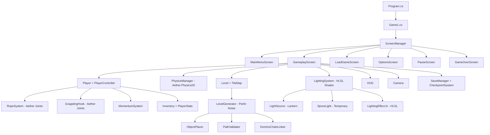
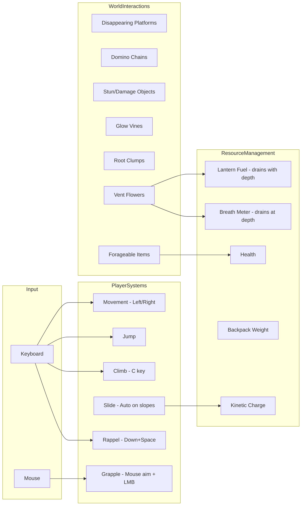
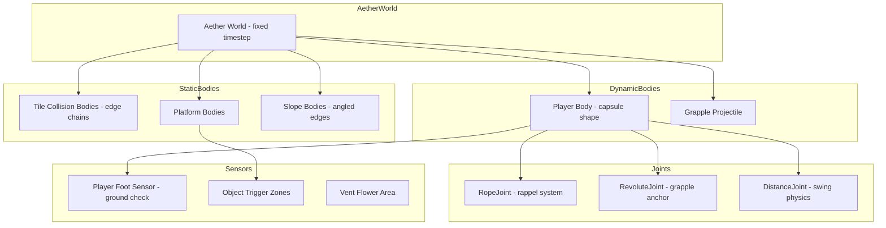
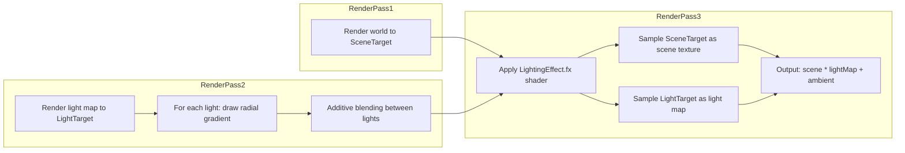
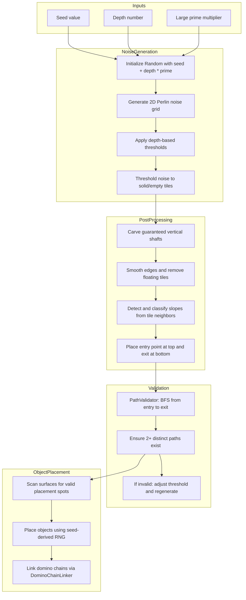

# Descent Into the Deep — Implementation Plan

## Project Overview

**Title:** Descent Into the Deep  
**Engine:** MonoGame 3.8+ DesktopGL, .NET 8  
**Genre:** 2D side-scrolling descent platformer with puzzle and survival elements  
**Current State:** Bare MonoGame template — everything must be built from scratch.

The player descends through 20–40 procedurally generated underground levels, managing light, air, resources, and physics-based movement. Death or resource depletion forces restart from checkpoint or full run restart.

### Key Technical Stack
- **Physics:** Aether.Physics2D — full rigid body simulation for player, rope, grapple, and collisions
- **Lighting:** Custom HLSL pixel shaders — GPU-accelerated dynamic lighting with smooth radial falloff
- **Generation:** Perlin noise density maps — organic cave generation with smooth vertical descent layouts
- **Save/Load:** System.Text.Json — built into .NET 8
- **Framework:** MonoGame 3.8+ DesktopGL

---

## Target Folder Structure

```
Bloop/
├── Program.cs
├── Game1.cs                          # Entry point, screen management
├── Core/
│   ├── ScreenManager.cs              # Manages game screens/states
│   ├── Screen.cs                     # Abstract base screen class
│   ├── Camera.cs                     # Smooth-follow vertical camera
│   ├── InputManager.cs               # Keyboard + mouse input abstraction
│   └── AssetManager.cs              # Centralized texture/font loading
├── Screens/
│   ├── MainMenuScreen.cs             # Title, Start, Load, Options
│   ├── SeedInputScreen.cs            # Numeric seed entry
│   ├── LoadGameScreen.cs             # JSON save file browser
│   ├── OptionsScreen.cs              # Volume, controls reminder
│   ├── GameplayScreen.cs             # Main gameplay loop
│   ├── PauseScreen.cs                # In-game pause overlay
│   └── GameOverScreen.cs             # Death / restart screen
├── Gameplay/
│   ├── Player.cs                     # Player entity, stats, inventory
│   ├── PlayerController.cs           # Input -> movement, jump, climb, slide
│   ├── Inventory.cs                  # Item storage, weight tracking
│   ├── PlayerStats.cs                # Health, breath, lantern fuel, kinetic charge
│   ├── RopeSystem.cs                 # Rappel rope mechanics via Aether joints
│   ├── GrapplingHook.cs              # Grapple aim, fire, swing via Aether
│   └── MomentumSystem.cs             # Kinetic charge from sliding
├── Physics/
│   ├── PhysicsManager.cs             # Aether.Physics2D world wrapper
│   ├── BodyFactory.cs                # Helper to create Aether bodies for tiles/objects
│   ├── CollisionCategories.cs        # Collision category flags
│   └── PhysicsDebugDraw.cs           # Debug visualization for physics bodies
├── World/
│   ├── Level.cs                      # Single level data structure
│   ├── Tile.cs                       # Tile types and properties
│   ├── TileMap.cs                    # 2D tile grid with Aether body generation
│   └── WorldObject.cs               # Base class for all world objects
├── Objects/
│   ├── DisappearingPlatform.cs       # Touch -> 5s timer -> vanish
│   ├── DominoPlatformChain.cs        # Linked disappearing platforms
│   ├── StunDamageObject.cs           # Stun/damage on touch, pulses when lit
│   ├── ClimbableSurface.cs           # C-key climbable surfaces
│   ├── GlowVine.cs                   # Becomes climbable after 2s lantern exposure
│   ├── RootClump.cs                  # Retracts after 8s without movement
│   ├── VentFlower.cs                 # Air pocket — refills breath + fuel
│   ├── CaveLichen.cs                 # Forageable food item
│   └── BlindFish.cs                  # Forageable food item
├── Generators/
│   ├── LevelGenerator.cs             # Seed-based Perlin noise level generation
│   ├── PerlinNoise.cs                # Perlin noise implementation
│   ├── ObjectPlacer.cs               # Places world objects on surfaces
│   ├── PathValidator.cs              # Ensures at least 2 paths per level
│   └── DominoChainLinker.cs          # Links disappearing platforms into chains
├── Lighting/
│   ├── LightingSystem.cs             # HLSL shader-based darkness + light sources
│   ├── LightSource.cs                # Individual light source data
│   └── SporeLight.cs                 # Temporary spore-based light
├── Shaders/
│   └── LightingEffect.fx             # HLSL pixel shader for dynamic lighting
├── UI/
│   ├── HUD.cs                        # Main gameplay HUD renderer
│   ├── LanternFuelBar.cs             # Fuel meter
│   ├── BreathMeter.cs                # Air/breath meter
│   ├── WeightDisplay.cs              # Backpack weight indicator
│   ├── KineticChargeMeter.cs         # Momentum sliding charge
│   ├── Minimap.cs                    # Fog-of-war minimap
│   └── InventoryUI.cs               # Inventory display
├── SaveLoad/
│   ├── SaveManager.cs                # JSON serialization/deserialization
│   ├── SaveData.cs                   # Data model for save files
│   └── CheckpointSystem.cs           # Auto-save at depth transitions
├── Effects/
│   ├── ParticleSystem.cs             # Spores, dust particles
│   ├── Particle.cs                   # Single particle data
│   └── DebuffSystem.cs              # Temporary debuffs from food
└── Content/
    ├── Content.mgcb
    └── Shaders/
        └── LightingEffect.fx         # Compiled shader content
```

---

## Architecture Diagram



---

## Gameplay Systems Flow



---

## Aether.Physics2D Integration Diagram



---

## HLSL Lighting Pipeline



The HLSL shader approach:
1. **Pass 1**: Render the entire game world normally to a `RenderTarget2D` called `sceneTarget`
2. **Pass 2**: Render a light map to a separate `RenderTarget2D` called `lightTarget` — start black, draw radial gradient circles for each light source using additive blending
3. **Pass 3**: Apply `LightingEffect.fx` pixel shader that multiplies `sceneTarget` by `lightTarget`, with a configurable ambient light floor so pitch-black areas still have minimal visibility
4. The shader supports: variable light radius, intensity falloff curves, color tinting per light, and a global ambient parameter that increases slightly near vent flowers

---

## Perlin Noise Generation Pipeline



The Perlin noise approach produces organic, natural-looking cave systems:
- Multiple octaves of noise layered for detail at different scales
- Depth-based threshold adjustment: deeper levels have denser rock, narrower passages
- Post-processing carves guaranteed vertical connections between levels
- Slope detection by analyzing neighboring tile patterns

---

## Implementation Phases

### Phase 1: Core Framework and Infrastructure
1. **Project structure setup** — Create all folders and stub files, add Aether.Physics2D NuGet package
2. **Core/InputManager.cs** — Keyboard + mouse state tracking with `IsKeyPressed`, `IsKeyHeld`, `GetMousePosition`, `IsLeftClick`
3. **Core/Screen.cs + Core/ScreenManager.cs** — Abstract screen base class with `Update`/`Draw`, screen stack management with transitions
4. **Core/Camera.cs** — Smooth-follow camera with vertical scrolling, viewport clamping
5. **Core/AssetManager.cs** — Runtime texture generation for placeholder shapes using colored rectangles
6. **Game1.cs refactor** — Initialize ScreenManager, load fonts, wire up screen transitions

### Phase 2: Menu System
7. **Screens/MainMenuScreen.cs** — Title display, menu buttons for Start/Load/Options
8. **Screens/SeedInputScreen.cs** — Numeric seed text input with validation
9. **Screens/LoadGameScreen.cs** — List JSON save files, show seed + depth preview
10. **Screens/OptionsScreen.cs** — Volume slider, controls reference display
11. **Screens/PauseScreen.cs** — Pause overlay with Resume/Save/Quit
12. **Screens/GameOverScreen.cs** — Death screen with Restart/Main Menu options

### Phase 3: Aether.Physics2D Integration
13. **Physics/CollisionCategories.cs** — Define collision category flags for player, terrain, objects, sensors
14. **Physics/PhysicsManager.cs** — Aether World wrapper with fixed timestep stepping, unit conversion helpers between pixels and meters, gravity configuration
15. **Physics/BodyFactory.cs** — Helper methods to create static bodies from tile edges, dynamic player capsule body, sensor fixtures for triggers
16. **Physics/PhysicsDebugDraw.cs** — Debug renderer to visualize all Aether bodies, joints, and contacts during development

### Phase 4: Player Movement with Aether Physics
17. **Gameplay/Player.cs** — Player entity with Aether dynamic body, foot sensor for ground detection, state machine: Idle, Walking, Jumping, Falling, Climbing, Sliding, Rappelling, Swinging, Stunned, Dead
18. **Gameplay/PlayerController.cs** — Maps input to Aether forces/impulses: apply horizontal force for movement, impulse for jump, disable gravity during climb, detect slope angle from contact normals for auto-slide
19. **Gameplay/PlayerStats.cs** — Health, breath, lantern fuel, kinetic charge values with drain/refill logic

### Phase 5: Rope, Grapple, and Momentum with Aether Joints
20. **Gameplay/RopeSystem.cs** — Rappel using Aether `RopeJoint` attached to ceiling contact point, variable length for descent, retraction speed affected by backpack weight
21. **Gameplay/GrapplingHook.cs** — Fire projectile body toward mouse aim with limited range, on contact create `RevoluteJoint` at anchor point, player swings as pendulum via Aether physics, release to launch with current velocity
22. **Gameplay/MomentumSystem.cs** — Track kinetic charge from slope contact normal angles during sliding, slingshot launch applies large impulse, zip-drop disables collision with disappearing platforms temporarily

### Phase 6: World and Tile System
23. **World/Tile.cs** — Tile enum types: Solid, Empty, Platform, SlopeLeft, SlopeRight, Climbable
24. **World/TileMap.cs** — 2D grid storage, generates Aether edge-chain static bodies from tile boundaries, tile rendering with colored rectangles
25. **World/Level.cs** — Level container with TileMap, object list, entry/exit points, depth number, Aether World reference
26. **World/WorldObject.cs** — Abstract base for all interactive objects with Aether body/sensor, update/draw

### Phase 7: Perlin Noise Procedural Generation
27. **Generators/PerlinNoise.cs** — Seed-based Perlin noise implementation with configurable octaves, persistence, and scale; produces 2D float grid
28. **Generators/LevelGenerator.cs** — Uses `PerlinNoise` with `seed + depth * largePrime` to generate density map, applies depth-based threshold to create solid/empty tiles, post-processes to carve vertical shafts, smooth edges, detect slopes, place entry/exit
29. **Generators/ObjectPlacer.cs** — Scans tile surfaces for valid placement spots, places world objects using seed-derived RNG with depth-scaled density
30. **Generators/PathValidator.cs** — BFS/DFS from entry to exit considering player movement capabilities, ensures 2+ distinct paths exist, triggers regeneration if invalid
31. **Generators/DominoChainLinker.cs** — Groups nearby disappearing platforms into chains using seed hash, assigns cascade order

### Phase 8: World Objects
32. **Objects/DisappearingPlatform.cs** — Aether static body, touch triggers 5s countdown then removes body; supports domino chain linking
33. **Objects/DominoPlatformChain.cs** — Manages chain of linked disappearing platforms with 1s cascade delay between each
34. **Objects/StunDamageObject.cs** — Aether sensor body, damages/stuns player on overlap, pulses visually only when lit by lantern
35. **Objects/ClimbableSurface.cs** — Standard C-key climbable, disables player gravity while climbing
36. **Objects/GlowVine.cs** — Becomes climbable after 2+ seconds of lantern exposure, tracks cumulative illumination time
37. **Objects/RootClump.cs** — C-key climbable, retracts into wall after 8s of no player movement on it, removes Aether body on retract
38. **Objects/VentFlower.cs** — Aether sensor area: 5s standing refills breath + lantern fuel, glowing visual, emits ambient light
39. **Objects/CaveLichen.cs** — Collectible food item with Aether sensor, restores health/stamina, 30% poison chance from seed
40. **Objects/BlindFish.cs** — Collectible food item, same mechanics as CaveLichen with different stat values

### Phase 9: HLSL Lighting System
41. **Shaders/LightingEffect.fx** — HLSL pixel shader: takes scene texture and light map texture as inputs, outputs `sceneColor * lightMapColor + ambientFloor`, supports configurable ambient level
42. **Lighting/LightSource.cs** — Data class: position, radius, intensity, color, lifetime, falloff curve type
43. **Lighting/SporeLight.cs** — Extends LightSource: temporary 5-meter radius, 15-second lifetime, spawned from disappearing platforms touched in lantern light
44. **Lighting/LightingSystem.cs** — Manages two RenderTarget2Ds; renders scene to sceneTarget; renders light map by drawing radial gradient textures at each light position with additive blending; applies LightingEffect.fx to composite final output; handles light source lifecycle

### Phase 10: Inventory and Resources
45. **Gameplay/Inventory.cs** — Item list, weight calculation, add/remove/use items, weight affects player physics via Aether body mass adjustment
46. **Effects/DebuffSystem.cs** — Temporary debuffs: slow slide, inverted controls, reduced jump, etc. with 10s duration
47. **UI/InventoryUI.cs** — Inventory display panel with item icons and weight

### Phase 11: HUD and UI
48. **UI/HUD.cs** — Master HUD renderer, positions all sub-elements on screen
49. **UI/LanternFuelBar.cs** — Horizontal bar showing fuel remaining with color gradient
50. **UI/BreathMeter.cs** — Breath remaining indicator with warning flash
51. **UI/WeightDisplay.cs** — Current weight / max weight text display
52. **UI/KineticChargeMeter.cs** — Kinetic charge fill bar with glow at max
53. **UI/Minimap.cs** — Fog-of-war minimap that reveals tiles as they enter lantern light radius

### Phase 12: Save/Load System
54. **SaveLoad/SaveData.cs** — Serializable data model: player stats, inventory items, depth, seed, discovered tile coordinates, checkpoint data
55. **SaveLoad/SaveManager.cs** — JSON serialization using System.Text.Json, atomic file writes via temp+rename, save file listing with metadata preview
56. **SaveLoad/CheckpointSystem.cs** — Auto-save triggered at depth level transitions, stores full game state

### Phase 13: Particle Effects
57. **Effects/Particle.cs** — Single particle: position, velocity, lifetime, color, size, alpha fade
58. **Effects/ParticleSystem.cs** — Object-pooled particle manager for spores, dust, ambient cave effects; integrates with lighting system for glowing particles

### Phase 14: Gameplay Screen Integration
59. **Screens/GameplayScreen.cs** — Orchestrates all systems: initializes Aether world, generates level, spawns player, runs physics step, updates lighting, renders with shader pipeline, manages HUD, handles save/load triggers

### Phase 15: Polish and Tuning
60. **Depth scaling** — Lantern drain multiplier increases with depth, breath drain rate scales, Perlin noise threshold tightens for denser caves, object density increases
61. **Placeholder audio comments** — Add TODO comments at all points where sound effects would play
62. **Performance optimization** — Aether body sleeping for off-screen objects, shader LOD, particle pool limits, tile culling to visible viewport
63. **Bug fixing and playtesting** — Ensure 60 FPS, all mechanics work together, Aether physics tuning, edge cases handled

---

## Key Technical Decisions

### Lighting Approach — Custom HLSL Shader
Use a **multi-pass HLSL shader pipeline**:
1. **Scene Pass**: Render the entire game world to `sceneTarget` RenderTarget2D
2. **Light Map Pass**: Render to `lightTarget` RenderTarget2D — start fully black, draw radial gradient circles for each light source using additive blending
3. **Composite Pass**: Apply `LightingEffect.fx` shader that samples both textures and outputs `scene * lightMap + ambient`

**Advantages over RenderTarget-only approach:**
- GPU-accelerated compositing — no CPU pixel manipulation
- Smooth radial falloff curves via shader math
- Easy to add effects like light color tinting, flickering, pulsing
- Configurable ambient floor prevents total blackout
- Can be extended with normal mapping or shadow casting later

**Shader details:**
- Input: `sceneTexture` sampler, `lightMapTexture` sampler, `ambientLevel` float
- Output: `finalColor = sceneColor * lightMapColor + vec4(ambientLevel)`
- Light map generation uses pre-generated radial gradient texture drawn at each light position

### Physics Approach — Aether.Physics2D
Use **Aether.Physics2D** (the maintained Farseer Physics successor for MonoGame):
- **Player**: Dynamic capsule body with foot sensor fixture for ground detection
- **Terrain**: Static edge-chain bodies generated from tile map boundaries — efficient for large tile grids
- **Slopes**: Angled edge segments that Aether handles natively — no custom slope math needed
- **Rope**: `RopeJoint` between player body and ceiling anchor point, variable max length
- **Grapple**: Fire a small kinematic body, on contact create `RevoluteJoint` at hit point, player swings naturally
- **Sensors**: Fixture-based trigger zones for object interactions using `OnCollision`/`OnSeparation` callbacks
- **Weight system**: Adjust player body mass based on inventory weight — heavier = more inertia, slower rope retraction

**Unit conversion**: Aether uses meters internally; use a constant `PIXELS_PER_METER = 64f` for conversion.

**Advantages over custom AABB:**
- Rope and grapple physics are realistic out of the box
- Slope handling is native — no janky custom code
- Collision callbacks simplify object interaction logic
- Joint system provides natural pendulum/swing behavior
- Well-tested library reduces physics bugs

### Procedural Generation Strategy — Perlin Noise
Each level generated using **multi-octave Perlin noise density maps**:
1. Initialize `PerlinNoise` with `seed + depth * 7919` (large prime)
2. Generate 2D noise grid at level dimensions (e.g., 120x200 tiles)
3. Apply depth-based density threshold: `threshold = 0.45 + depth * 0.005` (deeper = denser rock)
4. Tiles above threshold = Solid, below = Empty
5. **Post-processing**:
   - Carve guaranteed vertical shafts connecting top entry to bottom exit
   - Remove floating single tiles and fill tiny isolated pockets
   - Detect slopes by analyzing 2x2 tile neighborhoods
   - Widen narrow passages to ensure player can fit
6. Run PathValidator to confirm 2+ paths exist
7. Place objects on valid surfaces via ObjectPlacer

**Advantages over cellular automata:**
- Produces smoother, more organic cave shapes
- Multi-octave layering creates detail at multiple scales
- Easier to control density/openness via threshold parameter
- Seed-based reproducibility is straightforward
- Better suited for vertical descent layouts with natural-looking tunnels

### State Machine for Player
Player uses a **finite state machine** with states:
- Idle, Walking, Jumping, Falling
- Climbing, Sliding
- Rappelling, Swinging
- Stunned, Dead

Each state defines:
- Allowed transitions
- Aether body configuration (gravity scale, linear damping, fixed rotation)
- Input handling behavior
- Animation/visual representation

---

## Dependencies
- **MonoGame.Framework.DesktopGL 3.8+** — already in project
- **Aether.Physics2D.MG** — NuGet package, Farseer successor for MonoGame (must be added)
- **System.Text.Json** — built into .NET 8, used for save/load
- No other external dependencies

---

## Risk Areas and Mitigations

| Risk | Mitigation |
|------|-----------|
| HLSL shader compilation on different GPUs | Use simple shader operations compatible with Reach profile; test on multiple machines; provide fallback RenderTarget-only path |
| Aether.Physics2D performance with many tile bodies | Use edge chains instead of individual box bodies; enable body sleeping; only create bodies for visible chunks |
| Perlin noise producing unplayable levels | PathValidator with regeneration fallback; guaranteed shaft carving; minimum passage width enforcement |
| Aether unit conversion bugs | Centralize all conversion in PhysicsManager; use consistent PIXELS_PER_METER constant everywhere |
| Grapple/rope joint instability | Clamp joint forces; use warm starting; tune iteration counts; add safety checks for NaN velocities |
| Shader not loading in MGCB pipeline | Include .fx file in Content.mgcb with correct importer/processor; provide build instructions |
| Save file corruption | Atomic writes using temp file + rename pattern; validate JSON on load |
