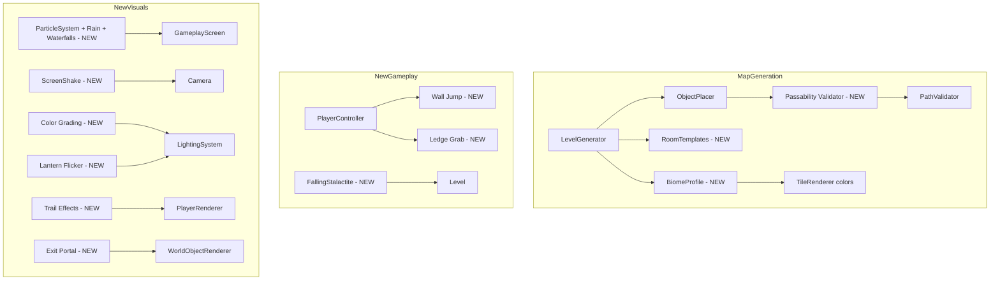

# Bloop — Improvements & New Features Plan

## Executive Summary

After a thorough analysis of the entire codebase, this document proposes improvements across three areas: **map generation**, **gameplay**, and **visual effects**. Each improvement includes the problem it solves, the proposed solution, and which files need modification.

---

## 1. Map Generation Improvements

### 1.1 — Object Passability Clearance Check ⚠️ CRITICAL

**Problem:** World objects (GlowVines, RootClumps, StunDamageObjects) are placed on wall surfaces and can physically block narrow passages. The `PathValidator` BFS only checks tile types — it has no awareness of placed objects. A 2-tile-wide corridor with a GlowVine on one wall and a RootClump on the other becomes impassable.

**Solution:** Add a post-placement passability validation pass that:
1. After `ObjectPlacer.PlaceObjects()` runs, build a "blocked tile" overlay from object bounding boxes
2. Re-run `PathValidator.Validate()` with the blocked overlay — if the path is now broken, remove the offending objects one by one (starting with the least important type) until passability is restored
3. Add a minimum clearance rule: no object may be placed if the remaining passage width at that tile would drop below 2 tiles

**Files to modify:**
- [`ObjectPlacer.cs`](Bloop/Generators/ObjectPlacer.cs) — add `ValidatePassability()` post-pass
- [`PathValidator.cs`](Bloop/Generators/PathValidator.cs) — add overload accepting a blocked-tile set
- [`LevelGenerator.cs`](Bloop/Generators/LevelGenerator.cs:202) — call validation after step 15

---

### 1.2 — Biome Variation by Depth

**Problem:** Every level looks and feels the same structurally. The only depth scaling is threshold density and object frequency. Players lose the sense of progression.

**Solution:** Introduce 4 biome tiers that change the generation parameters:
- **Shallow Caves (depth 1–5):** Wide open caverns, many platforms, gentle slopes, abundant vent flowers
- **Fungal Grottos (depth 6–12):** More organic shapes, increased GlowVine/CaveLichen density, narrower passages, mushroom-shelf platforms
- **Crystal Depths (depth 13–20):** Angular geometry (higher cellular automata threshold), more StunDamageObjects, fewer vent flowers, crystal pillar formations
- **The Abyss (depth 21+):** Extremely tight passages, minimal light sources, maximum hazard density, labyrinthine layout with more dead-ends

Each biome adjusts: noise scale, cavity threshold offset, shaft count, worm tunnel parameters, object density multipliers, and tile color palette.

**Files to modify:**
- [`LevelGenerator.cs`](Bloop/Generators/LevelGenerator.cs) — parameterize all constants into a `BiomeProfile` struct selected by depth
- [`ObjectPlacer.cs`](Bloop/Generators/ObjectPlacer.cs) — density multipliers per biome
- [`TileRenderer.cs`](Bloop/Rendering/TileRenderer.cs) — color palette selection per biome

---

### 1.3 — Guaranteed Landmark Rooms

**Problem:** Levels are uniformly random — there are no memorable spatial landmarks. Players can't orient themselves or remember "that big cavern with the waterfall."

**Solution:** After the noise-based generation but before smoothing, inject 1–3 pre-designed room templates per level:
- **Rest Alcove:** A 10×8 tile room with a guaranteed VentFlower, flat floor, and single entrance — a safe haven
- **Shaft Hub:** A 6×20 vertical chamber where 2+ shafts converge, with disappearing platform staircases
- **Treasure Vault:** A small dead-end room (8×6) with guaranteed Rare collectibles, guarded by StunDamageObjects at the entrance
- **Bridge Cavern:** A wide 15×8 open space with a gap in the middle, requiring domino chain platforms or grapple to cross

Templates are rotated/mirrored randomly and placed at positions chosen by the CavityAnalyzer (large open regions or junction points).

**Files to modify:**
- New file: `Bloop/Generators/RoomTemplates.cs` — template definitions and stamping logic
- [`LevelGenerator.cs`](Bloop/Generators/LevelGenerator.cs) — inject templates between steps 8 and 9
- [`CavityAnalyzer.cs`](Bloop/Generators/CavityAnalyzer.cs) — expose candidate positions for room placement

---

### 1.4 — Improved Pillar Band Logic

**Problem:** The current `InjectPillarBands()` uses a fixed period of 12 tiles and a noise threshold. This can create pillars that completely seal off passages, especially when combined with the cellular automata smoothing that runs before it. Since pillars are injected at step 9 (after smoothing at step 7), they can create new blockages that are never smoothed or validated.

**Solution:**
1. Move pillar injection to before the smoothing pass so cellular automata can soften pillar edges
2. After injecting pillars, run a local flood-fill check: if a pillar seals a passage, carve a 2-tile gap through it
3. Make pillar density scale with biome — fewer in shallow caves, more in crystal depths

**Files to modify:**
- [`LevelGenerator.cs`](Bloop/Generators/LevelGenerator.cs:177) — reorder steps and add local connectivity check

---

### 1.5 — Water Pools in Shaft Bottoms

**Problem:** Shaft bottoms are currently just empty space. They feel anticlimactic after a long descent.

**Solution:** Add a new tile type `TileType.Water` that fills the bottom 2–3 tiles of detected shaft bottoms. Water tiles:
- Slow player horizontal movement by 40%
- Break fall damage (landing in water negates all fall damage)
- BlindFish spawn exclusively in water tiles instead of on dry floors
- Visual: animated blue-tinted tiles with ripple effect

**Files to modify:**
- [`Tile.cs`](Bloop/World/Tile.cs) — add `Water` tile type
- [`TileMap.cs`](Bloop/World/TileMap.cs) — water tile physics (sensor body, no solid collision)
- [`LevelGenerator.cs`](Bloop/Generators/LevelGenerator.cs) — fill shaft bottoms with water after step 12
- [`TileRenderer.cs`](Bloop/Rendering/TileRenderer.cs) — water tile rendering with animation
- [`PlayerController.cs`](Bloop/Gameplay/PlayerController.cs) — water movement speed reduction
- [`Player.cs`](Bloop/Gameplay/Player.cs) — water fall damage negation

---

## 2. Gameplay Improvements

### 2.1 — Wall Jump Mechanic

**Problem:** The player has limited vertical mobility options. If the grappling hook can't reach a ceiling and there are no climbable surfaces, the player is stuck. This is especially frustrating in narrow vertical shafts.

**Solution:** Allow the player to perform a wall jump when:
- Player is in `Falling` or `Jumping` state
- Player is pressing toward a wall (horizontal input toward solid tile)
- Player presses Jump while adjacent to a wall

The wall jump applies an impulse away from the wall and upward (60% of normal jump height). Add a short cooldown (0.3s) to prevent infinite wall-jump climbing. Visual: small dust particles spawn at the wall contact point.

**Files to modify:**
- [`PlayerController.cs`](Bloop/Gameplay/PlayerController.cs:172) — wall jump detection and impulse
- [`Player.cs`](Bloop/Gameplay/Player.cs) — wall contact detection via Aether collision normals
- [`PlayerRenderer.cs`](Bloop/Rendering/PlayerRenderer.cs) — wall jump pose (legs pushing off wall)

---

### 2.2 — Ledge Grab / Mantle

**Problem:** The player frequently misses platform edges by 1–2 pixels and falls. This feels unfair, especially when the player clearly intended to land on a platform.

**Solution:** When the player is falling and their head is at or above a platform edge while their body is beside it:
1. Auto-transition to a new `PlayerState.Mantling` state
2. Freeze physics for 0.4s while playing a pull-up animation
3. Teleport player to standing position on top of the ledge
4. Detection: check if the tile at player head height is empty but the tile at torso height is solid, and the tile above the solid tile is empty

**Files to modify:**
- [`Player.cs`](Bloop/Gameplay/Player.cs:15) — add `Mantling` state
- [`PlayerController.cs`](Bloop/Gameplay/PlayerController.cs) — ledge detection logic
- [`PlayerRenderer.cs`](Bloop/Rendering/PlayerRenderer.cs) — mantle animation pose

---

### 2.3 — Environmental Hazard: Falling Stalactites

**Problem:** StunDamageObjects are static — they just sit on surfaces. There are no dynamic environmental threats that create tension and require awareness.

**Solution:** New world object `FallingStalactite`:
- Attached to ceiling tiles, visually a pointed rock hanging down
- When the player walks directly beneath it (within 2 tiles horizontally), it shakes for 1.5s then falls
- Falls as a physics body with gravity, deals damage on contact with player
- Shatters on impact with ground, spawning 3–4 rock debris particles
- Can be triggered early by grappling hook impact on the ceiling near it
- Respawns after 30 seconds

**Files to modify:**
- New file: `Bloop/Objects/FallingStalactite.cs`
- [`ObjectPlacer.cs`](Bloop/Generators/ObjectPlacer.cs) — placement logic for ceiling surfaces
- [`ObjectType`](Bloop/Generators/ObjectPlacer.cs:13) — add `FallingStalactite` enum value
- [`Level.cs`](Bloop/World/Level.cs:396) — instantiation in `CreateObject()`

---

### 2.4 — Improved Rope Physics: Rope Swing Momentum Transfer

**Problem:** When releasing the grappling hook, the player just enters `Falling` state. The swing momentum isn't dramatically preserved, making grapple-release-grapple chains feel sluggish.

**Solution:** On grapple release:
1. Preserve 120% of current velocity (momentum boost) instead of just the raw physics velocity
2. Add a brief "launch" state (0.3s) where the player has reduced gravity (0.3x) to extend the arc
3. Visual: speed lines appear around the player during the launch arc
4. If the player fires a new grapple during the launch state, the hook travels 30% faster (chain bonus)

**Files to modify:**
- [`GrapplingHook.cs`](Bloop/Gameplay/GrapplingHook.cs:102) — momentum boost on release
- [`Player.cs`](Bloop/Gameplay/Player.cs:15) — add `Launching` state with reduced gravity
- [`PlayerRenderer.cs`](Bloop/Rendering/PlayerRenderer.cs) — speed line effect

---

## 3. Visual Effects Improvements

### 3.1 — Ambient Particle System

**Problem:** The cave environment feels static. There are no ambient particles to create atmosphere — no dust motes, no floating spores, no dripping water, no rain, no waterfalls.

**Solution:** Implement a lightweight particle system with five ambient emitter types:
- **Dust Motes:** Tiny white/gray dots that drift slowly downward with slight horizontal sway. 20–30 particles visible at a time within the camera viewport. Affected by player movement (pushed away when player runs past).
- **Cave Spores:** Small green/cyan dots that float upward from GlowVine and VentFlower positions. Glow slightly (add as tiny light sources). 5–10 per emitter.
- **Water Drips:** Animated droplets that fall from ceiling tiles where water seepage is detected (ceiling tile with empty below). Splash particle on impact with floor.
- **Line Rain:** Thin vertical streaks that fall through large open caverns (detected via `CavityAnalyzer.IsLargeCavern()`). Rain only appears in caverns with high ceilings (6+ empty tiles vertically). Streaks are semi-transparent blue-white lines, 8–16px long, falling at varying speeds. Density scales with cavern size. Creates a sense of underground water seepage from the surface above. Splashes spawn on contact with solid tiles below.
- **Waterfalls:** Continuous streams of particles flowing down exposed wall faces where water seepage is heavy. Triggered at wall tiles that have 3+ consecutive empty tiles below them AND are adjacent to a large cavern. Particles flow downward in a narrow column (4–6px wide), with mist spray particles at the base where the waterfall hits a floor tile. The waterfall column emits a faint blue-white light source. Mist particles spread horizontally at the base, creating a fog effect.

All particles are viewport-culled and object-pooled for performance. Rain and waterfall emitter positions are computed once during level generation and stored in the Level for efficient per-frame spawning.

**Files to modify:**
- New file: `Bloop/Effects/ParticleSystem.cs` — pooled particle manager with emitter types
- New file: `Bloop/Effects/Particle.cs` — particle data struct
- [`GameplayScreen.cs`](Bloop/Screens/GameplayScreen.cs:310) — update and draw particles in `DrawWorld()`
- [`Level.cs`](Bloop/World/Level.cs) — compute and store rain/waterfall emitter positions during construction
- [`CavityAnalyzer.cs`](Bloop/Generators/CavityAnalyzer.cs) — expose cavern height data for rain emitter placement

---

### 3.2 — Screen Shake on Impact Events

**Problem:** High-impact events (fall damage, stalactite impact, slingshot launch) have no camera feedback. They feel weightless.

**Solution:** Add a screen shake system to the Camera:
- **Fall damage:** Shake intensity proportional to damage taken (2–6px amplitude, 0.3s duration)
- **Slingshot launch:** Quick upward jolt (4px, 0.15s)
- **Stun hit:** Sharp horizontal shake (5px, 0.2s)
- **Stalactite impact:** Heavy vertical shake (8px, 0.4s)

Implementation: offset the camera transform matrix by a decaying sinusoidal displacement.

**Files to modify:**
- [`Camera.cs`](Bloop/Core/Camera.cs) — add `Shake()` method and shake offset in `GetTransform()`
- [`Player.cs`](Bloop/Gameplay/Player.cs:240) — trigger shake on fall damage
- [`MomentumSystem.cs`](Bloop/Gameplay/MomentumSystem.cs:89) — trigger shake on slingshot

---

### 3.3 — Depth-Based Color Grading

**Problem:** The visual palette is identical at every depth. There's no visual progression as the player descends deeper.

**Solution:** Apply a subtle color tint overlay that shifts with depth:
- **Depth 1–5:** Warm brown/amber tones (earthy, safe feeling)
- **Depth 6–12:** Cool green/teal tones (fungal, alien)
- **Depth 13–20:** Cold blue/purple tones (crystalline, hostile)
- **Depth 21+:** Deep red/black tones (hellish, oppressive)

Implementation: modify the `LightingSystem.Composite()` pass to apply a depth-dependent color multiply after the scene×lightMap calculation. This is a single additional tint applied to the final output.

**Files to modify:**
- [`LightingSystem.cs`](Bloop/Lighting/LightingSystem.cs:222) — add color grading tint in `Composite()`
- [`GameplayScreen.cs`](Bloop/Screens/GameplayScreen.cs:353) — set tint color based on depth

---

### 3.4 — Improved Tile Edge Rendering: Organic Silhouettes

**Problem:** Cave walls are rectangular blocks with small notch decorations. The silhouette of the cave is very grid-like and artificial.

**Solution:** For exposed solid tile edges, draw organic "fringe" elements that break the grid:
- **Top edges:** Stalactite-like drips hanging down (2–5px triangles at random intervals)
- **Bottom edges:** Stalagmite bumps growing up (similar triangles)
- **Side edges:** Rough rock protrusions (small rectangles jutting out 1–3px)
- **Corners:** Rounded erosion using overlapping circles instead of the current 2-rect approximation

Use the existing `TileNeighborCache` to determine which edges are exposed. The fringe elements are deterministic from tile coordinates (stable across frames).

**Files to modify:**
- [`TileRenderer.cs`](Bloop/Rendering/TileRenderer.cs:86) — enhanced `DrawSolid()` with organic fringe
- [`GeometryBatch.cs`](Bloop/Rendering/GeometryBatch.cs) — add `DrawTriangleSolid()` if not already available for stalactite shapes

---

### 3.5 — Player Trail Effects

**Problem:** Fast movement (sliding, swinging, slingshot) has no visual feedback beyond the player sprite. It's hard to perceive speed.

**Solution:** Add contextual trail effects:
- **Sliding:** Sparks/dust trail behind the player on the slope surface (small orange/brown particles)
- **Swinging:** Rope trail with slight glow along the arc path
- **Slingshot launch:** Radial burst of energy particles at launch point + speed lines along trajectory
- **Zip-drop:** Vertical streak effect (elongated player silhouette)

**Files to modify:**
- New file: `Bloop/Effects/TrailEffect.cs` — manages trail particle spawning per movement type
- [`PlayerRenderer.cs`](Bloop/Rendering/PlayerRenderer.cs) — integrate trail rendering
- [`MomentumSystem.cs`](Bloop/Gameplay/MomentumSystem.cs) — spawn trail particles on slide/slingshot

---

### 3.6 — Light Flicker and Lantern Sway

**Problem:** The player's lantern light is a perfectly smooth circle that tracks the player exactly. It feels artificial and static.

**Solution:**
- **Flicker:** Add subtle random radius variation (±3–5%) at 8–12Hz to simulate flame flicker. When fuel is below 20%, increase flicker amplitude to ±15% and add occasional "sputter" moments where the light drops to 30% for 0.1s.
- **Sway:** Offset the lantern light position by a small amount (±4px) based on player velocity — the lantern swings slightly behind the player's movement direction.
- **Warm-up:** When entering a new level, the lantern starts dim and brightens over 1.5s (cinematic entrance).

**Files to modify:**
- [`GameplayScreen.cs`](Bloop/Screens/GameplayScreen.cs:380) — flicker and sway logic in `UpdateLighting()`
- [`LightSource.cs`](Bloop/Lighting/LightSource.cs) — add flicker parameters

---

### 3.7 — Exit Portal Visual Enhancement

**Problem:** The level exit is just a flat colored rectangle. It doesn't feel like a meaningful destination.

**Solution:** Replace the exit marker with an animated portal effect:
- **Locked state:** Pulsing purple membrane with particle tendrils reaching outward. Small shard icons orbit the portal showing how many are still needed.
- **Unlocked state:** Golden swirling vortex with radial light rays. Particles spiral inward. A warm light source emanates from the portal (added to LightingSystem).
- **Player proximity:** When within 80px, the portal's pull effect intensifies — particles accelerate, light brightens.

**Files to modify:**
- [`Level.cs`](Bloop/World/Level.cs:340) — replace exit rectangle drawing with portal renderer
- New method in [`WorldObjectRenderer.cs`](Bloop/Rendering/WorldObjectRenderer.cs) — `DrawExitPortal()`
- [`LightingSystem.cs`](Bloop/Lighting/LightingSystem.cs) — portal light source

---

## Architecture Diagram: New Systems Integration

---

## Implementation Priority

The improvements are ordered by impact and dependency (16 total):

### High Priority — Fix Critical Issues
1. **1.1 Object Passability Clearance Check** — fixes the blocking bug where objects block passages
2. **1.4 Improved Pillar Band Logic** — prevents another source of path blockage

### High Priority — Core Gameplay Feel
3. **2.1 Wall Jump** — essential mobility option for vertical traversal
4. **2.2 Ledge Grab** — quality-of-life that reduces frustration
5. **3.2 Screen Shake** — immediate game feel improvement
6. **3.6 Light Flicker and Lantern Sway** — atmosphere with minimal code

### Medium Priority — Content & Variety
7. **1.2 Biome Variation** — visual and structural progression
8. **3.3 Depth-Based Color Grading** — visual progression complement
9. **1.3 Guaranteed Landmark Rooms** — memorable level design
10. **2.3 Falling Stalactites** — dynamic environmental hazard

### Medium Priority — Polish
11. **3.1 Ambient Particle System with Rain & Waterfalls** — atmospheric depth, rain in caverns, waterfalls on walls
12. **3.4 Organic Tile Silhouettes** — visual quality
13. **3.5 Player Trail Effects** — movement feedback
14. **3.7 Exit Portal Enhancement** — goal clarity

### Lower Priority — Advanced Features
15. **2.4 Rope Swing Momentum** — advanced traversal feel
16. **1.5 Water Pools** — new tile type, significant scope
