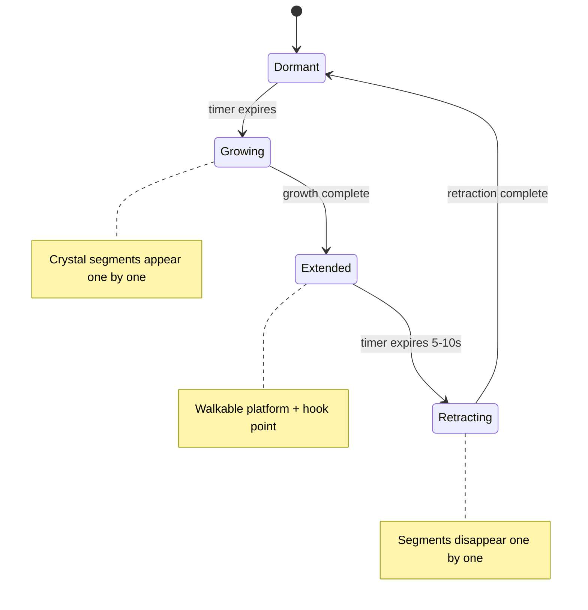

# Level Expansion & Crystal Bridge Implementation Plan

## Overview

Three major changes to the level generation system:

1. **Bigger levels** — wider maps (160 tiles horizontal), more and larger room templates
2. **Progressive difficulty** — levels 1–30 with gradual object/entity variety unlock, random biomes per level
3. **Crystal Bridge object** — new timed grow/retract crystal formations that create walkable paths and grappling hook points

---

## Architecture Summary

### Current Pipeline (files involved)

```
LevelGenerator.Generate(seed, depth)
  → PerlinNoise grids (80×120)
  → Threshold + cavity carving
  → Branching shafts + worm tunnels
  → RoomTemplates.InjectRooms()
  → Pillar bands + smoothing + connectivity
  → Slope detection + climbable walls
  → Entry/exit finding
  → PathValidator.Validate()
  → ObjectPlacer.PlaceObjects()
  → DominoChainLinker.LinkChains()
```

### Key Constants (current → new)

| Constant | Current | New | File |
|----------|---------|-----|------|
| `LevelWidth` | 80 | 160 | `LevelGenerator.cs` |
| `LevelHeight` | 120 | 120 (unchanged) | `LevelGenerator.cs` |
| Biome selection | depth-based | random per level | `LevelGenerator.cs` |
| Max depth | unlimited | 30 | `GameplayScreen.cs` |
| Room count | 1–3 | 2–5 | `RoomTemplates.cs` |

---

## TASK 1: Widen Level Dimensions & Add Bigger Rooms

### Files to modify

- [`LevelGenerator.cs`](Bloop/Generators/LevelGenerator.cs) — change `LevelWidth` from 80 to 160
- [`RoomTemplates.cs`](Bloop/Generators/RoomTemplates.cs) — add larger room templates, increase room count

### Changes in `LevelGenerator.cs`

1. Change `LevelWidth = 80` → `LevelWidth = 160`
2. Increase shaft count ranges: `MinShafts = 3, MaxShafts = 6` (was 2–4)
3. Increase worm tunnel counts: `MinWorms = 6, MaxWorms = 12` (was 4–8)
4. Increase worm step range: `WormMaxSteps = 80` (was 50) to span wider maps
5. Adjust pillar band period: `BandPeriod = 16` (was 12) for wider spacing
6. Update `FindEntryPoint` / `FindExitPoint` search ranges for wider map
7. Update fallback level generation for new width

### Changes in `RoomTemplates.cs`

1. Add 3 new large room templates:
   - **GrandCavern** — 30×16 wide open chamber with scattered pillars
   - **CrystalGallery** — 26×14 long horizontal gallery with crystal alcoves
   - **ColossalShaft** — 12×30 very tall vertical shaft with ledge platforms
2. Increase room count formula: `Math.Min(2 + (depth - 1) / 2, 5)` (was max 3, now max 5)
3. Add the new `LandmarkKind` enum values

### Ripple effects

- [`CavityAnalyzer.cs`](Bloop/Generators/CavityAnalyzer.cs) — no changes needed (already uses `map.Width/Height`)
- [`PathValidator.cs`](Bloop/Generators/PathValidator.cs) — no changes needed (already uses `map.Width/Height`)
- [`ObjectPlacer.cs`](Bloop/Generators/ObjectPlacer.cs) — no changes needed (iterates `w × h`)
- [`TileMap.cs`](Bloop/World/TileMap.cs) — no changes needed (constructor takes width/height)
- [`Camera.cs`](Bloop/Core/Camera.cs) — bounds are set from `TileMap.PixelWidth` already

---

## TASK 2: Progressive Difficulty Scaling (Levels 1–30)

### Design: Object/Entity Unlock Schedule

Levels 1–30 progressively introduce more object types and entities. Early levels are simple; later levels have full variety.

| Level Range | Objects Available | Entities Available |
|-------------|------------------|--------------------|
| 1–3 | DisappearingPlatform, GlowVine, VentFlower, PhosphorMoss | LuminescentGlowworm, LuminousIsopod |
| 4–6 | + RootClump, CaveLichen, BlindFish | + EchoBat, BlindCaveSalamander |
| 7–10 | + StunDamageObject, FallingStalactite, CrystalCluster | + SilkWeaverSpider |
| 11–15 | + IonStone, ResonanceShard (more), CrystalBridge | + ChainCentipede |
| 16–20 | + All objects at higher density | + DeepBurrowWorm |
| 21–30 | Full variety, max density, more hazards | All entities, higher counts |

### Files to modify

- [`ObjectPlacer.cs`](Bloop/Generators/ObjectPlacer.cs) — add `DifficultyProfile` struct and level-gated placement
- [`LevelGenerator.cs`](Bloop/Generators/LevelGenerator.cs) — pass difficulty level to object placer

### Implementation approach

Add a new `DifficultyProfile` struct in `ObjectPlacer.cs`:

```csharp
public readonly struct DifficultyProfile
{
    public int Level { get; init; }  // 1–30
    
    // Object unlock flags
    public bool HasRootClump { get; init; }
    public bool HasStunDamage { get; init; }
    public bool HasCaveLichen { get; init; }
    public bool HasBlindFish { get; init; }
    public bool HasFallingStalactite { get; init; }
    public bool HasCrystalCluster { get; init; }
    public bool HasIonStone { get; init; }
    public bool HasCrystalBridge { get; init; }
    
    // Entity unlock flags
    public bool HasEchoBat { get; init; }
    public bool HasSilkWeaverSpider { get; init; }
    public bool HasChainCentipede { get; init; }
    public bool HasDeepBurrowWorm { get; init; }
    public bool HasBlindCaveSalamander { get; init; }
    
    // Density multiplier (scales with level)
    public float DensityScale { get; init; }
    
    public static DifficultyProfile ForLevel(int level) { ... }
}
```

Each `Place*` method in `ObjectPlacer` will check the corresponding flag before placing. The `DensityScale` multiplier (0.5 at level 1, 1.0 at level 15, 1.5 at level 30) scales all placement chances.

---

## TASK 3: Random Biome Per Level

### Files to modify

- [`LevelGenerator.cs`](Bloop/Generators/LevelGenerator.cs) — change `BiomeProfile.ForDepth()` to `BiomeProfile.ForSeed()`

### Implementation

Replace the depth-based biome selection with seed-based random selection:

```csharp
public static BiomeProfile ForLevel(int level, int seed)
{
    // Random biome from seed, but weighted by level
    var rng = new Random(seed + level * 7919);
    var tier = (BiomeTier)(rng.Next(4)); // 0–3 random
    
    // Return profile for that tier, with density scaled by level
    return BuildProfile(tier, level);
}
```

The biome determines visual palette and structural parameters (noise scale, cavity offset, etc.) but the difficulty/variety is controlled by the `DifficultyProfile` from Task 2.

---

## TASK 4: Cap Max Level at 30

### Files to modify

- [`GameplayScreen.cs`](Bloop/Screens/GameplayScreen.cs) — add max level check in exit handler

### Implementation

In the exit check block (line ~369):

```csharp
if (exitDist < 40f && _level.IsExitUnlocked)
{
    if (Depth >= 30)
    {
        // Victory! Show win screen or loop
        ScreenManager.Replace(new GameOverScreen(Seed, Depth, "Victory!"));
        return;
    }
    SaveGame();
    Depth++;
    ReloadLevel();
}
```

---

## TASK 5: Create CrystalBridge Object

### New file: `Bloop/Objects/CrystalBridge.cs`

### Behavior

```
Timer cycle:
  DORMANT (2-4s) → GROWING (1-2s) → EXTENDED (5-10s) → RETRACTING (1-2s) → DORMANT
```

### Lifecycle diagram



### Properties

- **Growth direction**: Random from seed — up, left, right, diagonal-up-left, diagonal-up-right
- **Segment count**: 3–6 segments, each 1 tile (32px)
- **Physics**: Each segment gets a static Aether body when extended, removed when retracting
- **Hookable**: Segments have collision category that the grappling hook can attach to
- **Walkable**: Top surface of horizontal/diagonal segments acts as a platform
- **Visual**: Glowing crystal prisms that emerge from a seed point on a wall/floor/ceiling
- **Light**: Emits a soft glow while extended (registered with LightingSystem)

### Class structure

```csharp
public class CrystalBridge : WorldObject
{
    public enum BridgeState { Dormant, Growing, Extended, Retracting }
    
    private BridgeState _state = BridgeState.Dormant;
    private float _stateTimer;
    private readonly Vector2 _growDirection;  // normalized
    private readonly int _segmentCount;       // 3–6
    private readonly float _dormantDuration;  // 2–4s
    private readonly float _extendedDuration; // 5–10s
    private readonly float _growDuration;     // 1–2s
    private int _visibleSegments;             // 0 to _segmentCount
    private Body[] _segmentBodies;            // physics bodies per segment
    private LightSource? _light;
    
    // Segment positions computed from origin + direction * index * TileSize
    public Vector2 GetSegmentPosition(int index) { ... }
    public bool IsSegmentVisible(int index) { ... }
}
```

### Physics integration

- Each visible segment creates a `BodyFactory.CreateStaticRect()` with collision category `CollisionCategories.CrystalBridge` (new category)
- The grappling hook's collision filter must include `CrystalBridge` as a valid attach target
- Bodies are created during `Growing` state and removed during `Retracting` state

---

## TASK 6: Add CrystalBridge to ObjectPlacer

### Files to modify

- [`ObjectPlacer.cs`](Bloop/Generators/ObjectPlacer.cs) — add `ObjectType.CrystalBridge`, add `PlaceCrystalBridges()` method

### Placement rules

- Place on wall surfaces (solid tile with empty space adjacent)
- Prefer locations near gaps/shafts where a temporary bridge would be useful
- Growth direction points away from the wall into open space
- Minimum spacing: 8 tiles between crystal bridges
- Unlocked at level 11+
- 1–4 per level depending on difficulty

### ObjectPlacement additions

```csharp
// New fields for CrystalBridge
public Vector2 GrowDirection { get; set; }  // normalized direction
public int SegmentCount { get; set; }       // 3–6
```

---

## TASK 7: Add CrystalBridge Rendering

### Files to modify

- [`WorldObjectRenderer.cs`](Bloop/Rendering/WorldObjectRenderer.cs) — add `DrawCrystalBridge()` method

### Visual design

The crystal bridge uses the same visual language as `CrystalCluster` but elongated into prismatic segments:

- **Dormant**: Small glowing seed crystal on the wall (pulsing softly)
- **Growing**: Segments emerge one by one with a flash effect, each segment is a faceted prism
- **Extended**: Full crystal bridge with light cascade traveling along segments, soft ambient glow
- **Retracting**: Segments shatter one by one with particle burst, light dims

### Color palette

- Core: cyan-white glow (matches CrystalCluster Cyan variant)
- Edge: deep teal
- Growth flash: bright white
- Retract particles: scattered crystal shards

---

## TASK 8: Integrate CrystalBridge into Level.cs

### Files to modify

- [`Level.cs`](Bloop/World/Level.cs) — add `CrystalBridge` case to `CreateObject()` factory
- [`CollisionCategories.cs`](Bloop/Physics/CollisionCategories.cs) — add `CrystalBridge` category
- [`GrapplingHook.cs`](Bloop/Gameplay/GrapplingHook.cs) — add `CrystalBridge` to valid hook targets

### Level.cs factory addition

```csharp
ObjectType.CrystalBridge =>
    new CrystalBridge(placement.PixelPosition, world, 
        placement.GrowDirection, placement.SegmentCount),
```

### Light source

```csharp
if (obj is CrystalBridge bridge)
{
    var bridgeLight = new LightSource(
        bridge.PixelPosition,
        radius: 40f,
        intensity: 0f,  // starts dark, CrystalBridge controls intensity
        color: new Color(110, 200, 240));
    _levelLights.Add(bridgeLight);
    bridge.SetLightSource(bridgeLight);
}
```

---

## TASK 9: Update PathValidator for Wider Maps

### Files to modify

- [`PathValidator.cs`](Bloop/Generators/PathValidator.cs) — increase BFS limits for wider maps

### Changes

- The BFS already uses `map.Width` and `map.Height` dynamically, so no structural changes needed
- May need to increase the worm tunnel carving length for alternate path creation on wider maps
- Increase the max worm steps in the alternate-path carving to span the wider map

---

## TASK 10: Parameter Tuning

### Files to modify

- [`LevelGenerator.cs`](Bloop/Generators/LevelGenerator.cs) — adjust all BiomeProfile parameters for wider maps

### Key adjustments

- Shaft section width calculation: `(w - 4) / count` automatically adapts to wider maps
- Worm tunnel start positions: already use `w` dynamically
- Pillar band spacing: increase to avoid over-cluttering wider maps
- Room placement band width: automatically adapts via `mapW / (roomCount + 1)`

### BiomeProfile parameter scaling for wider maps

All biome profiles need their shaft/worm counts increased proportionally:
- ShallowCaves: MinShafts 3→5, MaxShafts 4→7, MinWorms 4→8, MaxWorms 8→14
- FungalGrottos: MinShafts 3→5, MaxShafts 4→7, MinWorms 5→9, MaxWorms 9→15
- CrystalDepths: MinShafts 3→6, MaxShafts 5→8, MinWorms 3→6, MaxWorms 6→10
- TheAbyss: MinShafts 3→6, MaxShafts 5→8, MinWorms 2→5, MaxWorms 5→9

---

## File Change Summary

| File | Change Type | Description |
|------|-------------|-------------|
| `Generators/LevelGenerator.cs` | Modify | Width 80→160, shaft/worm counts, random biome, difficulty param |
| `Generators/RoomTemplates.cs` | Modify | 3 new large templates, increased room count |
| `Generators/ObjectPlacer.cs` | Modify | DifficultyProfile, CrystalBridge placement, level-gated objects |
| `Generators/PathValidator.cs` | Modify | Minor: wider worm carving for alternate paths |
| `Objects/CrystalBridge.cs` | **New** | Timer-based grow/retract crystal bridge object |
| `Rendering/WorldObjectRenderer.cs` | Modify | DrawCrystalBridge() rendering method |
| `World/Level.cs` | Modify | CrystalBridge factory case + light source |
| `Physics/CollisionCategories.cs` | Modify | Add CrystalBridge category |
| `Gameplay/GrapplingHook.cs` | Modify | Add CrystalBridge as valid hook target |
| `Screens/GameplayScreen.cs` | Modify | Max level 30 cap, victory condition |

---

## Execution Order

The tasks should be implemented in this order to minimize broken intermediate states:

1. **Task 1** — Widen levels (structural change, everything else builds on this)
2. **Task 9** — Update PathValidator for wider maps (ensures generation still works)
3. **Task 10** — Tune parameters (ensures playable levels at new width)
4. **Task 3** — Random biomes (independent change)
5. **Task 2** — Difficulty scaling (independent, but benefits from wider maps being stable)
6. **Task 4** — Max level cap (simple, depends on Task 2 conceptually)
7. **Task 5** — CrystalBridge object (new file, no dependencies)
8. **Task 7** — CrystalBridge rendering (depends on Task 5)
9. **Task 6** — CrystalBridge placement (depends on Task 5)
10. **Task 8** — CrystalBridge integration (depends on Tasks 5, 6, 7)
