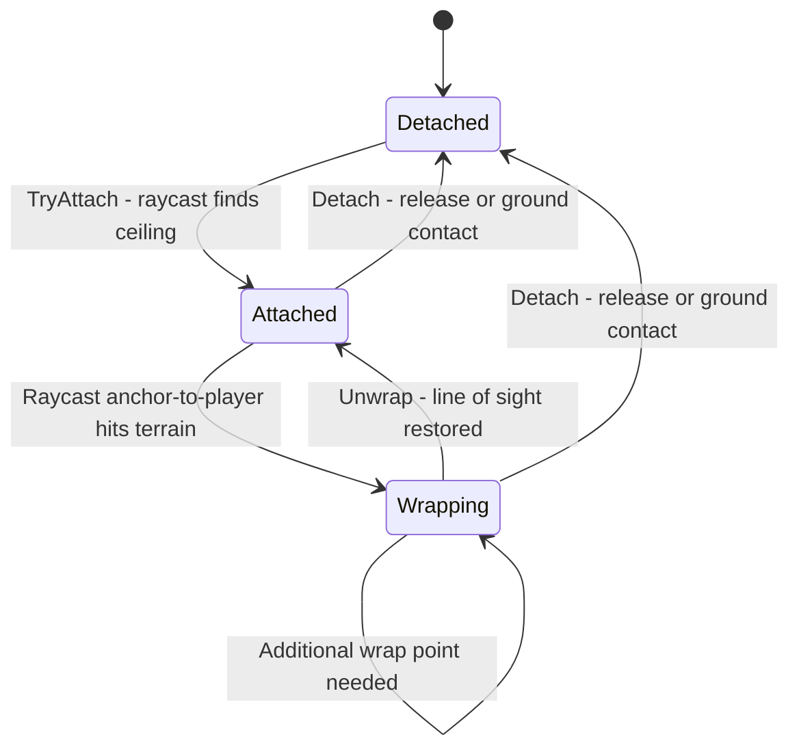
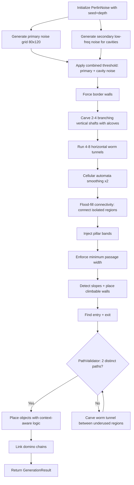
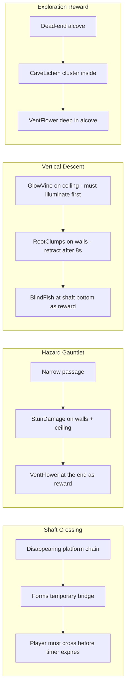

# Plan: Lighting, Rope Physics & Cave Complexity Fixes

## Overview

Three issues to address:
1. **Lighting is uniform** — the player's lantern should create a dramatic circular pool of light
2. **Rope passes through tiles** — the rope constraint ignores terrain, allowing over-length swings
3. **Caves are too linear** — need organic branching, horizontal passages, and guaranteed alternate routes
4. **Object placement** — integrate world objects more logically with cave topology for better challenge design

---

## Issue 1: Lantern Lighting — From Uniform to Dramatic

### Root Cause

The ambient light level in [`GetAmbientForDepth()`](Bloop/Screens/GameplayScreen.cs:406) returns values between **0.10 and 0.22**. At depth 1, ambient is 0.18 — meaning even unlit areas get 18% brightness. The shader formula in [`LightingEffect.fx`](Bloop/Content/Shaders/LightingEffect.fx:44) is `scene * (lightMap + ambient)`, so high ambient washes out the lantern's radial gradient, making the whole level look uniformly lit.

### Changes Required

#### File: [`GameplayScreen.cs`](Bloop/Screens/GameplayScreen.cs)

**A. Lower ambient range in `GetAmbientForDepth()`** (line 406-409)

Change from:
```csharp
return MathHelper.Clamp(0.18f - (depth - 1) * 0.003f, 0.10f, 0.22f);
```
To:
```csharp
return MathHelper.Clamp(0.05f - (depth - 1) * 0.005f, 0.015f, 0.05f);
```

This gives: depth 1 = 0.05, depth 5 = 0.03, depth 8+ = 0.015. Unlit areas will be near-black.

**B. Increase lantern base radius and intensity** (lines 62-64)

Change from:
```csharp
private const float LanternBaseRadius    = 440f;
private const float LanternBaseIntensity = 1.35f;
```
To:
```csharp
private const float LanternBaseRadius    = 520f;
private const float LanternBaseIntensity = 1.6f;
```

The larger radius and higher intensity ensure the lantern creates a clearly visible, bright circular pool against the now-dark surroundings.

**C. Raise the minimum radius when fuel is low** in [`UpdateLighting()`](Bloop/Screens/GameplayScreen.cs:381)

Change from:
```csharp
float baseRadius = 120f + (LanternBaseRadius - 120f) * fuelFraction;
```
To:
```csharp
float baseRadius = 160f + (LanternBaseRadius - 160f) * fuelFraction;
```

Ensures the lantern never shrinks to a tiny dot even at low fuel.

### Visual Result

```
Before:  ████████████████████████████████  uniform dim glow everywhere

After:   ░░░░░░░░░████████████░░░░░░░░░░  dark - bright circle - dark
                   ^^ player ^^
```

---

## Issue 2: Rope Passes Through Tiles

### Root Cause

[`RopeSystem.cs`](Bloop/Gameplay/RopeSystem.cs:84) uses a `DistanceJoint` that constrains the **exact distance** between anchor and player. This joint has no awareness of terrain — it only enforces a scalar distance. When the player swings, the rope arc can pass through solid tiles because:

1. The joint allows the full circular arc at the set distance
2. The player body collides with terrain, but the rope itself does not
3. The player can end up on the far side of a wall, with the rope phasing through rock

The [`GrapplingHook.cs`](Bloop/Gameplay/GrapplingHook.cs:127) already uses a `RopeJoint` (max-length, one-sided), which is better but still has the same terrain-phasing issue.

### Solution: Rope Wrap-Point System

Implement a rope wrapping system that detects when the rope line intersects terrain and creates intermediate anchor points, similar to how real ropes wrap around corners.

#### New File: `Bloop/Gameplay/RopeWrapSystem.cs`

A utility class used by both `RopeSystem` and `GrapplingHook` that:

1. Each frame, raycasts from the current anchor to the player position
2. If the ray hits terrain before reaching the player, the rope is wrapping around a corner
3. Creates a new intermediate anchor at the wrap point and shortens the remaining rope
4. When the player swings back, unwraps by removing intermediate anchors
5. The effective rope length is split across segments: `totalLength = sum of segment lengths`

```
Before:                          After:

  Anchor *                        Anchor *
          \                               \
           \  rope goes                    \ segment 1
            \ through rock         Wrap *---+
             \                          \
              \                          \ segment 2
               * Player                   * Player
```

#### Changes to [`RopeSystem.cs`](Bloop/Gameplay/RopeSystem.cs)

1. **Replace `DistanceJoint` with `RopeJoint`** — use max-length constraint like the grappling hook, so the rope acts as a maximum tether, not a rigid rod
2. **Add per-frame raycast check** between anchor and player:
   - If raycast hits terrain between anchor and player, find the corner point
   - Push a new wrap point onto a stack, create a new joint segment from wrap point to player
   - Reduce available rope length by the anchor-to-wrap distance
3. **Add unwrap detection**: when the angle between the last two segments reverses, pop the wrap point
4. **Clamp effective swing arc** — the player cannot swing past the point where the rope would need to pass through solid terrain

#### Changes to [`RopeSystem.cs`](Bloop/Gameplay/RopeSystem.cs) — Draw method (line 163)

Update drawing to render the rope as a polyline through all wrap points:
```
Anchor - WrapPoint1 - WrapPoint2 - ... - Player
```

#### Changes to [`GrapplingHook.cs`](Bloop/Gameplay/GrapplingHook.cs)

Apply the same wrap-point logic. The grappling hook already uses `RopeJoint`, so only the wrap detection and multi-segment drawing need to be added.

### Detailed Algorithm

```
Each frame while rope is attached:
  1. Raycast from currentAnchor to playerPosition
  2. If ray hits terrain:
     a. Find the corner tile vertex closest to the hit point
     b. Push corner as new wrap point
     c. Destroy current joint
     d. Create new static body at wrap point
     e. Create new RopeJoint from wrap point to player
     f. Reduce remaining rope length
  3. If wrap stack is not empty:
     a. Raycast from second-to-last anchor to player
     b. If clear line of sight exists, pop the last wrap point - unwrap
  4. Update joint MaxLength to remaining rope length
```

### Mermaid: Rope Wrap State Machine



---

## Issue 3: Caves Too Linear — Organic Perlin + Enhanced Connectivity

### Root Cause

The current [`LevelGenerator`](Bloop/Generators/LevelGenerator.cs:45) creates an 80x120 tile map using Perlin noise + 2-4 vertical shafts with horizontal corridors. The shafts meander slightly but are fundamentally linear top-to-bottom paths. There is no horizontal exploration, no branching, and no distinct cave spaces.

### Solution: Keep Organic Perlin Noise, Layer Connectivity On Top

The Perlin noise already produces natural-looking cave walls. We keep it as the foundation and enhance it with additional carving passes that create horizontal passages, branching shafts, and natural cavities.

#### Changes to [`LevelGenerator.cs`](Bloop/Generators/LevelGenerator.cs)

**New generation pipeline** — replace/augment steps in `TryGenerate()`:

##### Phase 1: Dual-Layer Noise (modify existing Step 1-2)

Use **two noise layers** instead of one:
- **Primary noise** (existing): scale 0.08, creates the base cave structure
- **Secondary noise** (new): scale 0.03 (lower frequency), creates large natural cavities

Where both layers are below threshold, carve extra-wide open spaces — these become organic "rooms" without rectangular shapes. This produces natural caverns that feel like erosion, not placed rectangles.

```csharp
// New: secondary low-frequency noise for natural cavities
float[,] cavityGrid = noise2.GenerateGrid(
    LevelWidth, LevelHeight,
    0.03f, 2, 0.6f, 2.0f);

// Combined threshold: if EITHER noise is below threshold, tile is empty
// This creates larger open areas where the low-freq noise dips
for (int ty = 0; ty < LevelHeight; ty++)
    for (int tx = 0; tx < LevelWidth; tx++)
    {
        bool primaryEmpty = grid[tx, ty] < threshold;
        bool cavityEmpty  = cavityGrid[tx, ty] < (threshold - 0.08f);
        if (primaryEmpty || cavityEmpty)
            map.SetTile(tx, ty, TileType.Empty);
        else
            map.SetTile(tx, ty, TileType.Solid);
    }
```

##### Phase 2: Horizontal Worm Tunnels (new method `CarveWormTunnels`)

After the noise pass, run **4-8 random-walk worms** that carve horizontal/diagonal passages:

- Each worm starts at a random position on the map edge or from a shaft intersection
- Worm width: 2-4 tiles
- Direction: biased horizontally (70% chance to move left/right, 30% up/down)
- Length: 20-50 tiles per worm
- Worms create the horizontal connectivity that the current vertical-shaft-only approach lacks

```csharp
private static void CarveWormTunnels(TileMap map, Random rng, int count)
{
    for (int i = 0; i < count; i++)
    {
        // Start from left or right edge at random Y
        int x = rng.Next(2) == 0 ? 3 : map.Width - 4;
        int y = rng.Next(map.Height / 5, 4 * map.Height / 5);
        int wormWidth = rng.Next(2, 5);
        int steps = rng.Next(20, 51);

        for (int s = 0; s < steps; s++)
        {
            // Carve a circle of tiles at current position
            for (int dy = -wormWidth/2; dy <= wormWidth/2; dy++)
                for (int dx = -wormWidth/2; dx <= wormWidth/2; dx++)
                    if (dx*dx + dy*dy <= wormWidth*wormWidth/4)
                        map.SetTile(x + dx, y + dy, TileType.Empty);

            // Move: 70% horizontal, 30% vertical
            if (rng.NextDouble() < 0.7)
                x += rng.Next(2) == 0 ? -1 : 1;
            else
                y += rng.Next(2) == 0 ? -1 : 1;

            x = Math.Clamp(x, 3, map.Width - 4);
            y = Math.Clamp(y, 3, map.Height - 4);
        }
    }
}
```

##### Phase 3: Branching Vertical Shafts (modify existing `CarveShafts`)

Keep the 2-4 shaft system but add **forking**:
- At random points (every 15-25 tiles vertically), a shaft splits into two narrower shafts
- The two branches diverge by 8-15 tiles horizontally and may reconnect 20-30 tiles later
- Add **horizontal alcoves** branching off shafts: short 5-10 tile dead-end passages that create exploration nooks

##### Phase 4: Flood-Fill Connectivity (new method `ConnectIsolatedRegions`)

After all carving, ensure the cave is fully connected:
1. Flood-fill from the entry point to find all reachable empty tiles
2. Identify disconnected cavities (unreachable pockets created by noise)
3. For each disconnected region larger than 20 tiles, carve a short tunnel to the nearest reachable tile
4. Small isolated pockets (under 20 tiles) are filled in as solid to avoid confusing dead-ends

##### Phase 5: Two-Path Guarantee (strengthen in PathValidator)

Instead of carving a crude secondary shaft as a last resort:
1. Run BFS to find path 1
2. Mark all tiles on path 1
3. Run a second BFS that **penalizes** tiles on path 1 (use Dijkstra with cost 5 for path-1 tiles vs cost 1 for others)
4. If path 2 shares more than 40% of tiles with path 1, the paths are not distinct enough
5. If paths are too similar, carve a **worm tunnel** between underused regions to create a genuine alternate route

### Revised Pipeline



---

## Issue 4: Context-Aware Object Placement

### Root Cause

The current [`ObjectPlacer`](Bloop/Generators/ObjectPlacer.cs) places objects based on simple surface detection (wall face? floor? ceiling?) with random chance. Objects are not placed with gameplay challenge in mind, and some objects only attach to vertical surfaces when they could logically appear on horizontal ones too.

### Solution: Topology-Aware Placement with Challenge Design

#### Changes to [`ObjectPlacer.cs`](Bloop/Generators/ObjectPlacer.cs)

##### A. Add `SurfaceType` enum for placement context

```csharp
[Flags]
enum SurfaceType
{
    None    = 0,
    Floor   = 1,  // solid tile with empty above
    Ceiling = 2,  // solid tile with empty below
    WallLeft  = 4,  // solid tile with empty to the left
    WallRight = 8,  // solid tile with empty to the right
}
```

##### B. Pre-scan surface map

Before placing objects, build a `SurfaceType[,]` grid that classifies every solid tile by its exposed faces. This allows objects to query "give me all ceiling tiles in this region" efficiently.

##### C. Improved placement rules per object type

**DisappearingPlatforms** — currently only bridge horizontal gaps under ceilings:
- **Add floor placement**: place as stepping stones across wide vertical shafts (floor surface with empty space on both sides)
- **Add domino staircase patterns**: when a shaft is detected (3+ consecutive empty columns), place a diagonal chain of disappearing platforms that form a temporary staircase
- **Challenge design**: place chains across the only path over a hazard, forcing the player to time their crossing

**StunDamageObjects** — currently only on walls/ceilings:
- **Add floor spikes**: place on floor surfaces (solid with empty above) — these are ground-level hazards the player must jump over
- **Add ceiling stalactites**: place on ceiling surfaces (solid with empty below) — these hang down and punish careless jumping
- **Challenge design**: cluster near narrow passages and shaft entrances to punish rushing; place near VentFlowers to create risk/reward decisions

**GlowVines** — currently only on right-facing walls:
- **Add left-wall placement**: scan for solid tiles with empty space to the left (mirror of current logic)
- **Add ceiling hanging vines**: place on ceiling surfaces, growing downward — these become climbable after illumination and serve as vertical traversal aids
- **Challenge design**: place in shafts where the player needs to descend but has no floor — must illuminate the vine first, then climb down

**RootClumps** — currently only on left-facing walls:
- **Add right-wall placement**: mirror of current logic
- **Add ceiling roots**: place on ceiling surfaces, growing downward — these retract after 8 seconds like wall roots
- **Challenge design**: place in sequences along vertical shafts where the player must chain from one root to the next before they retract

**VentFlowers** — currently only on floors:
- **Add alcove preference**: when placing, prefer locations inside dead-end alcoves or worm tunnel ends — this rewards exploration
- **Add shaft-bottom placement**: prefer the bottom of vertical shafts where breath is most needed
- **Challenge design**: place one VentFlower near a cluster of StunDamageObjects — the player must navigate hazards to reach the air pocket

**CaveLichen** — currently random on any surface:
- **Add cavern preference**: increase spawn chance in large open areas (detected by counting empty tiles in a 5-tile radius)
- **Add wall-cluster logic**: place 2-3 lichen in adjacent tiles to create foraging spots
- **Challenge design**: place poisonous lichen near safe lichen — the player must remember which is which (seed-determined)

**BlindFish** — currently random on floors:
- **Add pool preference**: increase spawn chance in wide floor areas (3+ consecutive floor tiles) — simulates underground pools
- **Add shaft-bottom preference**: fish collect at the bottom of vertical drops
- **Challenge design**: place in hard-to-reach areas that require rope/grapple to access

##### D. Add a `CavityAnalyzer` utility

A new helper class that pre-analyzes the tile map to identify:
- **Large cavities**: connected empty regions > 50 tiles (natural rooms from the dual-noise system)
- **Narrow passages**: corridors where the passage width is 2-3 tiles
- **Shaft bottoms**: the lowest empty tile in each vertical shaft
- **Dead-end alcoves**: passages that lead to a dead end within 10 tiles
- **Junction points**: tiles where 3+ passages meet

This analysis feeds into the object placer to make contextually appropriate decisions.

### Object Placement Challenge Patterns



---

## Files Changed Summary

| File | Change Type | Description |
|------|-------------|-------------|
| [`GameplayScreen.cs`](Bloop/Screens/GameplayScreen.cs) | Modify | Lower ambient levels, increase lantern radius/intensity |
| [`RopeSystem.cs`](Bloop/Gameplay/RopeSystem.cs) | Major rewrite | Replace DistanceJoint with RopeJoint, add wrap-point system |
| `Gameplay/RopeWrapSystem.cs` | **New file** | Shared rope-terrain collision and wrap-point logic |
| [`GrapplingHook.cs`](Bloop/Gameplay/GrapplingHook.cs) | Modify | Integrate wrap-point system for terrain-aware swinging |
| [`LevelGenerator.cs`](Bloop/Generators/LevelGenerator.cs) | Major rewrite | Dual-noise cavities, worm tunnels, branching shafts, flood-fill connectivity |
| [`PathValidator.cs`](Bloop/Generators/PathValidator.cs) | Modify | Dijkstra-based distinct path check, worm tunnel carving for alternate routes |
| [`ObjectPlacer.cs`](Bloop/Generators/ObjectPlacer.cs) | Major rewrite | Context-aware placement with challenge patterns, horizontal surface support |
| `Generators/CavityAnalyzer.cs` | **New file** | Pre-analyzes tile map topology for object placement decisions |

---

## Implementation Order

1. **Lighting fix** — smallest change, immediate visual impact, no risk of breaking other systems
2. **Cave generation** — must come before object placement since objects depend on cave topology
3. **Object placement** — depends on new cave topology and CavityAnalyzer
4. **Rope wrap system** — independent of cave changes, can be done in parallel or last

---

## Risk Assessment

- **Lighting**: Low risk. Only constant changes. Easy to tune if too dark/bright.
- **Cave generation**: Medium risk. Changes to level topology affect everything downstream. Mitigated by keeping the fallback generator, retry logic, and PathValidator. The organic Perlin approach preserves the existing natural look while adding connectivity.
- **Object placement**: Medium risk. New placement patterns could create impossible situations. Mitigated by the PathValidator ensuring all levels are completable, and by keeping minimum spacing rules.
- **Rope**: Medium risk. Wrap-point detection needs careful corner-case handling (wrapping around acute angles, rapid wrap/unwrap oscillation). Mitigated by keeping the existing detach-on-ground behavior and capping wrap points at 8.
