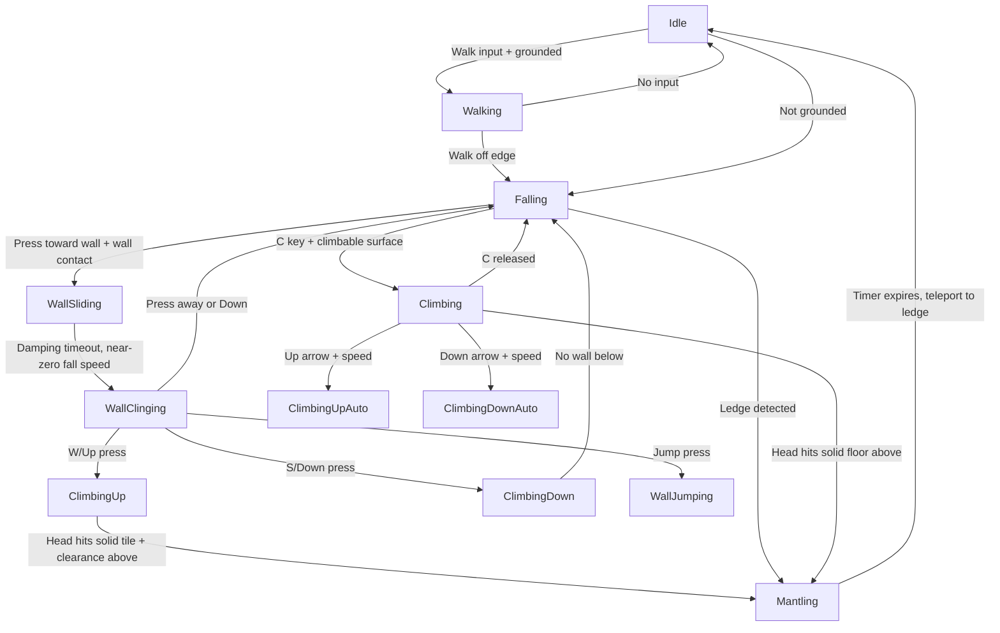

# Player Movement Fixes — Implementation Plan

## Root Cause Analysis

### Bug #1: Grounded + Hooked = No Movement

**Root Cause:** When the player is grounded with an active grapple anchor, the state machine retains `Swinging` state. In [`PlayerController.Update()`](Bloop/Gameplay/PlayerController.cs:424), the `Swinging` branch returns early (line 444: `return;`), never reaching the normal ground movement code at lines 465-510. Although [`GrapplingHook.Update()`](Bloop/Gameplay/GrapplingHook.cs:262) detects grounded+Idle/Walking/Crouching and avoids *re-entering* Swinging, it never **exits** Swinging to allow ground movement.

**Fix:** In [`GrapplingHook.Update()`](Bloop/Gameplay/GrapplingHook.cs) (or in `PlayerController`), when the player is grounded AND in `Swinging` state, automatically release the grapple or transition to `Idle` so normal ground movement takes over.

### Bug #2: Rope Extends Beyond Its Length

**Root Cause:** In [`GrapplingHook.OnHookCollision()`](Bloop/Gameplay/GrapplingHook.cs:397), when the hook hits terrain, the anchor position and player position are captured (lines 417-427). However, the `RopeJoint` is not created until [`GrapplingHook.Update()`](Bloop/Gameplay/GrapplingHook.cs:204) processes the `_pendingAnchor` flag — **after** the physics `Step()` completes. During the remaining Aether sub-steps between the collision callback and the end of `Step()`, the player continues moving (falling, swinging), increasing the anchor-player distance beyond the captured length.

Additionally, in [`RopeWrapSystem.FindTerrainIntersection()`](Bloop/Gameplay/RopeWrapSystem.cs:275), the DDA ray march uses a fixed step of `TileSize * 0.5f` (16px), which can miss thin (1-tile) walls at certain angles, allowing the rope to appear to pass through terrain.

**Fix:**
1. Create the `RopeJoint` **during** the collision callback rather than deferring to `Update()`, using a separate temporary flag, or capture the player position at a safer time.
2. Reduce the DDA step size from half-tile to quarter-tile (8px) for better accuracy.

### Bug #3: Rope Clips Through Tiles

**Root Cause:** Same as Bug #2's secondary cause — the half-tile DDA step in [`RopeWrapSystem.FindTerrainIntersection()`](Bloop/Gameplay/RopeWrapSystem.cs:286) is too coarse. At 16px steps, narrow terrain features (single-tile walls, thin pillars, diagonal corners) can be skipped entirely. The wrap-point snapping in [`FindNearestCorner()`](Bloop/Gameplay/RopeWrapSystem.cs:315) may also pick the wrong corner when the intersection point is near a tile boundary.

**Fix:**
1. Reduce DDA step size to 8px (quarter-tile) in `FindTerrainIntersection()`.
2. Improve `FindNearestCorner()` to use the approach/exit direction (anchor-to-player vector) to prefer the corner that the rope should physically wrap around, rather than the closest empty corner.
3. After computing the polyline, do a validation pass: verify each wrap-point-to-wrap-point segment does not intersect terrain. If a segment clips terrain, insert an additional wrap point.

### Bug #4: Wall Sliding Oscillation (Up/Down Cycling)

**Root Cause:** In [`PlayerController.Update()`](Bloop/Gameplay/PlayerController.cs:182-212), when the player falls adjacent to a wall and presses toward it, the wall slide system engages:
- Damping ramps from 0 to `WallSlideMaxDamping` (20) over `WallSlideRampTime` (0.5s) (lines 190-191).
- During this ramp-up, the player continues falling but at a decreasing rate. The physics engine's normal force from the wall collision can push the player slightly away from the wall, causing [`UpdateWallDetection()`](Bloop/Gameplay/PlayerController.cs:680) to lose wall contact.
- When wall contact is lost, `_wallSlideTimer` and `_wallSlideDamping` reset to 0 (lines 203-206).
- The player falls again, re-establishes wall contact, and the cycle repeats: slide down → ramp damping → lose contact → reset → fall again.

The 1-frame hysteresis in `UpdateWallDetection()` (lines 728-731) is insufficient to prevent this oscillation when the physics push-away lasts multiple frames.

**Additional Issue:** The `Climbable` tile/surface interaction via the C key (`IsClimbHeld()`) at [`PlayerController.cs:390-408`](Bloop/Gameplay/PlayerController.cs:390) has **no entry point** into `PlayerState.Climbing`. The code only handles movement when already `Climbing`, and transitions to `Falling` when C is released. There's no code that transitions TO `Climbing` state based on collision with `Climbable` tiles/surfaces + pressing C.

**Fix:**
1. Increase wall-detection hysteresis from 1 frame to 3-5 frames (short timer-based approach) to smooth out brief contact losses.
2. Apply a small inward force toward the wall during wall slide to maintain contact.
3. Add an explicit entry into `PlayerState.Climbing` when:
   - Player is in `Falling`/`Jumping`/`Walking` state
   - Player is adjacent to a `Climbable` tile or surface
   - Player presses C (or is auto-triggered by touching a climbable surface while pressing toward it)

### Bug #5: Wall Climbing Up/Down + Auto-Mantle at Top

**Root Cause in Current Code:**
- [`PlayerController.WallClinging` handling](Bloop/Gameplay/PlayerController.cs:215-268) only supports climbing **up** (W/Up at `WallClimbSpeed` = 40px/s). There is no S/Down handling to climb downward while clinging.
- [`CheckLedgeGrabFromCling()`](Bloop/Gameplay/PlayerController.cs:821) checks if the player's head hits a solid tile while climbing upward, then triggers a mantle. But this uses the **same tile column** as the player center (`pos.X / ts`), not the wall column, which may miss the ledge if the player is not perfectly aligned.

**Desired Behavior:**
1. Player jumps toward a vertical surface (wall or climbable surface).
2. On contact, player grabs the surface (enters `WallClinging` or `Climbing` state).
3. Player can climb **up** (W/Up) and **down** (S/Down) using the existing `ClimbSpeed` (100px/s).
4. When the player's head reaches the top edge of a horizontal surface above, the player automatically mantles onto it, ending the climb.

**Fix:**
1. Add S/Down handling to the `WallClinging` state (currently only W/Up is handled).
2. Improve `CheckLedgeGrabFromCling()` to:
   - Detect the ledge top at the wall tile column (not player center column).
   - Use the correct tile height for the mantle target.
   - Work for both climbing up AND moving horizontally toward a ledge.
3. Consider merging the `Climbing` and `WallClinging` concepts for a unified wall-climbing experience.

---

## Implementation Steps

### Step 1: Fix Grounded + Hooked Movement (Bug #1)

**File:** [`Bloop/Gameplay/GrapplingHook.cs`](Bloop/Gameplay/GrapplingHook.cs)

In `Update()`, after the wrap-system update (around line 262), add a check:
```csharp
// Auto-release or transition when grounded and swinging
if (_isAnchored && _ownerPlayer != null && _ownerPlayer.IsGrounded
    && _ownerPlayer.State == PlayerState.Swinging)
{
    // Apply tangential boost if desired, then release
    Release(); // or just SetState(Idle)
}
```

Alternatively, handle this in [`PlayerController.Update()`](Bloop/Gameplay/PlayerController.cs) at line 423-445: before the `Swinging` branch returns, check if grounded and transition to `Idle`/`Walking`:
```csharp
if (_player.State == PlayerState.Swinging)
{
    if (_player.IsGrounded)
    {
        _player.SetState(_player.PixelVelocity.X != 0 ? PlayerState.Walking : PlayerState.Idle);
        _player.ActiveRopeAnchorPixels = null;
        _player.IsRopeClimbing = false;
        // Fall through to normal movement code
    }
    else
    {
        // existing swinging code...
    }
}
```

### Step 2: Fix Rope Over-Extension (Bug #2)

**File:** [`Bloop/Gameplay/GrapplingHook.cs`](Bloop/Gameplay/GrapplingHook.cs)

Option A (safer): In `OnHookCollision()`, immediately create the anchor body and joint, but mark them as "pending" to be finalized on next step. This requires Aether to support adding bodies during callbacks.

Option B (more practical): In `Update()` when processing `_pendingAnchor`, apply an impulse toward the anchor to pull the player back to the correct rope length if they've exceeded it:
```csharp
// After creating the joint, check if player exceeded the rope length
float currentDist = Vector2.Distance(_pendingAnchorPos, _ownerPlayer.Body.Position);
if (currentDist > ropeLength + 0.01f)
{
    // Pull player back toward anchor
    Vector2 pullDir = _pendingAnchorPos - _ownerPlayer.Body.Position;
    pullDir.Normalize();
    float excess = currentDist - ropeLength;
    _ownerPlayer.Body.Position += pullDir * excess; // teleport correction
}
```

### Step 3: Fix Rope Terrain Clipping (Bug #3)

**File:** [`Bloop/Gameplay/RopeWrapSystem.cs`](Bloop/Gameplay/RopeWrapSystem.cs)

1. **Reduce DDA step size** in `FindTerrainIntersection()` (line 286):
   ```csharp
   float stepSize = TileSize * 0.25f; // 8px instead of 16px
   // Steps = length / stepSize + 2 for safety margin
   ```

2. **Improve `FindNearestCorner()`** (line 315):
   - Instead of picking the nearest empty corner to the intersection point, compute which side of the tile the rope enters from (anchor side) and which side it exits to (player side), and pick the corner at the intersection of those two sides.
   - This avoids choosing the wrong corner when multiple empty corners are near the intersection point.

3. **Add segment validation** at the end of `Update()`: after computing the full wrap-point chain, verify each segment doesn't intersect terrain. If a segment clips, insert a new wrap point at the intersection.

### Step 4: Fix Wall Slide Oscillation (Bug #4)

**File:** [`Bloop/Gameplay/PlayerController.cs`](Bloop/Gameplay/PlayerController.cs)

1. **Increase wall detection hysteresis** in `UpdateWallDetection()` (line 726-731):
   Replace the simple 1-frame boolean hysteresis with a short timer-based hysteresis:
   ```csharp
   // Add timer fields
   private float _wallLeftLostTimer = 0f;
   private float _wallRightLostTimer = 0f;
   private const float WallLostHysteresisDuration = 0.08f; // ~5 frames at 60fps
   
   // In UpdateWallDetection():
   if (touchLeft)
   {
       _player.IsTouchingWallLeft = true;
       _wallLeftLostTimer = WallLostHysteresisDuration;
   }
   else
   {
       _wallLeftLostTimer -= dt;
       _player.IsTouchingWallLeft = _wallLeftLostTimer > 0f;
   }
   // (same for right)
   ```

2. **Apply inward force during wall slide** (around line 192):
   While wall-sliding and pressing toward the wall, apply a small continuous force toward the wall to maintain contact:
   ```csharp
   float wallPushForce = _player.IsTouchingWallLeft ? -100f : 100f;
   _player.Body.ApplyForce(PhysicsManager.ToMeters(new Vector2(wallPushForce, 0f)));
   ```

3. **Add climbing entry detection** (around line 390):
   Add code before the existing climbing-handling block to detect when the player should ENTER climbing state:
   ```csharp
   // Auto-enter climbing when touching climbable surface and pressing toward it
   if (_input.IsClimbHeld() && _player.State != PlayerState.Climbing
       && _player.State != PlayerState.Rappelling
       && _player.State != PlayerState.Swinging)
   {
       if (IsTouchingClimbableSurface())
       {
           _player.SetState(PlayerState.Climbing);
           _player.Body.LinearVelocity = Vector2.Zero;
       }
   }
   ```
   
   Add a helper `IsTouchingClimbableSurface()` that checks if the player's body is touching a fixture with `CollisionCategories.Climbable`.

### Step 5: Fix Wall Climbing Up/Down + Auto-Mantle (Bug #5)

**File:** [`Bloop/Gameplay/PlayerController.cs`](Bloop/Gameplay/PlayerController.cs)

1. **Add climb-down to `WallClinging`** (lines 253-263):
   ```csharp
   else if (_input.IsKeyHeld(Keys.S) || _input.IsKeyHeld(Keys.Down))
   {
       // Climb down while clinging
       _player.Body.IgnoreGravity = false;
       _player.Body.LinearDamping = 8f;
       _player.Body.LinearVelocity = PhysicsManager.ToMeters(new Vector2(0f, WallClimbSpeed));
       // Check if we should release cling (no more wall below)
       if (!_player.IsTouchingWall)
       {
           _player.Body.IgnoreGravity = false;
           _player.Body.LinearDamping = 0f;
           _player.SetState(PlayerState.Falling);
       }
       return;
   }
   ```

2. **Improve `CheckLedgeGrabFromCling()`** (lines 821-847):
   - Detect the wall tile column (to the side the player is clinging to) instead of using `pos.X / ts`.
   - Check both the wall column and the player column for the ledge.
   - When climbing up and head meets a solid tile, check the tile ABOVE for clearance, then mantle.
   - When climbing down and feet pass below the wall, auto-release.

3. **Add horizontal ledge detection for auto-mantle**: When climbing up and reaching a point where:
   - The wall tile ends (empty space above it)
   - There's a solid tile adjacent horizontally (floor surface)
   - The player's head is at or below the floor surface
   → Trigger mantle onto the floor surface.

---

## Mermaid Diagram: State Transitions



## Files to Modify

| File | Changes |
|------|---------|
| [`Bloop/Gameplay/PlayerController.cs`](Bloop/Gameplay/PlayerController.cs) | Fixes for bugs #1, #4, #5 — grounded+swinging transition, wall slide hysteresis + inward force, climb entry detection, climb-down in WallClinging, improved CheckLedgeGrabFromCling |
| [`Bloop/Gameplay/GrapplingHook.cs`](Bloop/Gameplay/GrapplingHook.cs) | Fix for bugs #1, #2 — auto-release when grounded, post-anchor position correction |
| [`Bloop/Gameplay/RopeWrapSystem.cs`](Bloop/Gameplay/RopeWrapSystem.cs) | Fix for bugs #2, #3 — reduced DDA step size, improved corner selection, segment validation |
| [`Bloop/Gameplay/Player.cs`](Bloop/Gameplay/Player.cs) | May need small adjustments for new state transition edge cases |

## Risks & Mitigations

| Risk | Mitigation |
|------|-----------|
| Reducing DDA step size increases CPU load (more checks per frame) | Step size from 16px→8px doubles checks (max ~200 rays per frame), still negligible for CPU |
| Auto-releasing grapple when grounded may frustrate players who want to stay anchored | Only auto-release if player explicitly provides ground movement input (horizontal input or jump) |
| Wall-cling changes might break entity possession workflow | All changes are gated behind existing state checks; entity control state is unaffected |
| Timer-based hysteresis could introduce input lag | Use 80ms (5 frames at 60fps) — short enough to be imperceptible, long enough to smooth oscillation |
