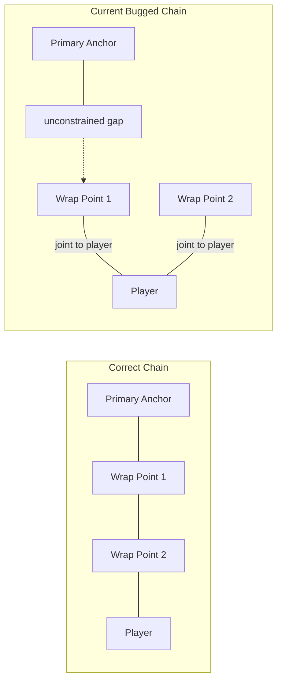
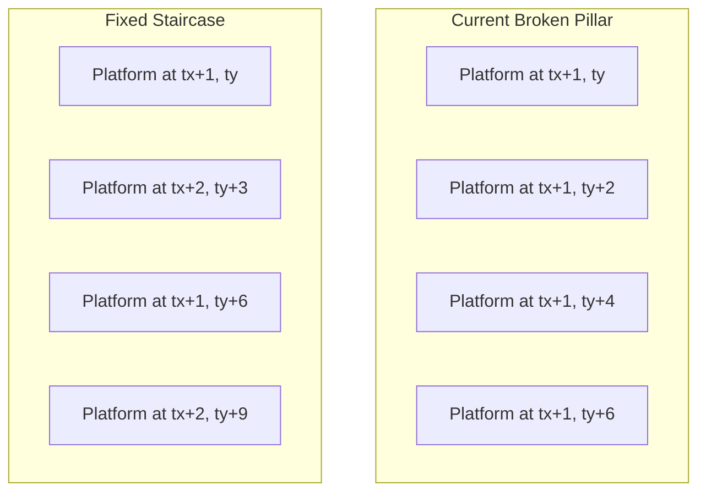
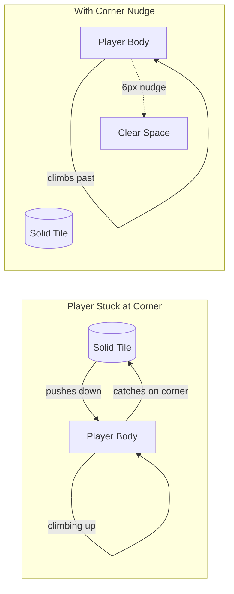

# Three-Bug Fix Plan: Root-Cause Analysis & Fix Specifications

## Overview

This document details the root causes and proposed fixes for three gameplay bugs in the **Descent Into the Deep** (Bloop) MonoGame/Aether.Physics2D platformer.

---

## Bug 1: Rope Clipping Through Tiles While Swinging

### Root Cause

The rope-wrap system in [`RopeWrapSystem.cs`](Bloop/Gameplay/RopeWrapSystem.cs) has two interacting defects:

#### Defect 1A — `FindNearestCorner()` selects the wrong corner during diagonal swings

When the player swings diagonally past a tile, [`FindNearestCorner()`](Bloop/Gameplay/RopeWrapSystem.cs:430) determines entry/exit side by comparing the anchor and player positions relative to the *tile center*. This works well when the rope approaches from a clear cardinal direction, but during a diagonal swing the `anchorDir` and `playerDir` can produce ambiguous side detection — e.g., the rope enters from what it detects as "left" but actually enters near the top-left corner at a 45° angle, leading the system to select the wrong corner (inner instead of outer).

When the **wrong corner** is selected:
- The wrap point is placed at an interior corner (inside the solid mass)
- The rope segment then passes *between two adjacent solid tiles* (through the shared edge) instead of around the outer corner
- Visually: the rope "clips through" the tile geometry

The fallback path (lines 478-503) iterates corners and picks the one closest to the intersection with an empty neighbor — but it doesn't verify that this corner actually creates a **valid non-intersecting segment** from the previous anchor.

#### Defect 1B — `InsertWrapPoint()` creates broken constraint chain

[`InsertWrapPoint()`](Bloop/Gameplay/RopeWrapSystem.cs:334) removes an existing joint and creates two replacement joints, but **both new joints connect to `playerBody`** (lines 358, 364):

```csharp
var joint1 = new RopeJoint(newBody, playerBody, ...);  // connects new wrap → player
var joint2 = new RopeJoint(existing.Body, playerBody, ...);  // connects existing wrap → player
```

This means the constraint chain becomes:
- `prevAnchor → (no joint)` ... `newBody → playerBody` (joint1)
- `existingBody → playerBody` (joint2)

The rope joints are **not chained in series** but form a parallel star to `playerBody`. This can leave a "gap" between the previous anchor and the new wrap point where the rope isn't physically constrained, allowing the visual rope to deviate from the constraint path.

Additionally, the segment-length accounting on line 350 only subtracts `seg1LengthPixels` from `remainingLengthPixels`, but doesn't account for the fact that the removed old joint had a different segment length.

### Fix Strategy

1. **Improve `FindNearestCorner()` selection robustness**: Instead of only using entry/exit side detection, add a validation step that tests each candidate corner by checking whether the segment from previous anchor → candidate → next anchor passes through terrain. Only select corners where **both** resulting segments are clear of solid tiles.

2. **Fix `InsertWrapPoint()` chain construction**: Change so `joint1` connects `newBody` → `existing.Body` (not `playerBody`), forming a proper series chain. Only the last wrap point's joint should connect to `playerBody`.

3. **Increase corner offset margin**: Change the 2px offset (line 511) to 4px to reduce re-intersection risk during fast swings.

### Files to Modify

- [`Bloop/Gameplay/RopeWrapSystem.cs`](Bloop/Gameplay/RopeWrapSystem.cs)
  - `FindNearestCorner()` — add segment-clearance validation to corner selection
  - `InsertWrapPoint()` — fix joint chain to connect wrap points in series, not parallel to player
  - Corner offset constant (2px → 4px)

---

## Bug 2: DisappearingPlatforms Generating as Impassable Pillars

### Root Cause

The pillar bug is in [`PlaceShaftStaircases()`](Bloop/Generators/ObjectPlacer.cs:520) in `ObjectPlacer.cs`.

#### Defect 2A — `Math.Clamp` prevents horizontal movement in narrow shafts

Line 554:
```csharp
curX = Math.Clamp(curX + dir, tx + 1, tx + shaftWidth - 2);
```

When `shaftWidth = 3` (minimum qualifying width):
- Lower bound: `tx + 1`
- Upper bound: `tx + 3 - 2 = tx + 1`
- **Bounds are equal** — `curX` can never move horizontally regardless of `dir`
- Result: all platforms in the chain are placed at `tx + 1`, forming a vertical pillar

Even with `shaftWidth = 4`:
- Bounds: `tx + 1` to `tx + 2`
- `curX` can only oscillate between two columns, producing a zigzag that's still too narrow to traverse

#### Defect 2B — No minimum vertical gap check

The loop steps `ty += 2` (every 2 rows = 64px vertical). Since each [`DisappearingPlatform`](Bloop/Objects/DisappearingPlatform.cs) has `PlatformWidth = 128px`, two platforms placed in adjacent or nearly-adjacent rows within the same shaft width will have overlapping horizontal extents. The player cannot fit between overlapping platforms.

#### Defect 2C — No bottom-platform exclusion

At the bottom of the staircase, platforms may be placed very close to the shaft floor, leaving no room for the player to pass underneath.

### Fix Strategy

1. **Fix horizontal placement logic**: Replace `Math.Clamp` with an alternating bounce pattern. Instead of a fixed `dir`, make platforms alternate between the left and right sides of the shaft, forming a true traversable staircase with clear horizontal separation.

2. **Add minimum vertical gap**: Skip placement if the previous platform in the chain was placed fewer than 4 rows (128px) above, ensuring the player can fit between platforms.

3. **Avoid shaft-bottom placement**: Skip the last 3 rows of the shaft to leave clearance at the bottom.

4. **Add shaft-width awareness**: For shafts of exactly 3 tiles wide, use a single-column offset (one side only) rather than a staircase, since there's no room for a true staircase.

### Files to Modify

- [`Bloop/Generators/ObjectPlacer.cs`](Bloop/Generators/ObjectPlacer.cs)
  - `PlaceShaftStaircases()` — rewrite the placement loop with proper alternation/bounce, vertical gap checks, and bottom clearance

---

## Bug 3: Player Gets Stuck on Tile Corners While Climbing Vertical Walls

### Root Cause

The player can climb walls via either the [`Climbing`](Bloop/Gameplay/PlayerController.cs:419) state (on Climbable tiles) or [`WallClinging`](Bloop/Gameplay/PlayerController.cs:272) state (holding W/Up on a solid wall). In both cases, the player moves vertically alongside a wall. The bug occurs when the player reaches the **top corner of a tile** that protrudes at the end of a wall section.

#### Defect 3A — `ApplyCornerCorrection()` only fires during upward jumps

[`ApplyCornerCorrection()`](Bloop/Gameplay/PlayerController.cs:1004) is called only when `LinearVelocity.Y < 0f` (the player is jumping upward and their head hits a ceiling tile). It is **never called** during:
- [`Climbing` state](Bloop/Gameplay/PlayerController.cs:419-437) — velocity is set directly, no corner correction
- [`WallClinging` upward climb](Bloop/Gameplay/PlayerController.cs:272-281) — velocity is set directly, no corner correction

#### Defect 3B — No sideways nudge during climbing

When climbing upward and the player's top edge encounters a protruding tile corner:
- The climbing code continuously sets downward velocity to 0 and upward velocity to `ClimbSpeed`
- The physics engine pushes the player body back down due to contact with the protruding corner
- This creates an oscillation — the player appears to "stutter" up and down at the corner
- The player can't smoothly traverse onto the tile above because no horizontal push-around exists

#### Defect 3C — `CheckLedgeGrabFromCling()` expects a full mantle, not a corner traverse

[`CheckLedgeGrabFromCling()`](Bloop/Gameplay/PlayerController.cs:957) triggers a full mantle animation when the player climbs up into a solid tile directly above — but this requires specific conditions (head in solid, torso clear). A corner protrusion (where the tile juts out horizontally, not directly above) doesn't meet these conditions.

### Fix Strategy

1. **Add climbing-specific corner correction**: Create a new method `ApplyClimbingCornerCorrection()` that checks for protruding tile corners at the player's **top-head corner** (not the center ceiling) during upward climbing movement. If a solid tile exists diagonally adjacent to the player's head on the side they're climbing, apply a horizontal nudge (up to 6px) to slide the player around the corner.

2. **Call the new method during climbing**: Invoke `ApplyClimbingCornerCorrection()` in the Climbing state block (line 434, alongside `CheckLedgeGrabFromCling()`) and in the WallClinging upward block (line 280, alongside `CheckLedgeGrabFromCling()`).

3. **Extend `ApplyCornerCorrection()` to fire during climbing**: Alternatively (or additionally), modify `ApplyCornerCorrection()` to also check for side-corner protrusions when the player is in Climbing or WallClinging state, not just when `LinearVelocity.Y < 0f`.

### Files to Modify

- [`Bloop/Gameplay/PlayerController.cs`](Bloop/Gameplay/PlayerController.cs)
  - Add `ApplyClimbingCornerCorrection()` method (analogous to `ApplyCornerCorrection()` but for side-corner protrusions during climbing)
  - Call it from the Climbing state block (line ~434) and WallClinging upward block (line ~280)
  - Optionally extend `ApplyCornerCorrection()` to handle climbing states

---

## Implementation Order

Each bug fix is independent and can be implemented in any order. Recommended order:

1. **Bug 2** (simplest, most contained, lowest risk of side effects)
2. **Bug 3** (moderate complexity, affects player movement but contained to PlayerController)
3. **Bug 1** (most complex, involves physics constraint chain and corner selection — test thoroughly)

---

## Testing Notes

- Bug 2 can be verified by generating several seeds/levels and checking that DisappearingPlatform staircases are traversable (no vertical pillars)
- Bug 3 needs manual testing by finding a vertical wall with a protruding corner and climbing upward past it
- Bug 1 needs manual testing by swinging on the grappling hook at various angles near tiles and verifying the rope doesn't clip

---

## Mermaid Diagrams

### Bug 1: Rope Wrap Chain (Correct vs. Broken)



### Bug 2: Shaft Staircase vs. Pillar



### Bug 3: Climbing Corner Stick


