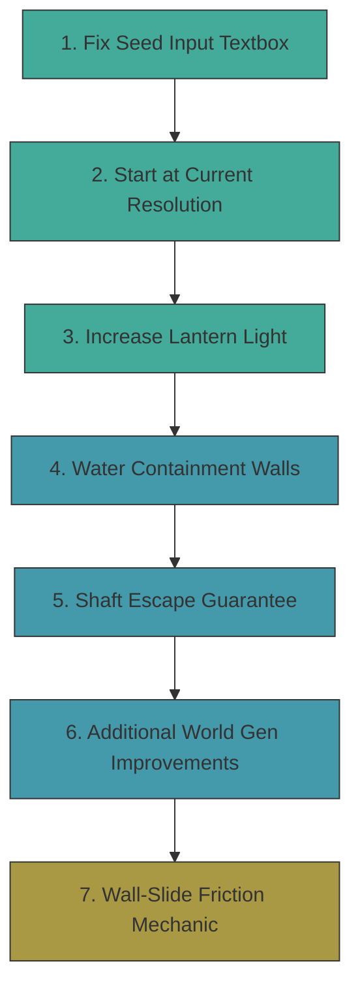

# World Generation & QoL Improvements Plan

## Overview

This plan addresses world generation fairness, organic feel, and several quality-of-life fixes across the Bloop codebase.

---

## 1. Vertical Shaft Escape — Never Get Stuck

### Problem
The grappling hook has a `MaxRange` of 600px (~18.75 tiles). If a player falls into a vertical shaft taller than that, and there are no climbable walls or ledges within hook range, they are permanently stuck.

### Root Cause Analysis
- [`GrapplingHook.MaxRange`](Bloop/Gameplay/GrapplingHook.cs:28) = 600px — hook projectile is destroyed if it travels further
- [`PlaceClimbableWalls()`](Bloop/Generators/LevelGenerator.cs:945) only has a 15% chance per eligible wall run, and only marks runs of 3–8 tiles
- Vertical shafts carved by [`CarveBranchingShafts()`](Bloop/Generators/LevelGenerator.cs:389) can be 6–12+ tiles per segment with no guaranteed climbable surfaces
- The [`PathValidator`](Bloop/Generators/PathValidator.cs:22) BFS uses `MaxJumpHeight = 3` but does NOT simulate grappling hook reach — it only validates jump/climb reachability

### Solution: Multi-Layered Escape Guarantee

**A. Post-generation shaft escape audit** — New step in [`LevelGenerator.TryGenerate()`](Bloop/Generators/LevelGenerator.cs:246) after step 12 (climbable walls):
- Scan every column for vertical empty runs > `MaxJumpHeight` (3 tiles)
- For each such shaft, verify that at least ONE of these escape mechanisms exists within every `MaxJumpHeight`-tile vertical window:
  - A climbable wall tile on either side
  - A ledge/platform to stand on
  - A horizontal passage leading out
- If none exist, **inject climbable wall tiles** on the nearest solid wall face, or place a small ledge (2-tile platform) every 3 tiles

**B. Guaranteed climbable walls in tall shafts** — Enhance [`PlaceClimbableWalls()`](Bloop/Generators/LevelGenerator.cs:945):
- After the random 15% placement pass, do a **mandatory pass** for shafts taller than 8 tiles
- For any shaft column with >8 consecutive empty tiles and no climbable surface within 3 tiles vertically, force-place a climbable run of 4+ tiles on the nearest wall

**C. Emergency wall-cling mechanic** (creative solution) — Add a new `WallSlide` behavior:
- When the player is falling and pressing against a wall (already detected via `IsTouchingWallLeft`/`IsTouchingWallRight`), apply a friction drag that slows descent to ~30% of normal fall speed
- This is NOT wall climbing (no upward movement) — just a survival brake that prevents death from long falls and gives time to spot a grapple point
- Implemented in [`PlayerController.Update()`](Bloop/Gameplay/PlayerController.cs:82) during the Falling state

### Files to Modify
- [`Bloop/Generators/LevelGenerator.cs`](Bloop/Generators/LevelGenerator.cs) — Add `EnsureShaftEscapeRoutes()` after step 12
- [`Bloop/Gameplay/PlayerController.cs`](Bloop/Gameplay/PlayerController.cs) — Add wall-slide friction during Falling state

---

## 2. Water Containment — Solid Walls on Both Sides

### Problem
Water pools can spawn in open areas where they visually "float" without solid tile boundaries on the left and right edges.

### Root Cause Analysis
- [`WaterPoolSystem.BuildPools()`](Bloop/World/WaterPool.cs:69) merges adjacent `IsShaftBottom` tiles into pool rectangles
- It only checks that tiles are shaft-bottom + empty — no check for solid containment walls
- A pool run can extend to the edge of a cavern where there's no solid wall

### Solution: Enforce Solid Containment

In [`WaterPoolSystem.BuildPools()`](Bloop/World/WaterPool.cs:69), after detecting a run of shaft-bottom tiles:
- **Left boundary check**: Verify that the tile at `(runStart - 1, ty)` is solid. If not, shrink `runStart` rightward until a solid left boundary is found
- **Right boundary check**: Verify that the tile at `(runStart + runLen, ty)` is solid. If not, shrink `runLen` leftward until a solid right boundary is found
- **Depth containment**: For each depth row below the surface, verify solid walls exist at the same left/right boundaries. If a wall is missing at depth, reduce `DepthTiles` to the last fully-contained row
- If after shrinking the run is < 2 tiles wide, discard the pool entirely

### Files to Modify
- [`Bloop/World/WaterPool.cs`](Bloop/World/WaterPool.cs) — Add containment validation in `BuildPools()`

---

## 3. Increase Lantern Light

### Problem
The lantern light feels too dim, making exploration frustrating.

### Current Values
- [`LanternBaseRadius`](Bloop/Screens/GameplayScreen.cs:78) = 180px (~5.6 tiles)
- [`LanternBaseIntensity`](Bloop/Screens/GameplayScreen.cs:79) = 1.9
- Radius shrinks to minimum 50px as fuel depletes
- [`AmbientLevel`](Bloop/Lighting/LightingSystem.cs:66) = 0.05 at depth 1, down to 0.015 at deep levels

### Solution
- Increase `LanternBaseRadius` from **180 → 260** (~8 tiles visible radius)
- Increase `LanternBaseIntensity` from **1.9 → 2.4**
- Raise the minimum radius floor from **50 → 80** (so even low fuel gives usable light)
- Slightly raise ambient floor from **0.015 → 0.025** (deep levels are still dark but not pitch black)

### Files to Modify
- [`Bloop/Screens/GameplayScreen.cs`](Bloop/Screens/GameplayScreen.cs:78) — Update lantern constants and `GetAmbientForDepth()`

---

## 4. Fix Seed Input Textbox

### Problem
The seed textbox on the SeedInputScreen doesn't allow the player to type anything.

### Root Cause Analysis
Looking at [`SeedInputScreen.Update()`](Bloop/Screens/SeedInputScreen.cs:46):
- The screen reads `Keyboard.GetState()` directly into `currKeys` (line 58)
- It iterates `currKeys.GetPressedKeys()` and compares against `_prevKeys` (line 80-87)
- **BUT** `_prevKeys` is only updated at line 89 (`_prevKeys = currKeys`) — this happens AFTER the digit input loop
- The issue is that `ScreenManager.Input.Update()` is called at the start of the game loop, which advances the keyboard state. By the time `SeedInputScreen.Update()` runs, the `InputManager` has already consumed the current frame's state
- The `_prevKeys` field is a local `KeyboardState` that starts as default (all keys up), so the FIRST key press works, but the `input.IsKeyPressed(Keys.Enter)` call on line 68 and `input.IsKeyPressed(Keys.Back)` on line 76 use the `InputManager`'s state — these work fine
- **The real bug**: The `var input = ScreenManager.Input` is used for Enter/Back/Pause, but the digit loop uses raw `Keyboard.GetState()`. The problem is that `_prevKeys` is initialized to `default(KeyboardState)` which has all keys UP. On the first frame, this works. But the issue is likely that `_prevKeys = currKeys` at line 89 is reached AFTER the early returns on lines 63 and 71. When the player presses Escape or Enter, the method returns before updating `_prevKeys`, causing the next frame to see stale state.

Actually, re-reading more carefully: the flow is correct for digits. The real issue is likely that **MonoGame's `TextInput` event is not being used**, and the raw keyboard polling approach conflicts with the `InputManager` which also polls `Keyboard.GetState()`. Since `InputManager.Update()` is called first in the game loop, and `SeedInputScreen` also calls `Keyboard.GetState()`, there could be a timing issue where the key state has already been consumed.

**The fix**: Use MonoGame's `Window.TextInput` event instead of raw keyboard polling. This is the standard approach for text input in MonoGame and handles key repeat, shift states, etc. properly.

### Solution
- Subscribe to `Game.Window.TextInput` event when the screen is pushed
- Unsubscribe when the screen is popped
- In the event handler, filter for digit characters and append to `_inputText`
- Remove the manual `KeyToDigit()` polling loop entirely
- Keep using `InputManager` for Enter, Back, and Escape (these work fine as action keys)

### Files to Modify
- [`Bloop/Screens/SeedInputScreen.cs`](Bloop/Screens/SeedInputScreen.cs) — Replace keyboard polling with `TextInput` event
- [`Bloop/Core/Screen.cs`](Bloop/Core/Screen.cs) — May need to expose `Game.Window` reference (check if already accessible)

---

## 5. Start at Current Resolution with Taskbar Margin

### Problem
The game always starts at a hardcoded 1280×720 window size, regardless of the user's screen resolution. It should start windowed at the current screen resolution minus a margin for the Windows taskbar.

### Current Code
In [`Game1` constructor](Bloop/Game1.cs:38):
```csharp
PreferredBackBufferWidth  = 1280,
PreferredBackBufferHeight = 720,
IsFullScreen              = false
```

### Solution
- In [`Game1.Initialize()`](Bloop/Game1.cs:58) (after `base.Initialize()` so the graphics device is ready):
  - Query the primary display resolution via `GraphicsAdapter.DefaultAdapter.CurrentDisplayMode`
  - Set window size to `displayWidth` × `(displayHeight - taskbarMargin)` where `taskbarMargin` ≈ 72px (accommodates standard Windows 11 taskbar)
  - Apply via `_graphics.PreferredBackBufferWidth/Height` + `_graphics.ApplyChanges()`
  - Center the window on screen
- The virtual resolution (1280×720) stays unchanged — `ResolutionManager` already handles scaling/letterboxing

### Files to Modify
- [`Bloop/Game1.cs`](Bloop/Game1.cs) — Add resolution detection in `Initialize()`

---

## 6. Additional World Generation Improvements

### 6A. Smoother Cave Transitions — Reduce Jagged Edges
- Increase cellular automata passes from **2 → 3** in [`LevelGenerator.TryGenerate()`](Bloop/Generators/LevelGenerator.cs:305)
- This produces smoother, more organic cave walls without significantly reducing open space

### 6B. Prevent Isolated 1-Tile Solid Blocks
- After smoothing, add a pass that removes any solid tile completely surrounded by empty tiles (floating 1×1 blocks look unnatural)
- These "orphan" tiles are visual noise and can interfere with grapple hook trajectories

### 6C. Minimum Shaft Width Enforcement
- After `EnforceMinPassageWidth()`, add a check for vertical shafts: any shaft narrower than 2 tiles should be widened to 2
- This prevents the player from getting wedged in 1-tile-wide vertical gaps where neither jumping nor grappling works

### 6D. Gradual Density Increase
- The current `ThresholdDepthScale` of 0.004 per depth makes deeper levels denser too quickly
- Reduce to **0.003** so the difficulty curve is gentler in the first 10 levels

### 6E. More Climbable Walls in Deep Biomes
- In deeper biomes (CrystalDepths, TheAbyss), increase `ClimbableChance` from 15% to 25%
- This compensates for the denser terrain and fewer open spaces, giving the player more escape options

### Files to Modify
- [`Bloop/Generators/LevelGenerator.cs`](Bloop/Generators/LevelGenerator.cs) — All 6A–6E changes

---

## Implementation Order



Quick fixes (green) are done first, then world generation changes (blue), then the new mechanic (orange).

---

## Summary of All File Changes

| File | Changes |
|------|---------|
| [`Bloop/Screens/SeedInputScreen.cs`](Bloop/Screens/SeedInputScreen.cs) | Replace keyboard polling with TextInput event |
| [`Bloop/Game1.cs`](Bloop/Game1.cs) | Auto-detect screen resolution, set windowed size with taskbar margin |
| [`Bloop/Screens/GameplayScreen.cs`](Bloop/Screens/GameplayScreen.cs) | Increase lantern radius/intensity constants, raise ambient floor |
| [`Bloop/World/WaterPool.cs`](Bloop/World/WaterPool.cs) | Add solid wall containment validation in BuildPools |
| [`Bloop/Generators/LevelGenerator.cs`](Bloop/Generators/LevelGenerator.cs) | Add EnsureShaftEscapeRoutes, 3rd smooth pass, orphan removal, shaft width enforcement, reduce ThresholdDepthScale, biome-scaled ClimbableChance |
| [`Bloop/Gameplay/PlayerController.cs`](Bloop/Gameplay/PlayerController.cs) | Add wall-slide friction during Falling state |
